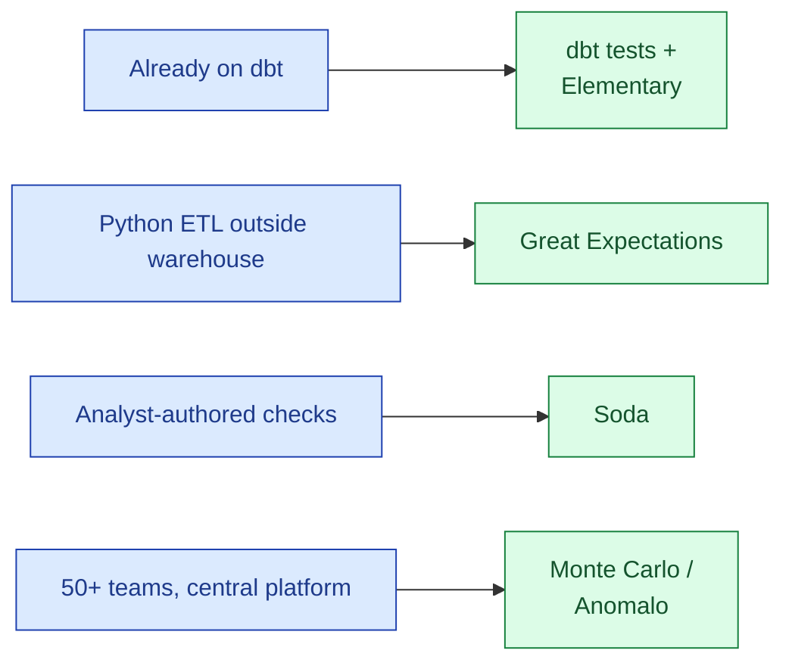
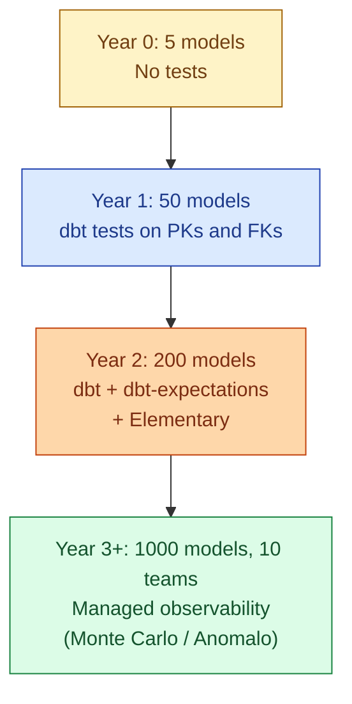

dbt tests live next to the SQL models that produce the data. **Great Expectations** is a Python framework with rich expectations, designed for pipelines that live outside the warehouse. **Soda** is YAML-first, lightweight, and built so non-engineers can author checks. **Elementary** sits on top of dbt and adds anomaly detection. **Monte Carlo** and **Anomalo** are managed observability platforms that watch the whole warehouse with machine learning. None of them is wrong. The "best" is the one your team will actually maintain.



## What each tool actually does

### dbt tests

In-warehouse, SQL-based, declared in YAML next to the models. The four built-in tests cover most schema checks. dbt-utils and dbt-expectations cover most of the rest. Runs as part of `dbt build`.

Strengths: lives with the SQL, free, integrates with version control. Weaknesses: only tests what dbt builds. Cannot reach Python pipelines or non-warehouse data.

### Great Expectations (GX)

Python framework. Tests are called "Expectations" and run against pandas, Spark, or SQL backends. The expectation library is large: column statistics, distributional tests, custom Python-defined checks. Stores results in a "Data Docs" site that becomes a quality dashboard.

```python
import great_expectations as gx

context = gx.get_context()
batch = context.get_batch("orders")
batch.expect_column_values_to_not_be_null("order_id")
batch.expect_column_values_to_be_in_set("status",
    ["new","paid","shipped","cancelled"])
batch.expect_column_mean_to_be_between("amount", 50, 500)
```

Strengths: rich expectations, language-native, runs anywhere Python runs. Weaknesses: heavy, opinionated, the v1 rewrite (2024) churned the API for the second time in three years.

### Soda

YAML-first checks, designed for analysts to write without learning Python or SQL deeply. Soda Core is the open-source CLI; Soda Cloud is the SaaS dashboard.

```yaml
# checks.yml
checks for fact_orders:
  - missing_count(order_id) = 0
  - duplicate_count(order_id) = 0
  - row_count > 1000
  - freshness(loaded_at) < 2h
  - invalid_count(status) = 0:
      valid values: [new, paid, shipped, cancelled]
```

Strengths: readable for non-engineers, fast onboarding, good CI integration. Weaknesses: smaller community than GX, less expressive when you need real custom logic.

### Elementary

A dbt package plus an optional cloud product. Sits inside the dbt project and adds anomaly detection, freshness monitoring, and a UI that surfaces test failures over time.

```yaml
# dbt_project.yml
models:
  +meta:
    elementary:
      timestamp_column: loaded_at

# schema.yml
models:
  - name: fact_orders
    tests:
      - elementary.volume_anomalies
      - elementary.freshness_anomalies
      - elementary.dimension_anomalies:
          dimensions: [status, country]
```

Strengths: native to dbt, almost no new tooling, free open source. Weaknesses: only as good as the dbt project; does not see non-dbt pipelines.

### Monte Carlo and Anomalo

Managed observability platforms. They connect to the warehouse, profile every table, and learn baselines automatically with machine learning. No checks to write for the common cases; the system infers what "normal" looks like from history and pages on deviations.

Strengths: minimal authoring work, broad coverage, full lineage and incident triage. Weaknesses: expensive (real five-figure annual commitments), black-box on which checks are running, vendor lock-in.

## The comparison table

| | dbt tests | Great Expectations | Soda | Elementary | Monte Carlo / Anomalo |
|---|---|---|---|---|---|
| **Language** | SQL + YAML | Python | YAML | SQL + YAML (dbt) | None (managed) |
| **Lives where** | dbt project | Anywhere Python runs | CLI / CI / Cloud | dbt project | SaaS, connects to warehouse |
| **Best for** | Warehouse models | Python ETL, pandas, Spark | Quick checks, analyst-authored | Anomalies on dbt models | Large multi-team platforms |
| **Authoring** | Engineer | Engineer | Analyst | Engineer | Mostly automatic |
| **Price** | Free | Free | Free + paid Cloud | Free + paid Cloud | Five figures+ per year |
| **Anomaly detection** | DIY | Some | Yes | Yes | Best-in-class (ML) |

## The graduation pattern

A recognisable pattern from teams that scale data quality over time.



The lesson: start with dbt tests. Graduate to additional tools only when the cost of writing tests by hand exceeds the cost of the tool.

## When to genuinely need Great Expectations

dbt covers the warehouse layer. GX earns its place when:

- The pipeline is Python-heavy and lives outside the warehouse. Spark jobs, ML feature pipelines, ingestion.
- The checks are statistical (distributions, KS tests, value drift over time).
- The data is in formats dbt cannot reach (parquet on S3, in-memory pandas, Kafka topics).

If everything you care about is in the warehouse and built by dbt, GX is overhead.

## When Soda is the right call

Soda is the answer when authoring is the bottleneck. A platform team writes the framework; analytics engineers, analysts, and even non-technical stakeholders author the checks in YAML. The barrier to "I want a check on this column" is one PR with three lines of YAML.

Soda is also the lightest option for non-dbt environments. If you have a warehouse but not a full dbt setup, Soda + scheduled runs covers the same ground with less framework.

## When the managed platforms make sense

Monte Carlo and Anomalo are expensive. The bill needs to be justified. They earn their cost when:

- The data platform has 20+ teams producing data.
- Writing tests manually for every table has become a full-time job.
- Lineage and incident triage matter as much as the tests themselves.
- The cost of a missed incident is high enough that ML-based anomaly detection pays for itself.

Below that threshold, dbt + Elementary covers 80% of the value at a fraction of the price.

## The "single source of truth" question

A common antipattern: dbt tests AND Soda checks AND GX expectations all running on the same tables, written by different teams, alerting through different channels. Now nobody knows which system is authoritative, alerts duplicate, and a passing dbt test plus a failing GX expectation produces an argument instead of a fix.

Pick one tool per layer:

- **Warehouse models built by dbt**: dbt tests, full stop.
- **Anomaly detection on warehouse**: pick one of Elementary, Soda, Monte Carlo. Not all three.
- **Non-warehouse pipelines**: GX or Soda. Not both.

The discipline of "one tool per layer" matters more than which tool you pick.

## The 2026 honest take

After watching teams of every size:

- For a small team on dbt: **dbt tests + Elementary**. Free, integrated, sufficient.
- For a mid-sized team with mixed warehouse and Python: **dbt + GX**. dbt for warehouse, GX for Python.
- For a platform team supporting many analyst-authored checks: **add Soda**. The authoring story is the differentiator.
- For a large enterprise (50+ teams, $1M+ data platform budget): **add Monte Carlo or Anomalo**. The ML and the lineage justify the price.

Most teams overbuy. The "start with dbt, graduate when you actually outgrow it" rule beats "buy the SaaS that the trade press recommends" every time.

## Common mistakes

- **Three overlapping tools running on the same tables.** Pick one per layer.
- **Buying Monte Carlo when dbt tests would do.** Five-figure spend on what dbt covers for free.
- **Treating GX as a dbt replacement.** GX is for Python pipelines. Inside dbt, dbt-expectations is closer.
- **Writing Soda checks in YAML and dbt tests in YAML for the same column.** Pick one tool.
- **Not running the tests in CI.** Whatever tool you pick, the value comes from blocking bad PRs.
- **No alert routing.** A tool that fires alerts into a channel no one watches is no better than no tool.
- **Buying a tool to fix a culture problem.** If no one writes tests, no tool will save you.

## Quick recap

- dbt tests for warehouse models. The free, integrated, default.
- Great Expectations for Python and Spark pipelines outside the warehouse.
- Soda when analyst authoring is the bottleneck.
- Elementary as the cheapest anomaly-detection upgrade on top of dbt.
- Monte Carlo or Anomalo when scale and lineage justify the bill.
- One tool per layer. Overlap is more dangerous than a gap.

This concept sits in **Stage 6 (Reliability, debugging, cost)** of the [Data Engineering Roadmap](/practice/data-engineering/roadmap/).
