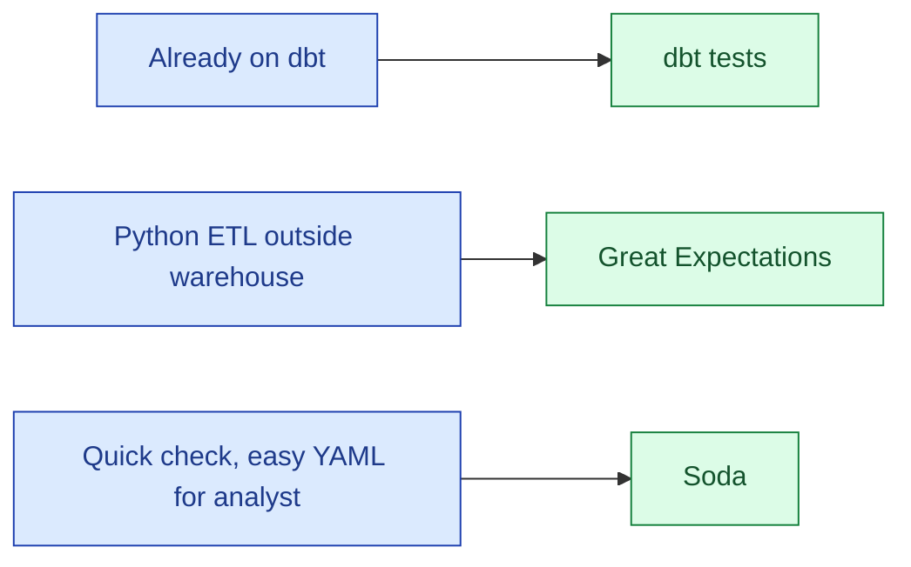

dbt tests live next to the SQL models that produce the data. Great Expectations (GX) is a Python framework with rich expectations, designed for pipelines outside the warehouse. Soda is YAML-first, lightweight, and built for non-engineers to author checks. None is wrong. The "best" is the one your team will actually maintain.

| | dbt tests | Great Expectations | Soda |
|---|---|---|---|
| **Language** | SQL + YAML | Python | YAML |
| **Lives in** | dbt project | Anywhere Python runs | CLI / CI / Soda Cloud |
| **Best for** | Warehouse models | Pipelines, Python ETL | Quick checks, non-engineers |
| **Ecosystem** | Massive (dbt-utils, dbt-expectations) | Mature, opinionated | Smaller, growing |

**What this page will cover.**

- The overlap: each tool can do `not_null`, `unique`, `freshness`, basic anomaly detection.
- The differences: where the tests live, who writes them, how they integrate with CI.
- The dbt-expectations package: brings most GX checks into dbt.
- The "single source of truth" question: pick one for the warehouse layer.
- When you genuinely need GX: Python-heavy pipelines, complex statistical checks.
- The 2026 honest take: dbt for warehouse-native, GX for everything else, Soda when authoring is the bottleneck.

*Page coming soon.*

This concept sits in **Stage 6 (Reliability, debugging, cost)** of the [Data Engineering Roadmap](/practice/data-engineering/roadmap/).
