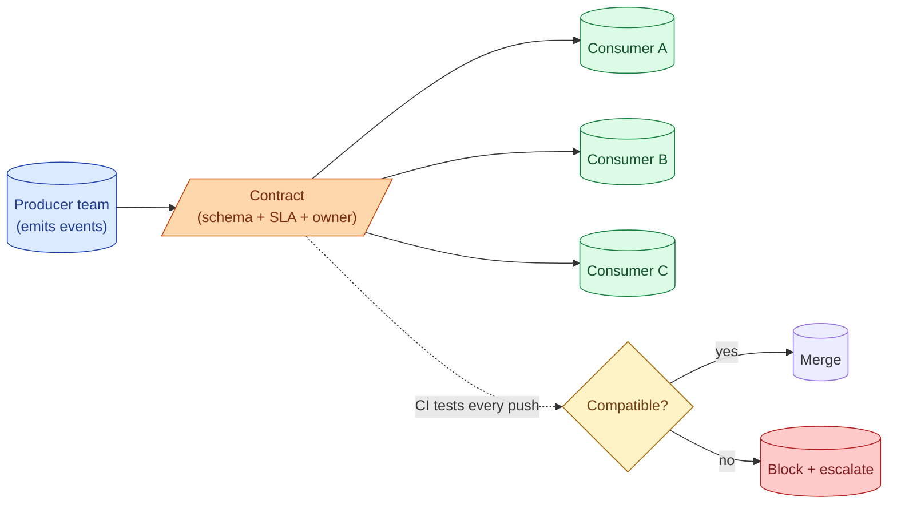

A data contract is a versioned, machine-readable agreement: the schema, the SLA, the freshness target, the allowed-values list, the owner. The producer commits to it. The consumer can read it. Changes to the contract go through a review process, not a Slack message at 4 p.m. on a Friday.

**What this page will cover.**

- What a contract holds: schema, semantics, freshness, ownership, change policy.
- Schema-as-contract: Avro + schema registry as the canonical implementation.
- The "additive change vs breaking change" rule.
- The producer's CI gate: a schema change cannot merge without compatibility checks.
- Why contracts solve the "every team built its own customer model" problem.
- The 2026 ecosystem: dbt's data contracts feature, Apache Iceberg's view definitions, Soda contracts.

*Page coming soon. Until then, see [#011 Data contracts in plain words](/practice/data-engineering/011-data-contracts-in-plain-words/) for the practice problem.*

This concept sits in **Stage 6 (Reliability, debugging, cost)** of the [Data Engineering Roadmap](/practice/data-engineering/roadmap/).
