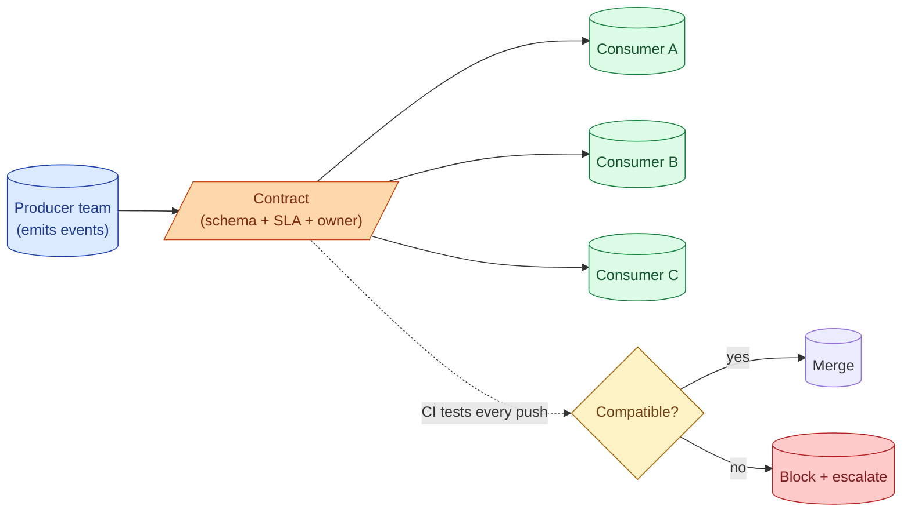
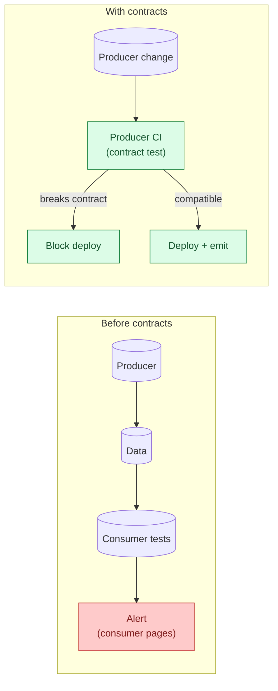
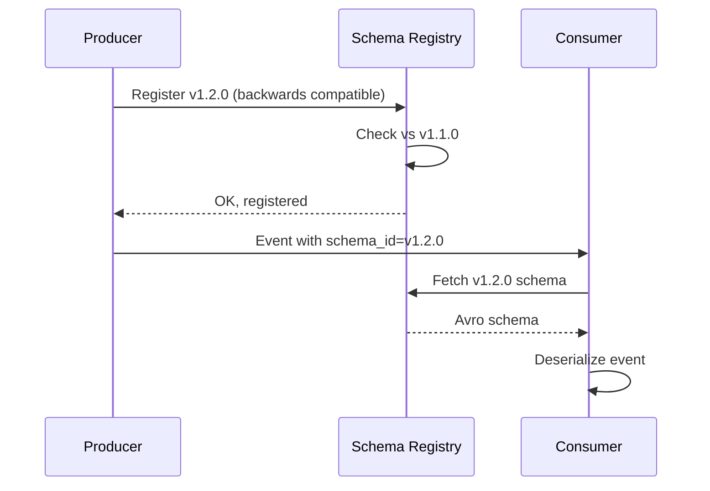

A data contract is a versioned, machine-readable agreement: the schema, the SLA, the freshness target, the allowed-values list, the owner. The producer commits to it. Consumers can read it. Changes to the contract go through a review process rather than a Slack message at 4 p.m. on a Friday. Contracts shift quality work upstream, so the producer catches a breaking change in CI instead of the consumer catching it as a 03:00 page.



## What a contract holds

Six things, at minimum.

1. **Schema**: column names, types, nullability. The structural shape.
2. **Semantics**: the meaning of each column. `currency_code` is ISO-4217, three uppercase letters. `event_time` is UTC.
3. **Allowed values**: closed sets, ranges, formats. `status IN ('new','paid','shipped','cancelled')`.
4. **Freshness SLA**: "the table is updated within 2 hours of the source event."
5. **Volume SLA**: "expect 1-10 million rows per day under normal load."
6. **Ownership**: a team, a Slack channel, a runbook URL. When something breaks, the contract tells you who to call.

A contract without ownership is a wish.

## The shift left

The non-contract pattern: producer writes data, consumer writes tests on the consumer side, consumer's dashboard breaks when the producer makes a breaking change. The consumer files a ticket. Maybe.

The contract pattern: producer commits to a schema, CI on the producer's side breaks if a code change would violate the contract. The producer cannot deploy a breaking change without negotiating with consumers first.



The quality work moved from consumer-side reactive to producer-side preventive. The consumer's downstream dbt tests are still useful for catching production drift, but the structural breaks are gone.

## Additive vs breaking change

The single most important rule in any contract regime: distinguish additive from breaking changes.

**Additive (backwards compatible)**: adding a nullable column, adding a value to an enum (with care), adding a new event type. Consumers that ignore the new field keep working. Producer can ship without coordination.

**Breaking (not compatible)**: removing a column, changing a type, renaming a field, narrowing an enum, tightening a nullability constraint. Consumers will break. Producer cannot ship without coordination.

A contract registry's main job is enforcing this rule. The compatibility check runs on every push to the producer's repo. Additive: green. Breaking: blocked until the contract is bumped to a new major version.

## A concrete contract

A minimal contract for an order event, written in the `data-contract-cli` format (an open spec that gained adoption through 2025-2026).

```yaml
dataContractSpecification: 0.9.3
id: orders-v1
info:
  title: Orders
  version: 1.2.0
  owner: orders-team
  contact:
    name: Orders Team
    url: https://wiki.example.com/orders
servingChannel: kafka-prod
servers:
  kafka:
    type: kafka
    topic: orders.events.v1
terms:
  usage: Internal only. Do not export outside the data platform.
models:
  order:
    type: record
    fields:
      order_id:
        type: string
        required: true
        unique: true
      customer_id:
        type: string
        required: true
      amount_cents:
        type: integer
        required: true
        minimum: 0
      currency:
        type: string
        required: true
        enum: [USD, EUR, GBP, SEK]
      status:
        type: string
        required: true
        enum: [new, paid, shipped, cancelled, refunded]
      event_time:
        type: timestamp
        required: true
        description: UTC, ISO 8601
servicelevels:
  availability:
    percentage: 99.9
  freshness:
    threshold: 5m
  retention:
    period: 365d
```

The producer's CI validates every commit against this file. The schema check runs on the producer's Kafka producer; the SLA checks run on the consumer side via dbt freshness tests reading the same contract. One source of truth, two enforcement points.

## Schema registry as canonical implementation

The classic implementation of contracts at scale is a schema registry. Confluent Schema Registry, AWS Glue Schema Registry, Apicurio: same idea in different vendors. Producers publish Avro / Protobuf / JSON schemas; consumers read them; the registry enforces compatibility on every write.



The registry holds every version. Compatibility modes (`BACKWARD`, `FORWARD`, `FULL`) tell the registry what to allow. Most teams use `BACKWARD`: new producer + old consumer must work, which is the common deployment order.

Avro is the dominant format for this in 2026 because schema evolution rules are well-defined and the registry pattern is mature. Protobuf is rising; JSON Schema is convenient for HTTP APIs but weaker on evolution.

## Contracts beyond events: dbt contracts

dbt added native model contracts in dbt 1.5 (2023) and matured them through 2026. A model can declare its public schema:

```yaml
models:
  - name: dim_customer
    config:
      contract:
        enforced: true
    columns:
      - name: customer_id
        data_type: string
        constraints:
          - type: not_null
          - type: primary_key
      - name: email
        data_type: string
        constraints:
          - type: not_null
      - name: country
        data_type: string
        constraints:
          - type: not_null
```

If a change to the model would violate the contract (rename a column, change a type, drop a constraint), `dbt build` fails. Producer-side enforcement, same idea as the schema registry but inside dbt.

## Versioning and deprecation

A contract is versioned. Producers do not delete or mutate old versions; they publish new ones. Consumers migrate on their own schedule.

A common pattern:

1. Producer publishes v2 alongside v1.
2. Consumers migrate one at a time. The producer monitors who reads v1 (via consumer registration or query logs).
3. After all consumers have moved, the producer announces v1 deprecation with a date.
4. After the deprecation date, the producer can remove v1.

The minimum deprecation window in most companies is 90 days. Less is too short for downstream teams to plan; more leaves dead versions around forever.

## Who owns the contract registry

The most common 2026 setup: the platform team owns the registry as a service; producer teams own individual contracts. The registry enforces the rules; the producer owns the content.

The wrong setup is "the data platform team owns all contracts." Now the platform team is a bottleneck and the producer team is not on the hook for the data they emit. Ownership has to be co-located with the team writing the producer code.

## Common mistakes

- **Contracts without enforcement.** A YAML file in a wiki is not a contract; it is a wish.
- **Producers blocked on consumer migrations.** A 1-year-old v1 with no consumers is dead weight. Enforce deprecation windows.
- **Mutating contracts in place.** Any backward-incompatible change must be a new major version, not an edit.
- **Putting the contract on the consumer side.** Consumer-side tests catch drift, not breaks. Push the contract to the producer.
- **Ownership in a doc, not in code.** The contract needs a machine-readable owner field that paging systems can route on.
- **Contracts for every internal table.** Real cost. Contracts pay off on cross-team data products, not on the analytics engineer's mart.
- **No version negotiation.** Producer ships v2; consumers using v1 break the next day. Maintain v1 in parallel.

## Quick recap

- A data contract is schema + SLA + ownership, in code, versioned, enforced.
- Contracts shift quality work upstream: producer-side CI breaks before consumer-side dashboards do.
- Distinguish additive (no coordination) from breaking (new major version) changes.
- Schema registries (Confluent, Glue, Apicurio) are the canonical event-side implementation.
- dbt model contracts are the warehouse-side equivalent. Both enforce on the producer.
- Versioning matters. Old versions live until consumers migrate; announce deprecation windows of 90+ days.

This concept sits in **Stage 6 (Reliability, debugging, cost)** of the [Data Engineering Roadmap](/practice/data-engineering/roadmap/).
