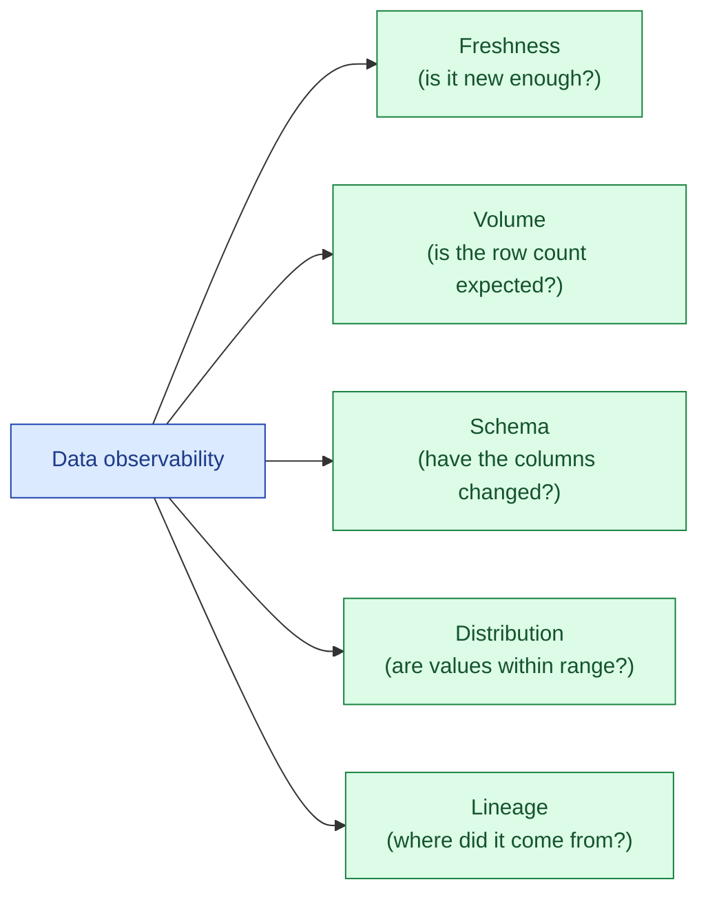

Data observability is the practice of monitoring five things automatically: freshness, volume, schema, distribution, and lineage. Together they answer "is the data healthy?" without anyone running a query. Originally framed by Monte Carlo, now industry-standard vocabulary.

**What this page will cover.**

- The five signals in detail with one example each.
- Tooling landscape: Monte Carlo, Anomalo, Datafold, Soda, Bigeye, Elementary (open source).
- DIY data observability with dbt + Elementary + Slack alerts.
- Why "alert on every anomaly" is the wrong default; alert on tested invariants.
- Connecting to incident response: a data alert should produce a ticket, not a Slack ping.
- The honest take: start with freshness + volume + schema. Distribution and lineage come later.

*Page coming soon. Until then, see [#084 Data observability: freshness, volume, drift](/practice/data-engineering/084-data-observability-freshness-volume-drift/) for the practice problem.*

This concept sits in **Stage 6 (Reliability, debugging, cost)** of the [Data Engineering Roadmap](/practice/data-engineering/roadmap/).
