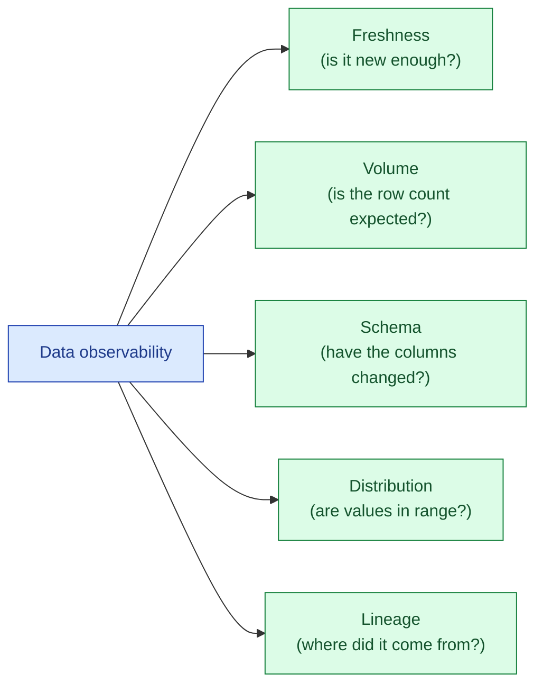
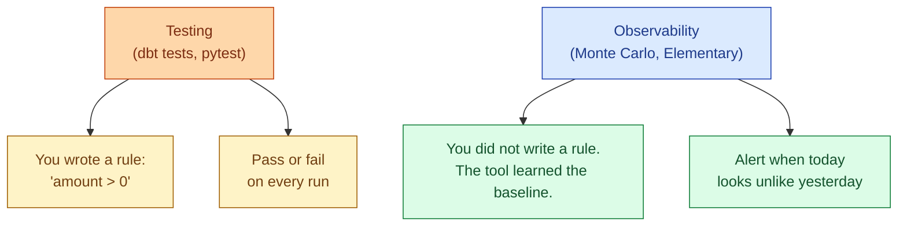
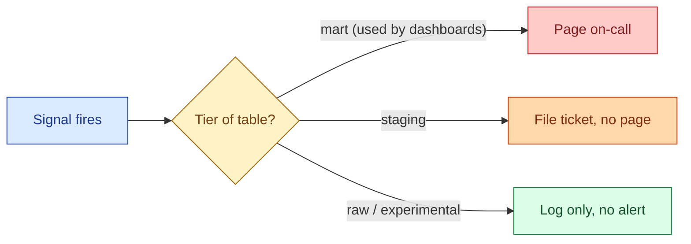

Data observability is the practice of monitoring five things automatically: freshness, volume, schema, distribution, and lineage. Together they answer "is the data healthy?" without anyone running a query. Originally framed by Monte Carlo, now the industry-standard vocabulary.

## The five pillars



Each pillar catches a different class of failure. None of them replaces the others.

### Freshness

How old is the newest row? If `max(loaded_at)` on `fact_orders` is from 14 hours ago and the SLO says "fresh within 2 hours", the upstream load broke. Freshness is the single most useful signal. It catches stuck jobs, broken connectors, paused schedulers, and orphaned DAGs without any business logic at all.

```sql
SELECT
  table_name,
  MAX(loaded_at) AS newest_row,
  TIMESTAMPDIFF(MINUTE, MAX(loaded_at), CURRENT_TIMESTAMP) AS minutes_stale
FROM analytics.fact_orders;
```

### Volume

Did roughly the expected number of rows arrive? Yesterday: 412,000 orders. Today: 38. Something is wrong upstream even if no job failed. Volume catches silent partial loads: the CDC stream that dropped a shard, the API that started returning empty pages, the date partition written to the wrong path.

A simple rule: alert if today's row count is outside 50% to 200% of the trailing 7-day median. Tune the band per table.

### Schema

Did the columns change? A new column appears, an old one disappears, a `STRING` becomes an `INT`. Schema drift breaks downstream models silently because the query still runs, it just produces the wrong shape. Schema observability is comparing today's `INFORMATION_SCHEMA.COLUMNS` to yesterday's and alerting on the diff.

### Distribution

Did the values inside the rows change shape? `null` rate on `email` jumps from 2% to 47%. `country` suddenly has a `XX` value that has never existed. `amount` mean drops by 80%. Distribution catches the cases where the schema is fine and the row count is fine but the data inside is wrong.

This is the pillar most prone to false positives. Real distributions drift for real business reasons. Pick a few high-value columns per table and watch only those.

### Lineage

When something breaks, which downstream models and dashboards are affected? Lineage is observability's "blast radius" view. It does not catch failures; it scopes them. See [#052 Data lineage](/practice/data-engineering/concepts/052-data-lineage/) for the full picture.

## Observability vs testing

These get confused. They are not the same thing.



Testing is what you already know to check. Observability is what you did not think to check. A dbt test catches the `amount < 0` case because you wrote that test. Observability catches the case where `amount` is suddenly 100x what it was yesterday, even though every value is still positive.

Both matter. Start with tests (they are free and predictable). Add observability when tests stop catching the incidents you actually have.

## Build vs buy

Three real options in 2026.

| Option | Cost | What you get |
|---|---|---|
| **dbt tests + Elementary (open source)** | Free | Freshness, volume, schema, basic distribution. Slack alerts. Requires you to run it. |
| **Monte Carlo, Anomalo, Bigeye, Datafold** | $50k-$200k/year | Five pillars, ML-based distribution alerts, lineage UI, on-call integration. Vendor runs it. |
| **DIY: SQL + cron + Slack webhook** | Engineering time | Whatever you write. Fine for one team, painful at scale. |

The honest answer for most teams under 50 engineers: dbt tests plus Elementary plus a few hand-written freshness checks gets you 80% of the value at 0% of the cost. Move to a paid tool when the data team is large enough that "who owns this alert" stops being obvious.

## A working freshness check in SQL

The cheapest observability you can build. Schedule this query hourly, post the result to Slack if anything is stale.

```sql
WITH staleness AS (
  SELECT
    'fact_orders' AS table_name,
    120 AS sla_minutes,
    MAX(loaded_at) AS newest_row,
    TIMESTAMPDIFF(MINUTE, MAX(loaded_at), CURRENT_TIMESTAMP) AS lag_minutes
  FROM analytics.fact_orders
  UNION ALL
  SELECT
    'fact_events',
    30,
    MAX(loaded_at),
    TIMESTAMPDIFF(MINUTE, MAX(loaded_at), CURRENT_TIMESTAMP)
  FROM analytics.fact_events
)
SELECT *
FROM staleness
WHERE lag_minutes > sla_minutes;
```

If this query returns zero rows, all tables are fresh. If it returns rows, those are your incidents. The query is the alert.

## Alert design

The default failure mode of data observability is alert fatigue. Five pillars times 200 tables is 1,000 possible alerts per day. Most of them are noise. A few rules keep it manageable.



Tier the tables. Only mart tables (the ones a dashboard or downstream API reads) page the on-call. Staging tables file tickets. Raw tables log only. This cuts alert volume by 10x and turns the remaining alerts into things people actually act on.

## A worked incident

The dashboard "Daily revenue" shows $0 for yesterday. Without observability, the analyst notices, pings the data team, the data team starts from scratch.

With observability, the incident already exists:

1. **Freshness alert at 03:14**: `fact_orders` is 4 hours stale, SLO 1 hour.
2. **Volume alert at 03:14**: `raw.orders_stream` row count is 0 for the last 3 hours.
3. **Lineage view**: `fact_orders` derives from `raw.orders_stream`. So does the "Daily revenue" dashboard.

The on-call sees one ticket with three correlated signals and a list of impacted dashboards. Time to diagnosis: 5 minutes. Without observability: 90 minutes of "is it the data or the dashboard?"

## Common mistakes

- **Treating observability as a replacement for tests.** Tests catch what you know. Observability catches what you do not know. You need both.
- **Alerting on every pillar for every table.** Tier the tables. Most raw tables should not page anyone.
- **Distribution alerts with no business context.** A 30% jump in `signup_country = 'IN'` might be a marketing campaign, not a bug. Pair distribution with a human owner.
- **Buying a tool before writing a single freshness check.** The first freshness check is one SQL query and a cron job. Build that first, learn what hurts, then decide if a paid tool is worth it.
- **No incident playbook.** Alerts that no one knows how to respond to are noise. Every alert needs an owner and a runbook.
- **Treating the dbt freshness block as enough.** dbt source freshness is a great start. It does not catch volume or distribution.
- **Ignoring the cost of observability itself.** Running a `COUNT(*)` on every table every hour is not free. Sample, partition, and cache the observability queries themselves.

## Quick recap

- Five pillars: freshness, volume, schema, distribution, lineage. Each catches a different failure class.
- Observability complements testing. Tests check what you wrote. Observability flags what you did not.
- Start with freshness and volume. They catch most real incidents and produce the fewest false alarms.
- Tier the tables. Only mart-level alerts should page the on-call.
- dbt tests plus Elementary covers most teams under 50 engineers. Paid tools earn their cost at larger scale.
- The first observability check is one SQL query and a cron job. Ship that before evaluating vendors.

This concept sits in **Stage 6 (Reliability, debugging, cost)** of the [Data Engineering Roadmap](/practice/data-engineering/roadmap/).
