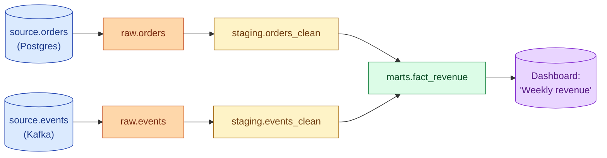
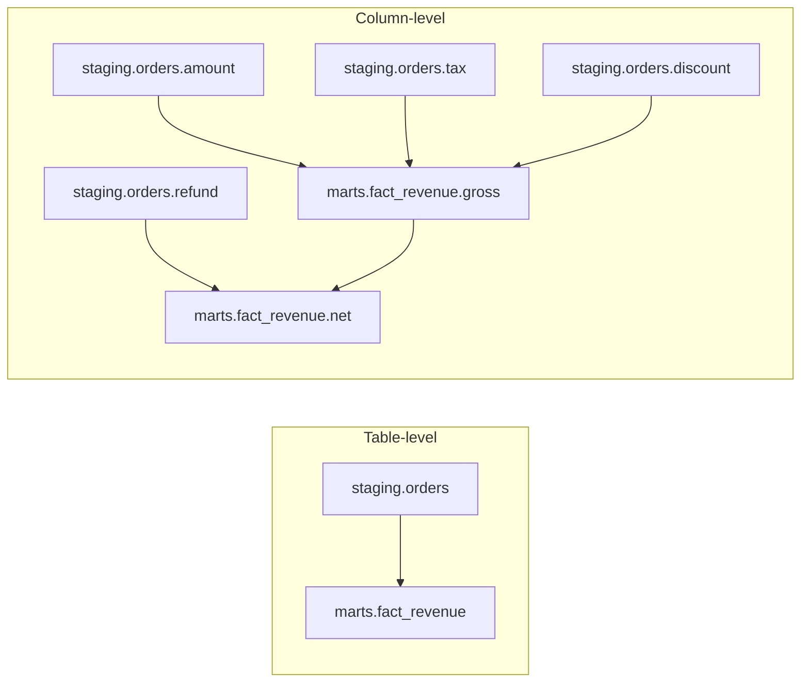
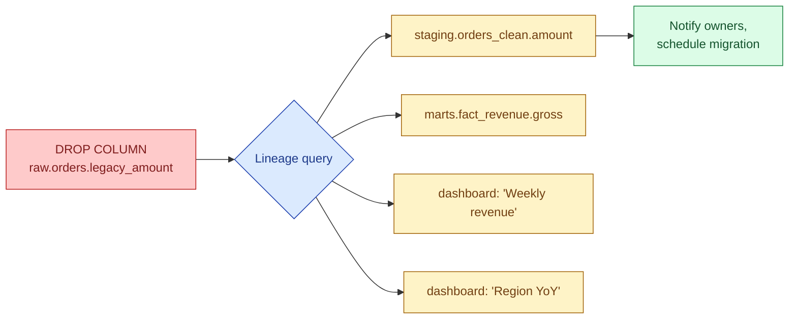

Data lineage is the directed graph of "this column came from that column, which came from that source." Column-level lineage is the goal because table-level lineage rarely answers the question that broke the dashboard. Good lineage lets a data engineer go from "the revenue number is wrong" to the source row in minutes.

## The shape of a lineage graph



That graph answers two questions: where did this number come from (walk left), and what breaks if I change this (walk right). Both are essential during incidents.

## Table-level vs column-level

The big practical distinction.

| Lineage type | What it shows | Cost to produce |
|---|---|---|
| **Table-level** | `marts.fact_revenue` reads from `staging.orders_clean` and `staging.events_clean` | Free with dbt, OpenLineage, most catalogs |
| **Column-level** | `marts.fact_revenue.gross_amount` derives from `raw.orders.amount + raw.orders.tax` | Requires SQL parsing. Tooling-heavy. |

Table-level is enough for "what dashboards break if I drop this table?" It is not enough for "the revenue number is wrong by 7%, which column is the source of the error?" That second question needs column-level.



For PII tracking, column-level is non-negotiable. "Is the user's email anywhere in `marts.*`?" is a column-level question. Table-level cannot answer it.

## Where lineage comes from

Three real sources in 2026.

**1. dbt (table-level, free).** Every dbt project produces a `manifest.json` with the full DAG of model dependencies. Open the dbt docs site and you get a clickable lineage graph. This is the cheapest lineage on the market and covers any pipeline that runs through dbt.

```yaml
# models/marts/fact_revenue.yml
version: 2
models:
  - name: fact_revenue
    description: "Daily revenue per region"
    depends_on:
      - ref('stg_orders')
      - ref('stg_events')
```

The `ref()` calls in the SQL are what dbt parses into the graph. No extra config.

**2. OpenLineage (the cross-tool standard).** An open spec that pipelines emit lineage events to. Airflow, Spark, dbt, Flink, Trino all have OpenLineage integrations. The events go to a backend like Marquez or a commercial catalog. The value: one graph spanning every tool, not one graph per tool.

```json
{
  "eventType": "COMPLETE",
  "job": {"namespace": "airflow", "name": "daily_revenue.fact_revenue"},
  "inputs": [{"namespace": "warehouse", "name": "staging.orders_clean"}],
  "outputs": [{"namespace": "warehouse", "name": "marts.fact_revenue"}]
}
```

**3. SQL parsing tools (column-level).** Tools that read every query in your warehouse and parse the SQL into column dependencies. Datafold, SQLLineage, Atlan, Castor, DataHub all do this. The output is column-level lineage without anyone annotating anything. The cost is licensing or running the parser yourself.

## Impact analysis

The single most useful lineage operation is "what depends on this column?" Sometimes called impact analysis.



Without lineage, a column drop becomes "send an email to everyone, hope someone speaks up." With column-level lineage, the migration ticket lists exactly which 4 downstream models and 11 dashboards need to be updated. Engineers run this query before every schema change.

## A worked debugging flow

The dashboard shows $1.2M revenue. Finance says it should be $1.4M. The number is wrong by $200k.

Without lineage:
1. Find the dashboard query (15 min).
2. Find the model behind the query (10 min).
3. Find the source tables of the model (10 min).
4. Run sample queries on each source to localise (45 min).
5. Find the bug.

Time: 80+ minutes. Most of it is graph traversal in your head.

With column-level lineage:
1. Open the lineage view for `fact_revenue.gross`.
2. Walk the graph left, sampling at each node.
3. At `staging.orders_clean.amount`, the sum matches finance. At `marts.fact_revenue.gross`, it does not.
4. The bug is the join between staging and the dimension table. Fix it.

Time: 15 minutes. The graph traversal moved from your head into the tool.

## PII tracking

Compliance teams ask one question every quarter: "where is user PII stored?" Without column-level lineage, the answer is a spreadsheet someone updated 8 months ago. With column-level lineage:

```sql
-- pseudo-query against a lineage backend
SELECT downstream_table, downstream_column
FROM lineage_edges
WHERE upstream_table = 'source.users'
  AND upstream_column IN ('email', 'phone', 'address')
  AND downstream_table LIKE 'marts.%';
```

The answer is a list of tables and columns, refreshed daily, that holds up in an audit.

## The cost question

Free options exist. Paid options exist. The honest trade.

| Option | Cost | What you get | Misses |
|---|---|---|---|
| **dbt docs** | Free | Table-level lineage within dbt | Anything outside dbt, no column-level |
| **OpenLineage + Marquez** | Engineering time | Cross-tool table-level | Column-level (still emerging) |
| **DataHub (open source)** | Engineering time + ops | Both, with effort | Polish, hosted UX |
| **Atlan, Castor, Alation, Monte Carlo** | $50k-$200k+/yr | Both, hosted, nice UI | Lock-in, integration friction |

For most teams: dbt docs covers 70% of the value for free. Add OpenLineage when pipelines span multiple tools. Pay for column-level when an incident proves you need it (not before).

## Common mistakes

- **Treating table-level as good enough.** It answers some questions and not others. The PII question always needs column-level.
- **Building a lineage UI no one uses.** Lineage that lives in a separate tool people forget about is wasted effort. It should be one click away from the dashboard or the model.
- **Manual lineage docs.** Spreadsheets and wiki pages go stale within weeks. Lineage must be derived from the SQL, not maintained by humans.
- **Ignoring the dashboard layer.** Lineage that stops at the mart table misses where the data actually gets consumed. Hook the BI tool into the lineage graph.
- **Buying a tool before measuring usage.** A $150k catalog with 3 active users is the worst-cost-per-query in the platform.
- **Confusing lineage with observability.** Lineage scopes blast radius. It does not detect anything. You need both.

## Quick recap

- Lineage is the graph of "this came from that." It answers "where did this number come from?" and "what breaks if I change this?"
- Table-level lineage is cheap and covers most non-incident use cases. Column-level is needed for PII tracking and root-cause debugging.
- dbt produces table-level lineage for free. OpenLineage is the cross-tool standard. Column-level requires SQL parsing tools.
- Impact analysis before schema changes is the highest-ROI use. Run it before every column drop.
- Pay for a commercial catalog when an incident proves you need column-level and the build cost exceeds the license.
- Lineage and observability are different tools. One detects, one scopes. Use both.

This concept sits in **Stage 6 (Reliability, debugging, cost)** of the [Data Engineering Roadmap](/practice/data-engineering/roadmap/).
