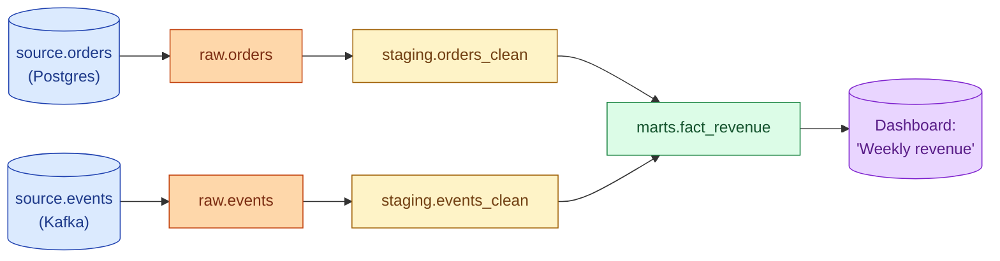

Data lineage is the directed graph of "this column came from that column, which came from that source." Column-level lineage is the goal because table-level lineage rarely answers the question that broke the dashboard. Good lineage lets a data engineer go from "the revenue number is wrong" to the source row in minutes.

**What this page will cover.**

- Table-level vs column-level lineage. Why column-level is the only one that fully answers debugging questions.
- dbt's lineage out of the box (table-level).
- OpenLineage, Marquez, DataHub: the open-source standards.
- Commercial catalog options: Atlan, Alation, Castor.
- Impact analysis: "if I change this column, what dashboards break?"
- The honest 2026 take: lineage pays for itself the first time someone uses it during an incident.

*Page coming soon. Until then, see [#090 OpenLineage and data discovery](/practice/data-engineering/090-openlineage-and-data-discovery/) for the practice problem.*

This concept sits in **Stage 6 (Reliability, debugging, cost)** of the [Data Engineering Roadmap](/practice/data-engineering/roadmap/).
