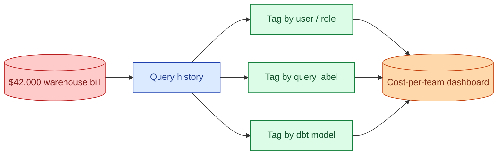
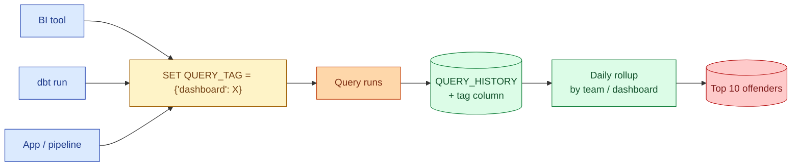
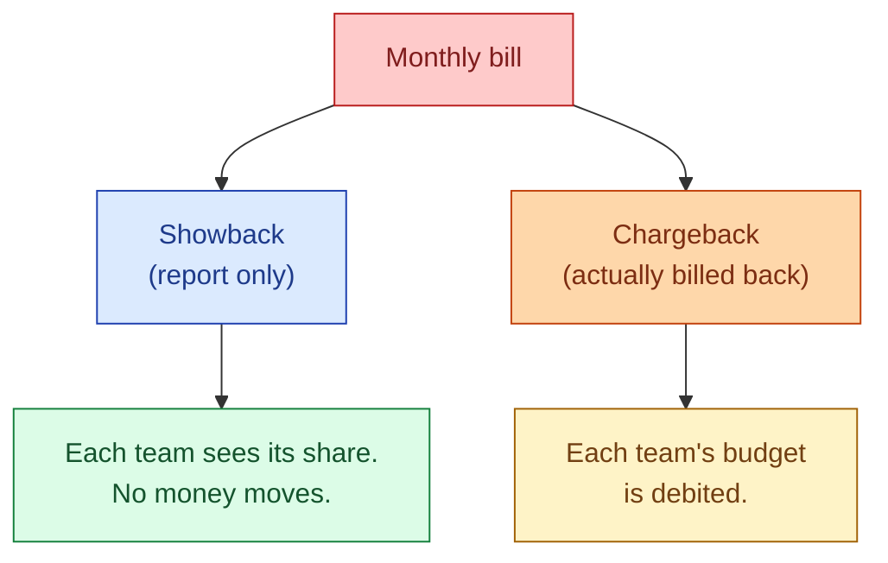

The warehouse bill at the end of the month is one number. Splitting that number across teams, dashboards, and models is cost attribution. Without it, no one knows which query to kill. With it, you have a leaderboard of the top cost offenders updated every morning.

## The shape



The raw material is the query history table that every warehouse exposes. The work is joining each query to a team, a dashboard, or a pipeline, then summing the cost.

## Where the data lives

| Warehouse | Table | What you get |
|---|---|---|
| **Snowflake** | `SNOWFLAKE.ACCOUNT_USAGE.QUERY_HISTORY` | Per-query credits used, bytes scanned, user, role, warehouse, query tag |
| **BigQuery** | `INFORMATION_SCHEMA.JOBS_BY_*` | Per-query bytes billed, slot ms, user email, labels |
| **Databricks** | `system.billing.usage`, `system.query.history` | Per-query DBUs, user, warehouse, tags |
| **Redshift** | `SYS_QUERY_HISTORY`, `STL_QUERY` | Per-query duration, queue, user |

The schemas differ but the shape is the same: timestamp, user, query text, cost. Every cost dashboard starts here.

## The killer column: query tag

Without tags, attribution is guesswork. With tags, every query carries its own metadata.

```sql
-- Snowflake: set a tag for the session
ALTER SESSION SET QUERY_TAG = '{"team": "marketing", "dashboard": "weekly_revenue", "owner": "amirul"}';

-- BigQuery: set labels on the job
-- (set via SDK or in the job_config)
-- labels = {"team": "marketing", "dashboard": "weekly_revenue"}

-- Databricks: tag the warehouse, or use SET statements
SET TAGS = ('team' = 'marketing', 'dashboard' = 'weekly_revenue');
```

The trick is to set the tag automatically. The BI tool sets it per dashboard. The dbt run sets it per model. The scheduled job sets it per pipeline. Nobody types tags by hand because nobody will.

## A working Snowflake attribution query

The whole pattern in one query.

```sql
SELECT
  TRY_PARSE_JSON(query_tag):team::string  AS team,
  TRY_PARSE_JSON(query_tag):dashboard::string AS dashboard,
  user_name,
  COUNT(*)                         AS query_count,
  SUM(execution_time) / 1000 / 60  AS minutes_compute,
  SUM(credits_used_cloud_services
      + (execution_time / 1000 / 60 / 60)
      * warehouse_size_credits)    AS credits_burned
FROM snowflake.account_usage.query_history
WHERE start_time >= DATEADD(day, -7, CURRENT_TIMESTAMP)
GROUP BY team, dashboard, user_name
ORDER BY credits_burned DESC
LIMIT 50;
```

Sort by `credits_burned`. The top of the list is the answer to "where is the money going?"

## The flow from query to bill



The tag is set before the query runs. The cost is captured after. The join key is the tag. Without the tag, every attribution becomes "match on the SQL text", which is fragile.

## The dashboard nobody opens

The single most expensive cost pattern in any warehouse: a scheduled dashboard refresh that runs every 15 minutes for a dashboard that nobody has loaded in 4 months. The cost is real. The value is zero.

Find them.

```sql
-- Snowflake: scheduled refreshes for dashboards with low view counts
SELECT
  TRY_PARSE_JSON(query_tag):dashboard::string AS dashboard,
  COUNT(*)                AS refreshes_30d,
  SUM(execution_time)/1000/60 AS minutes_burned
FROM snowflake.account_usage.query_history
WHERE start_time >= DATEADD(day, -30, CURRENT_TIMESTAMP)
  AND TRY_PARSE_JSON(query_tag):source::string = 'scheduled_refresh'
GROUP BY dashboard
ORDER BY minutes_burned DESC;
```

Join that against the BI tool's view-count table. The dashboards with thousands of refreshes and dozens of human views are the easy wins. Pause the schedule, watch the bill drop. Often 15-30% in a week.

## Chargeback vs showback

Finance eventually asks: "split the bill across business units." Two real models.



Showback is reporting. Teams see their cost but the data team still owns the bill. Chargeback is real money moving. Each team's budget is debited monthly. Chargeback creates immediate pressure to optimise; it also creates immediate political fights about which costs are "platform overhead" and which are "team usage."

Most companies start with showback for 6-12 months, then move to chargeback once the numbers are credible and the tagging is reliable.

## Common mistakes

- **No tagging strategy at day 1.** Retrofitting tags onto a year of queries is impossible. Set the tagging convention early and enforce it in code.
- **Trusting query text to identify teams.** "If the SQL contains 'marketing'" is fragile. Tags survive refactoring. Text does not.
- **Reporting cost without an owner.** A leaderboard with no name attached to each row produces no action. Every line needs a human owner.
- **Ignoring the BI refresh schedule.** Scheduled dashboard refreshes are the top hidden cost in almost every warehouse. Audit them first.
- **Confusing query time with cost.** A 30-second query on a 4XL warehouse costs 32x what the same query costs on an XS. Time alone is a bad proxy.
- **Building the dashboard, never reviewing it.** A cost dashboard nobody opens has the same problem as a BI dashboard nobody opens. Tie it to a weekly meeting.
- **Underestimating cloud services / metadata cost.** Snowflake's cloud services credits are real money. Include them in the rollup.

## Quick recap

- Cost attribution is splitting one bill across many teams, dashboards, and models.
- Every modern warehouse exposes query history with cost per query. Snowflake `QUERY_HISTORY`, BigQuery `INFORMATION_SCHEMA.JOBS`, Databricks `system.query.history`.
- Tagging queries automatically (BI tool, dbt, jobs) is the foundation. Without tags, attribution is guesswork.
- The "dashboard nobody opens" is the single largest hidden cost in most warehouses. Find it first.
- Showback before chargeback. Build trust in the numbers before they move money.
- The cost leaderboard only works if every line has a human owner attached.

This concept sits in **Stage 6 (Reliability, debugging, cost)** of the [Data Engineering Roadmap](/practice/data-engineering/roadmap/).
