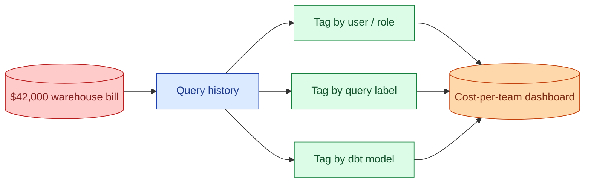

The warehouse bill at the end of the month is one number. Splitting that number across teams, dashboards, and models is cost attribution. Without it, no one knows which query to kill. With it, you have a leaderboard of the top 10 cost offenders updated every morning.

**What this page will cover.**

- Where the data lives: `INFORMATION_SCHEMA.JOBS` (BigQuery), `QUERY_HISTORY` (Snowflake), Databricks system tables.
- Tagging queries with `query_tag` / labels so attribution survives the SQL.
- The dbt-warehouse cost integration (job timing + bytes scanned per model).
- Per-user, per-dashboard, per-pipeline rollups.
- The "top 10 offenders" daily report that tightens the feedback loop.
- The chargeback model: when finance wants the cost split by team, what do you give them?

*Page coming soon. Until then, see [#030 Warehouse cost doubled in two months](/practice/data-engineering/030-warehouse-cost-doubled-in-two-months/) for the practice scenario.*

This concept sits in **Stage 6 (Reliability, debugging, cost)** of the [Data Engineering Roadmap](/practice/data-engineering/roadmap/).
