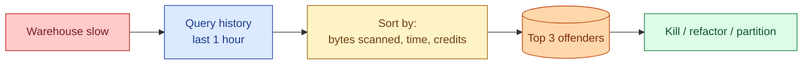

The whole warehouse is slow. Dashboards lag. Pipelines miss SLA. The reason is almost always one or two queries that drank all the compute. Finding them in under five minutes is a real skill that separates seniors from juniors when the on-call phone rings.

**What this page will cover.**

- The 3 queries to memorise: top by bytes scanned, top by total time, top by credits / DBU.
- The "scan less" principle: partition pruning, columnar projection, filter pushdown.
- Recognising the patterns: cartesian join, missing `WHERE`, `SELECT *` in a 100-column table.
- Concurrency vs query cost: sometimes the fix is a separate warehouse, not query tuning.
- The 80/20 rule: 5% of queries usually account for 80% of cost. Find those 5%.
- The honest 2026 take: a weekly slow-query review session pays for itself in a month.

*Page coming soon. Until then, see [#096 The twenty-minute query that should be two seconds](/practice/data-engineering/096-the-twenty-minute-query-that-should-be-two-seconds/) for the practice problem.*

This concept sits in **Stage 6 (Reliability, debugging, cost)** of the [Data Engineering Roadmap](/practice/data-engineering/roadmap/).
