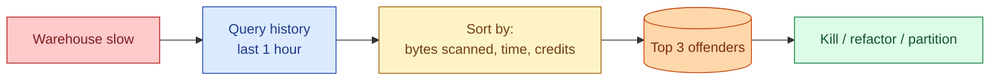
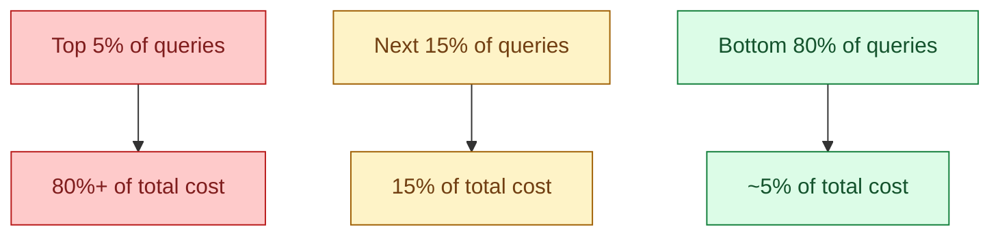
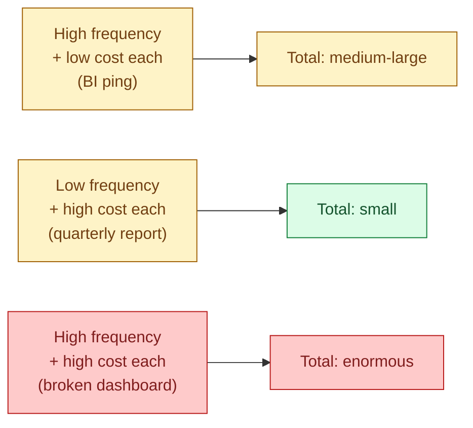

The whole warehouse is slow. Dashboards lag. Pipelines miss SLA. The reason is almost always one or two queries that drank all the compute. Finding them in under five minutes is a real skill that separates seniors from juniors when the on-call phone rings.

## The triage flow



Five-minute drill: open query history, sort by the right column, look at the top three. That is usually all it takes.

## The 80/20 of warehouse cost

In every warehouse I have ever audited, the same pattern holds: 5% of queries account for 70-90% of cost. Most queries are cheap. A handful are enormous. The job of slow-query attribution is finding those few.



This shape is why "optimise every query" is the wrong strategy. Find the top 5%, fix those, move on. The other 95% are not worth the engineering time.

## Three queries to memorise

For Snowflake. Equivalent versions exist for BigQuery (`INFORMATION_SCHEMA.JOBS`) and Databricks (`system.query.history`).

**Top by bytes scanned (last hour).**

```sql
SELECT
  query_id,
  user_name,
  warehouse_name,
  bytes_scanned / 1024 / 1024 / 1024 AS gb_scanned,
  total_elapsed_time / 1000 AS seconds,
  LEFT(query_text, 200) AS sql_preview
FROM snowflake.account_usage.query_history
WHERE start_time >= DATEADD(hour, -1, CURRENT_TIMESTAMP)
ORDER BY bytes_scanned DESC
LIMIT 20;
```

**Top by elapsed time (currently running).**

```sql
SELECT
  query_id,
  user_name,
  warehouse_name,
  TIMESTAMPDIFF(SECOND, start_time, CURRENT_TIMESTAMP) AS running_seconds,
  LEFT(query_text, 200) AS sql_preview
FROM snowflake.account_usage.query_history
WHERE execution_status = 'RUNNING'
ORDER BY start_time ASC
LIMIT 20;
```

**Top by credits burned (last day).**

```sql
SELECT
  query_id,
  user_name,
  warehouse_size,
  (execution_time / 1000 / 60 / 60) * warehouse_size_credits AS credits,
  LEFT(query_text, 200) AS sql_preview
FROM snowflake.account_usage.query_history
WHERE start_time >= DATEADD(day, -1, CURRENT_TIMESTAMP)
ORDER BY credits DESC
LIMIT 20;
```

Three queries, three angles. Bytes scanned is the BigQuery-style metric (cost-per-byte). Elapsed time finds the runaway. Credits is the real-money rollup.

## A worked incident

Tuesday morning. Dashboards across the company are 4x slower than usual. The on-call opens the "top by credits in the last hour" query.

```text
query_id          user        warehouse_size  credits  sql_preview
abc123            etl_user    LARGE           182      SELECT * FROM raw.events
def456            etl_user    LARGE           34       INSERT INTO marts.fact_revenue ...
ghi789            analyst_jo  MEDIUM          21       SELECT region, SUM(amount) ...
```

The top row stands out. 182 credits for one query, running on a Large warehouse. The SQL preview shows `SELECT * FROM raw.events`. No filter. The user is `etl_user`, which is a service account. Someone wrote an ad-hoc one-off and accidentally pointed it at the biggest table without a `WHERE` clause. Kill it (or wait, then refactor the script).

Total triage time: 2 minutes. The same incident without the query is 45 minutes of "is it a dashboard? a pipeline? a join? did something fail?"

## The patterns to recognise

The expensive queries fall into a small number of shapes.

| Pattern | What it looks like | The fix |
|---|---|---|
| **Cartesian join** | Two tables joined with no `ON` clause, or `ON 1=1`. Output rows are billions. | Add the join key. |
| **Missing WHERE on partitioned table** | `SELECT ... FROM events` against a 10 TB partitioned table | Filter on the partition column. See [#056](/practice/data-engineering/concepts/056-partition-for-cost/). |
| **SELECT \* on a wide table** | 100-column Parquet table, query needs 3 columns | List the columns. Stops the engine reading the other 97. |
| **Repeated subquery instead of CTE** | The same expensive subquery referenced 5 times in one SQL statement | CTE or temp table once, reuse. |
| **String function on partition column** | `WHERE SUBSTR(event_date, 1, 7) = '2026-06'` | Rewrite as a range filter. The function disables pruning. |
| **High-frequency dashboard refresh** | Same query every 30 seconds, results unchanged for hours | Cache. Lower the refresh rate. |

When you see one of these in the top 5, you know what to do.

## The heatmap pattern: cost vs frequency

A single expensive query is bad. A medium-cost query that runs 10,000 times a day is worse. The way to see both is a heatmap of cost-per-execution times execution-count.



The right metric is `cost × frequency`. Group queries by a query fingerprint (hash of the SQL with literals removed), then rank by total cost across all executions.

```sql
SELECT
  MD5(REGEXP_REPLACE(query_text, '\\d+', 'N')) AS fingerprint,
  COUNT(*)                                AS executions,
  AVG(bytes_scanned) / 1024 / 1024 / 1024 AS avg_gb,
  SUM(bytes_scanned) / 1024 / 1024 / 1024 AS total_gb,
  ANY_VALUE(LEFT(query_text, 200))        AS sample_sql
FROM snowflake.account_usage.query_history
WHERE start_time >= DATEADD(day, -7, CURRENT_TIMESTAMP)
GROUP BY fingerprint
ORDER BY total_gb DESC
LIMIT 20;
```

This pulls the high-frequency cheap queries into focus. They never show up on a "top single query" report, but their cumulative cost is often the largest line item.

## Concurrency vs query cost

Sometimes the warehouse is slow not because one query is expensive but because 80 queries are competing for the same warehouse. The fix is not query tuning, it is splitting the workload across warehouses.

A useful diagnostic: count concurrent running queries per warehouse over the last hour. If the concurrent count regularly exceeds `max_concurrency_level`, the queries are queuing. The fix is a multi-cluster warehouse (see [#058 Compute autoscaling](/practice/data-engineering/concepts/058-compute-autoscaling/)) or a separate warehouse for batch jobs.

## Common mistakes

- **Optimising the wrong queries.** If a query costs $0.02 and you spend an hour rewriting it, you have lost money. Start at the top of the leaderboard.
- **Killing a long-running query without checking what it is.** Sometimes that 4-hour query is the only thing standing between you and a missed monthly close.
- **Ignoring high-frequency cheap queries.** They do not show up on single-query reports. Use fingerprints to find them.
- **Confusing slow with expensive.** A query can be slow because the warehouse is busy, not because the query itself is bad. Check concurrency before tuning.
- **Forgetting metadata / cloud services cost.** In Snowflake, cloud services credits are 10% of the bill in many accounts. They count.
- **No weekly review.** Without a recurring meeting where someone owns "the top 10 expensive queries this week", the same queries reappear month after month.
- **Tuning in isolation.** A query that scans 5 TB might be a symptom of a model that was never partitioned. Fix the model, not the query.

## Quick recap

- 5% of queries account for 80%+ of cost in almost every warehouse. Find those 5%.
- Three queries to memorise: top by bytes scanned, top by elapsed time, top by credits.
- The patterns are small: cartesian join, missing partition filter, `SELECT *`, repeated subquery, function-on-partition.
- Fingerprint queries to catch the high-frequency cheap ones that hide in single-query reports.
- A slow warehouse can be a single expensive query or many queries competing for compute. Diagnose before tuning.
- A weekly slow-query review meeting is the cheapest cost-control mechanism on the platform.

This concept sits in **Stage 6 (Reliability, debugging, cost)** of the [Data Engineering Roadmap](/practice/data-engineering/roadmap/).
