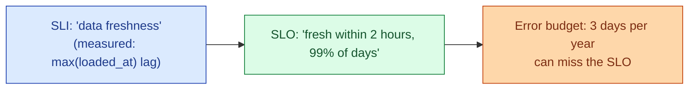

In software, an SLI is what you measure (latency, error rate). An SLO is the target (99.9% of requests under 300ms). An error budget is what is left (0.1% can be late or wrong). For data, the same vocabulary applies but the SLIs are different: freshness, completeness, accuracy. The data team has not adopted this as widely as it should.

**What this page will cover.**

- The three SLI categories that fit data: freshness, completeness (no rows missing), accuracy (no rows wrong).
- Picking an SLO that matches user expectations, not an aspirational round number.
- The error budget conversation: when you run out, you slow down on features and harden the pipeline.
- The "burn rate" alert: 14-day window vs 1-hour window for fast vs slow burns.
- Why every dashboard owner should be told the SLO for the data behind it.
- The cross-link to [SD #077 SLI, SLO, SLA, and error budgets](/practice/system-design/concepts/077-sli-slo-sla-error-budgets/) for the general framing.

*Page coming soon.*

This concept sits in **Stage 6 (Reliability, debugging, cost)** of the [Data Engineering Roadmap](/practice/data-engineering/roadmap/).
