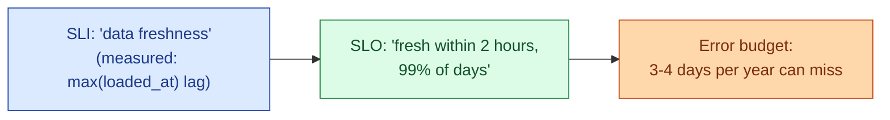
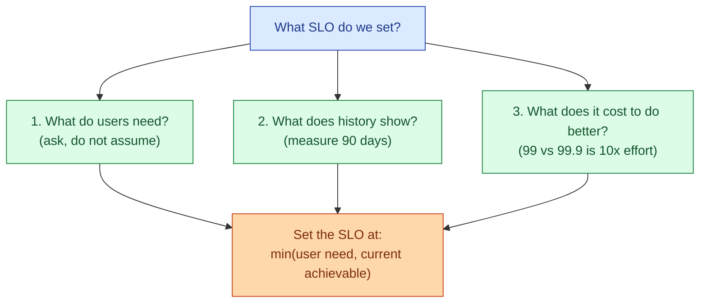
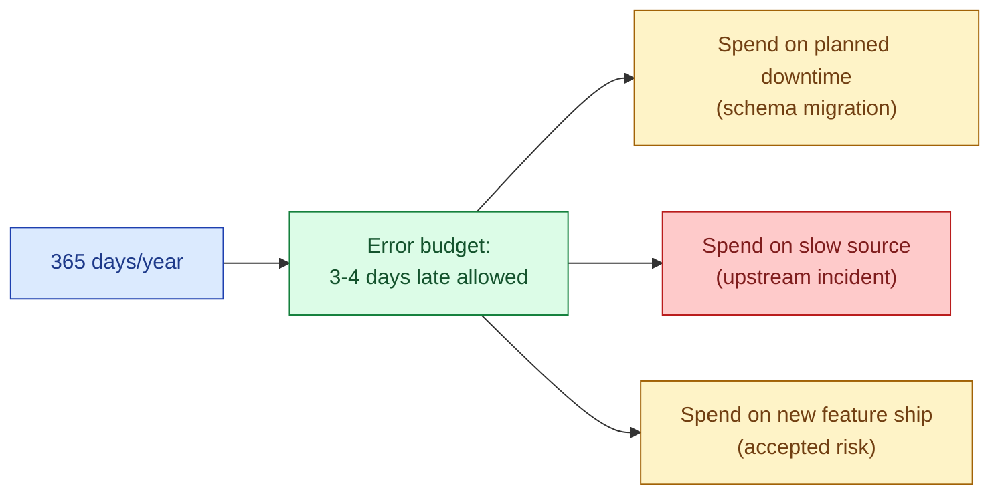

In software, an SLI is what you measure (latency, error rate). An SLO is the target (99.9% of requests under 300ms). An error budget is what is left (0.1% can be late or wrong). For data, the same vocabulary applies but the SLIs are different: freshness, completeness, accuracy. The data team has not adopted this as widely as it should.

## The three layers



SLI is the number on the dashboard. SLO is the line on the dashboard you do not want to cross. Error budget is how often you are allowed to cross it before something happens (engineering work shifts from features to reliability).

## The data SLI categories

Three types cover most pipelines.

| Category | SLI | Example |
|---|---|---|
| **Freshness** | Time since the newest row | `fact_orders` is fresh if `max(loaded_at)` is within 2 hours |
| **Completeness** | Rows present vs expected | `fact_events` should have at least 100k rows per hour, no gaps |
| **Accuracy** | Rows that pass a correctness check | 99.9% of orders match the source system row-for-row |

Freshness is the easiest to measure and the most useful day-to-day. Completeness catches partial loads. Accuracy catches the "schema is fine, volume is fine, but the numbers are wrong" case and is the hardest to compute cheaply.

## Picking the SLO

The biggest mistake teams make: pick an aspirational round number (99.9%, four nines) without checking what users actually need or what the pipeline can actually deliver.



If marketing only checks the dashboard once a day at 10am, the freshness SLO is "fresh by 9am, 95% of days." Not 99.9%. The SLO matches the use case.

If the pipeline historically hits the target 92% of days, do not commit to 99% on Monday. Commit to 95%, get there reliably, then ratchet up. SLOs that are violated routinely teach the team to ignore alerts.

## Error budget in practice

If the SLO is "99% of days fresh by 9am", the error budget is 1% of days, which is about 3-4 days per year. That budget is real. It can be spent.



If the budget is spent (3+ misses in a quarter on a 99% SLO), the team stops shipping new pipelines and works on reliability until the budget recovers. This is the contract the SRE world uses, and it works just as well for data.

The reverse: if the budget is barely touched after 6 months, the SLO is too lax. Tighten it.

## The burn rate alert

A single missed day does not trigger anything. But burning through the entire monthly budget in one day is an emergency. Burn-rate alerts compare current consumption to total budget over multiple windows.

| Window | Alert if budget burned at... | Meaning |
|---|---|---|
| **1 hour** | 14x the steady rate | Fast burn, page the on-call |
| **6 hours** | 6x the steady rate | Sustained issue, ticket |
| **3 days** | 1x the steady rate | Slow burn, weekly review |

The two-window pattern (fast and slow) avoids two failure modes. The 1-hour window catches genuine emergencies. The 3-day window catches chronic underperformance that no single hour would flag.

## The "we have no control over the source" pushback

Every data team objects to SLOs the first time. "The Postgres replica is slow, the Kafka cluster fails, the SaaS API rate-limits us. We do not control any of it. How can we commit?"

The answer is two-part.

**Part 1.** You do control the pipeline, the retries, the alerting, the fallback. A flaky source plus good pipeline design produces good freshness. A reliable source plus a broken pipeline produces bad freshness. The SLO measures the user-visible outcome, not the source.

**Part 2.** When the source is the problem, the error budget gets spent and the team's engineering time shifts. That is the point. If you keep burning budget on a flaky source, the answer is not "lower the SLO" but "fix the source or replace it." The budget gives you the political ammunition for that conversation.

## A working freshness SLI

Schedule this hourly. Write the result to a tracking table. The tracking table is the SLI history.

```sql
INSERT INTO ops.freshness_sli
SELECT
  CURRENT_TIMESTAMP                                AS check_at,
  'fact_orders'                                    AS table_name,
  120                                              AS sla_minutes,
  MAX(loaded_at)                                   AS newest_row,
  TIMESTAMPDIFF(MINUTE, MAX(loaded_at), CURRENT_TIMESTAMP) AS lag_minutes,
  CASE
    WHEN TIMESTAMPDIFF(MINUTE, MAX(loaded_at), CURRENT_TIMESTAMP) <= 120
    THEN 1 ELSE 0
  END                                              AS within_sla
FROM analytics.fact_orders;
```

Then the SLO rollup is trivial:

```sql
SELECT
  table_name,
  COUNT(*) AS checks,
  SUM(within_sla) AS passes,
  SUM(within_sla)::float / COUNT(*) AS sli
FROM ops.freshness_sli
WHERE check_at >= DATEADD(day, -30, CURRENT_TIMESTAMP)
GROUP BY table_name;
```

If `sli` is `0.987`, the table is hitting 98.7% of checks. If the SLO is 99%, the budget is being burned. If the SLO is 95%, there is room.

## Communicating SLOs

Every dashboard owner should know the SLO of the data behind it. Print it on the dashboard. "Data is fresh by 09:00, 99% of days. If you are seeing stale data, check #data-incidents." This sets the user's expectation correctly and stops the "why is this dashboard old" Slack pings during the 1% of days when the SLO is exhausted.

For the broader SRE framing of this vocabulary, see [SD #077 SLI, SLO, SLA, and error budgets](/practice/system-design/concepts/077-sli-slo-sla-error-budgets/).

## Common mistakes

- **Picking 99.9% because it sounds good.** Match the SLO to the actual user need and the historical baseline. Round numbers are not magic.
- **Setting an SLO you cannot measure.** "Accuracy 99.99%" is not an SLO if no one is running the correctness checks. The measurement comes first.
- **No error budget conversation.** An SLO without a budget is just a number on a wiki. The budget is what changes engineering priorities.
- **Alerting on every miss.** Alert on burn rate, not on individual misses. A single late day is normal. Burning a month's budget in an hour is not.
- **Hiding the SLO from dashboard users.** They will keep paging the team during expected outages if they do not know what was promised.
- **Treating the SLO as a soft target.** If the team treats it as aspirational, it becomes irrelevant. Either the budget is real or the SLO is theatre.
- **No regular review.** Re-evaluate every SLO quarterly. User needs change. So should the targets.

## Quick recap

- SLI is what you measure. SLO is the target. Error budget is what you are allowed to miss.
- The three data SLI categories: freshness, completeness, accuracy. Start with freshness, it is easiest and most useful.
- Pick SLOs from user need and historical baseline, not from round numbers.
- Burn-rate alerts (fast + slow window) beat "page on every miss."
- The "we do not control the source" pushback is a signal to fix the source, not to lower the SLO.
- Publish the SLO where users can see it. Reset user expectations once instead of explaining the same outage 40 times.

This concept sits in **Stage 6 (Reliability, debugging, cost)** of the [Data Engineering Roadmap](/practice/data-engineering/roadmap/).
