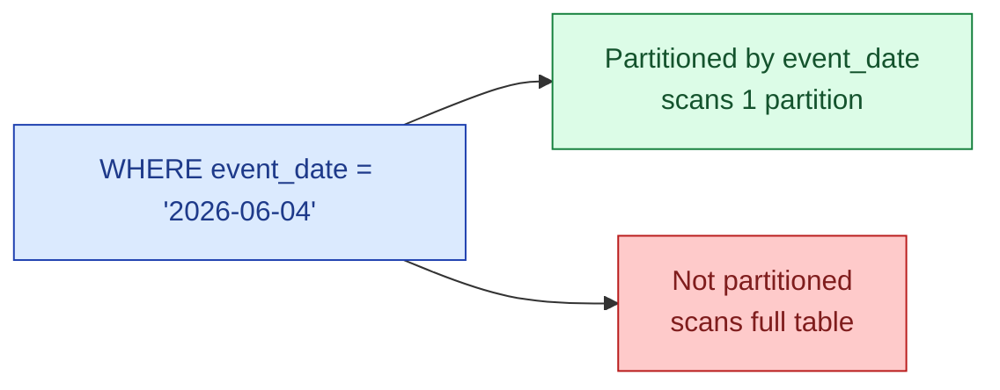
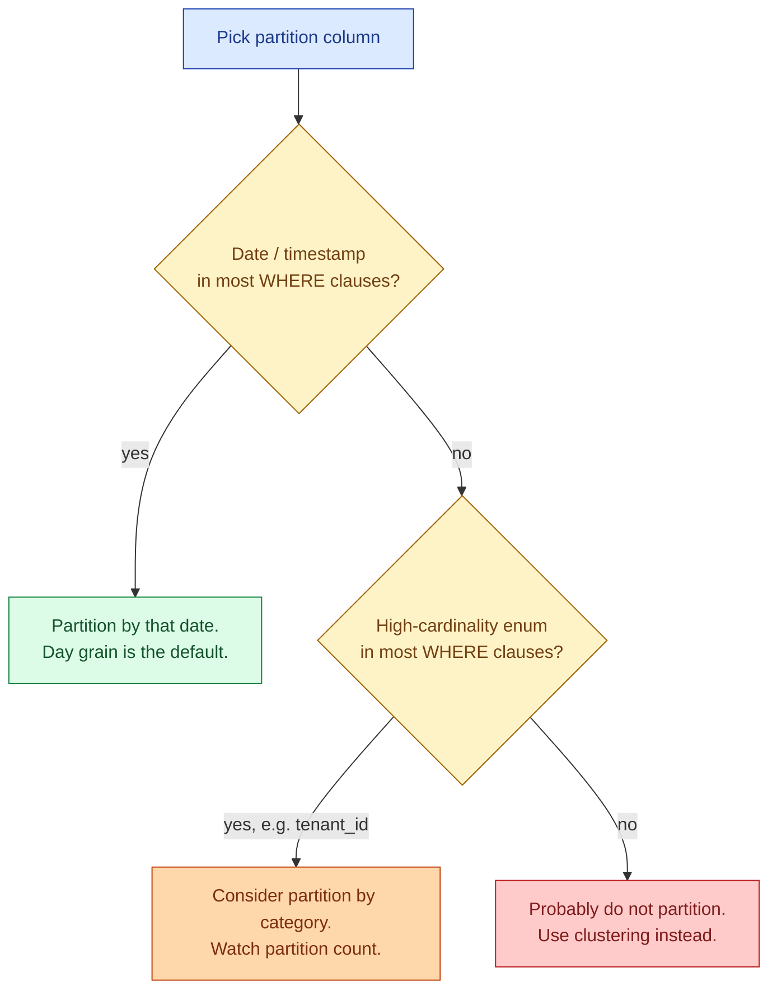

Partitioning is sold as a performance feature. The real win is cost. A query that filters `WHERE event_date = '2026-06-04'` on a partitioned table scans one day. The same query without partitioning scans the whole table. In BigQuery, Snowflake, Databricks SQL, all per-byte-scanned billing, that is the difference between 5 cents and 5 dollars on a single query.

## The pruning picture



On a 2-year fact table partitioned by day, a one-day query reads 1/730th of the data. Same SQL, same answer, ~730x cheaper. That single lever is the largest cost reduction available in a cloud warehouse.

## Picking the partition column

The rule: partition on the column your `WHERE` clauses already use. For 90% of analytics tables, that is a date. Order date, event date, ingestion date.



Day grain is almost always right. Hourly partitioning produces 24x more partitions for small queries to skip but creates metadata overhead. Monthly partitioning produces too few partitions, so a one-day query still scans the whole month.

A useful cap: aim for under 4,000 partitions per table. BigQuery hard-caps at 4,000. Snowflake has no hard cap but performance degrades. 4 years of daily data is about 1,460 partitions, well under the limit.

## The query that breaks pruning

The single most common bug. Functions applied to the partition column disable pruning.

```sql
-- works: scans 1 day
SELECT SUM(amount)
FROM orders
WHERE order_date = '2026-06-04';

-- breaks pruning: function on the partition column,
-- engine cannot prove which partition matches without evaluating per row
SELECT SUM(amount)
FROM orders
WHERE DATE_TRUNC('day', order_date) = '2026-06-04';

-- breaks pruning: cast on the partition column
SELECT SUM(amount)
FROM orders
WHERE CAST(order_date AS STRING) LIKE '2026-06%';

-- works again: rewrite as a range
SELECT SUM(amount)
FROM orders
WHERE order_date >= '2026-06-01'
  AND order_date <  '2026-07-01';
```

The rule: never wrap the partition column in a function in the `WHERE` clause. If you need a transformation, apply it to the literal on the other side of the comparison.

## A worked cost calculation

`events` table: 2 years of data, ~50 GB per day, ~36 TB total. BigQuery on-demand pricing: $6.25 per TB scanned.

| Query shape | Bytes scanned | Cost per run |
|---|---|---|
| Full table scan (no partitioning, no filter) | 36 TB | $225 |
| Full table scan (partitioned but filter has function) | 36 TB | $225 |
| 30-day window, partitioned | 1.5 TB | $9.40 |
| 1-day window, partitioned | 50 GB | $0.31 |
| 1-day window, partitioned + columns projected | 5 GB | $0.03 |

The last row is 7,500x cheaper than the first. Same dashboard, same answer. The only differences: partition by day, filter on the partition column, list the columns you actually need.

A single dashboard refreshing every 15 minutes for a month, at row 1, costs $648,000. At row 5, $86. This is not a hypothetical. Mistakes like row 1 happen in real warehouses.

## Enforcing partition filters

BigQuery has the killer feature: `require_partition_filter`. The table refuses to run a query that has no partition filter.

```sql
CREATE TABLE events
PARTITION BY DATE(event_timestamp)
OPTIONS (
  require_partition_filter = true
);

-- this query fails with an explicit error:
SELECT COUNT(*) FROM events;
-- Cannot query over table 'events' without a filter over column(s)
-- 'event_timestamp' that can be used for partition elimination
```

Turn this on for any table above ~1 TB. It transforms the most expensive cost mistake (full-table scan by accident) into a compile-time error. Snowflake does not have a direct equivalent; the best substitute is a row-access policy or a view that enforces a filter.

## dbt config in one line

Turning partitioning on for an incremental model is one config block.


```sql
-- models/marts/fact_events.sql
{{ config(
    materialized='incremental',
    partition_by={'field': 'event_date', 'data_type': 'date', 'granularity': 'day'},
    require_partition_filter=true,
    incremental_strategy='insert_overwrite'
) }}

SELECT
  event_date,
  user_id,
  event_name,
  payload
FROM {{ ref('stg_events') }}

WHERE event_date >= DATE_SUB(CURRENT_DATE, INTERVAL 3 DAY)

```


The `insert_overwrite` strategy combined with daily partitions gives you the cheapest incremental load shape: dbt rebuilds only the last N days, overwrites those partitions, leaves the rest untouched.

## When partitioning hurts

Partitioning is not free. The cases where it backfires.

- **Tiny tables.** A 100 MB table does not benefit from partitioning. The metadata overhead exceeds the scan savings.
- **Too-granular partitions.** Hour-grain on a low-volume table produces 8,760 partitions per year, most of them tiny. Metadata cost dominates.
- **Streaming ingest of one row at a time.** Each insert touches one partition. With per-second inserts and day partitions, fine. With per-second inserts and second partitions, the metadata cost kills the warehouse.
- **Queries that never filter on the partition column.** If every query is `WHERE user_id = ?`, partitioning by date does nothing. Cluster by `user_id` instead.

The check: if the typical query scans the whole table anyway, partitioning is wasted complexity.

## Snowflake's micro-partitions

Snowflake automatically slices every table into ~16 MB micro-partitions and tracks min/max per column on each. You do not declare a partition column. The closest thing to declared partitioning is the `CLUSTER BY` clause, which influences how Snowflake organises micro-partitions during automatic clustering.

The effect is similar to explicit partitioning: a query with a selective `WHERE` prunes most micro-partitions. The trap is the same: a function on the clustered column disables pruning.

## Common mistakes

- **Partition by month, then complain about cost.** The grain is too coarse for daily queries. Day grain is the default for a reason.
- **Partition by hour because "more is better."** It is not. 8,760 partitions per year is metadata-heavy without saving scan bytes for typical day-range queries.
- **Functions on the partition column.** `DATE_TRUNC(col)`, `CAST(col)`, `COALESCE(col, ...)` all disable pruning. Rewrite the predicate.
- **No `require_partition_filter`.** Turn it on. A single accidental full scan can cost more than a month of normal use.
- **Picking the wrong partition column.** Partition on the column the `WHERE` actually uses. Order-creation date and event-arrival date are different; pick the one queries filter on.
- **Partitioning a tiny table.** The overhead is real. Below ~1 GB, do not bother.
- **Forgetting to partition the incremental model and the historic backfill identically.** A reload of history without the partition spec rebuilds the table without partitioning. Always check the table definition after a `--full-refresh`.

## Quick recap

- Partitioning is the single biggest cost lever in cloud warehouses. The right column cuts the bill by an order of magnitude.
- Pick the column your `WHERE` clauses already use. For analytics, it is almost always a date at day grain.
- Functions on the partition column disable pruning. Rewrite as range filters on the raw column.
- Turn on `require_partition_filter` on any large table. It turns the worst cost mistake into a compile error.
- dbt config makes partitioned incremental models one block of YAML.
- Below ~1 GB and on tables never filtered on the partition column, partitioning hurts more than it helps.

This concept sits in **Stage 6 (Reliability, debugging, cost)** of the [Data Engineering Roadmap](/practice/data-engineering/roadmap/).
