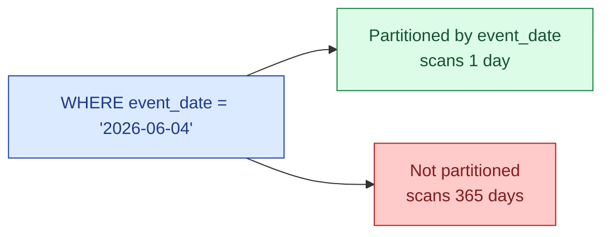

Partitioning is sold as a performance feature. The real win is cost. A query that filters `WHERE event_date = '2026-06-04'` on a partitioned table scans one day. The same query without partitioning scans the whole table. In BigQuery, Snowflake, Databricks SQL — all per-byte-scanned billing — that is the difference between 5 cents and 5 dollars.

**What this page will cover.**

- Picking the partition column: the one your `WHERE` clauses already use.
- Granularity: day vs hour vs month. Day is the universal default.
- The "30-day query, partitioned by day" math: 30 partitions instead of 365 or 730.
- When partitioning hurts cost: tiny tables, too-granular partitions, ingesting one row at a time.
- BigQuery's `_PARTITIONTIME` shortcut and Snowflake's automatic micro-partitioning.
- The dbt config that turns partitioning on for an incremental model in one line.

*Page coming soon. Until then, see [#006 Partitioning vs clustering in BigQuery](/practice/data-engineering/006-partitioning-vs-clustering-in-bigquery/) for the practice problem.*

This concept sits in **Stage 6 (Reliability, debugging, cost)** of the [Data Engineering Roadmap](/practice/data-engineering/roadmap/).
