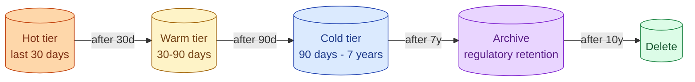
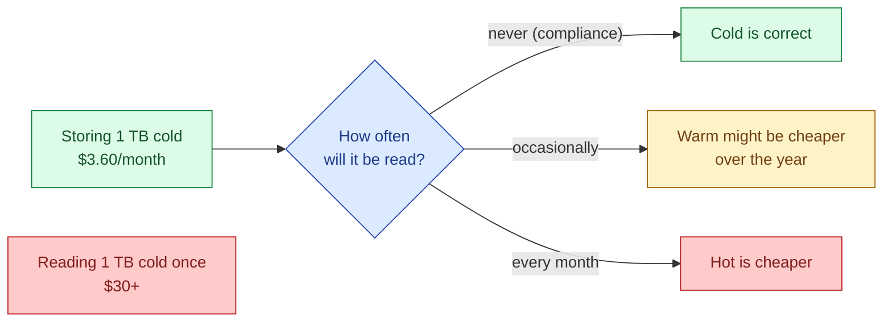
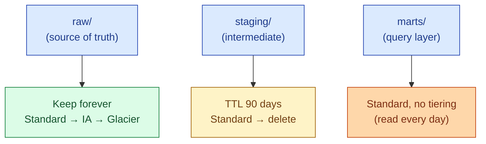

Object storage has multiple price tiers. Hot storage (S3 Standard) is fast and costs the most. Cold storage (Glacier, Archive) is cheap and takes minutes to hours to read. Picking the right tier per dataset and writing a lifecycle policy is one of the easiest wins on a warehouse bill that has grown over time.

## The four tiers

| Tier | Read latency | Storage $/GB/mo | Retrieval cost | Where it fits |
|---|---|---|---|---|
| **Hot** (S3 Standard) | Milliseconds | ~$0.023 | Free | Active queries, dashboards |
| **Warm** (S3 Standard-IA, Nearline) | Milliseconds | ~$0.0125 | Per-GB read fee | Less frequent access, 30-90 days |
| **Cold** (Glacier Flexible, Coldline) | Minutes to hours | ~$0.0036 | Higher per-GB read fee | Compliance, > 90 days |
| **Archive** (Glacier Deep Archive) | 12+ hours | ~$0.00099 | Highest per-GB read fee | Legal hold, regulatory retention |

Numbers are approximate AWS US-East at the time of writing. GCS and Azure tiers map similarly. The exact prices change; the shape of the trade does not.

## The lifecycle picture



The shape: each tier covers a range of ages. Objects move automatically, not by hand. The lifecycle policy is the rule that does the moving.

## The cost math

A real example. 50 TB of event logs growing 10 TB per year.

| Strategy | Hot $/mo | Warm $/mo | Cold $/mo | Total $/mo |
|---|---|---|---|---|
| All in S3 Standard | $1,150 | - | - | **$1,150** |
| 5 TB hot, 45 TB cold | $115 | - | $162 | **$277** |
| 5 TB hot, 10 TB warm, 35 TB cold | $115 | $125 | $126 | **$366** |

The middle row is 76% cheaper than the top. The bottom row is more expensive than the middle because warm storage between hot and cold often makes the bill worse, not better. Pick the tier transitions carefully.

Warm tier earns its keep when objects are read occasionally during the window. If the access pattern is "writes, then nothing, then maybe a query in 6 months", skip warm and go straight from hot to cold.

## The retrieval cost trap

Cold storage is cheap to keep. It is not cheap to read. AWS Glacier Flexible Retrieval charges around $0.03/GB to retrieve plus a per-request fee. Reading 1 TB of cold data once costs roughly $30 plus request fees.



The break-even: if a 1 TB dataset is read more than about once every 8 months, cold tier is actually more expensive than hot. Move data to cold only when you expect zero or near-zero reads.

## A working lifecycle policy

S3 lifecycle rules are declarative. The whole rule fits in JSON.

```json
{
  "Rules": [
    {
      "ID": "event-logs-tiering",
      "Status": "Enabled",
      "Filter": { "Prefix": "events/" },
      "Transitions": [
        { "Days": 30, "StorageClass": "STANDARD_IA" },
        { "Days": 90, "StorageClass": "GLACIER_IR" },
        { "Days": 365, "StorageClass": "DEEP_ARCHIVE" }
      ],
      "Expiration": { "Days": 2555 }
    }
  ]
}
```

The rule: after 30 days move to Infrequent Access, after 90 days to Glacier Instant Retrieval, after 1 year to Deep Archive, delete after 7 years. AWS moves the objects automatically. Set it once, save money forever.

The same applies on GCS via Object Lifecycle Management and on Azure via Storage Lifecycle Management. The vocabulary differs; the mechanism is identical.

## Intelligent tiering

S3 Intelligent-Tiering is AWS's "do not think about it" option. You put objects in one storage class; S3 watches the access pattern and automatically moves them between hot, warm, and cold internal tiers. There is a small monitoring fee per object per month.

When it is the right choice: access patterns you do not understand or that change over time. New data lake, unclear which datasets get read.

When explicit lifecycle wins: known access patterns, large objects, predictable cost. The monitoring fee adds up on billions of small objects.

## The data platform decision

For most platforms the recipe is the same.



- **Raw layer**: keep forever. Tier aggressively. You rarely read 2-year-old raw data, but compliance and reprocessing demand you keep it.
- **Staging layer**: delete with TTL. Staging is rebuildable from raw. Three months is usually enough.
- **Marts layer**: stay hot. Queried every day. Tiering would slow dashboards without saving meaningful money.

Most cost wins come from the raw layer. That is where the bytes are.

## Compliance and right-to-delete

Storage tiers complicate GDPR-style deletion. If a user requests deletion and their data is in Deep Archive, you owe them a deletion within the regulatory window but Glacier retrievals take hours. The fix: keep PII in a separate prefix with shorter tiering, or use Glacier's bulk delete operations which do not require retrieval first.

Some regulated industries require archives to be immutable (write-once-read-many). S3 Object Lock and Glacier Vault Lock provide this. Turn it on when the auditor asks; do not turn it on by default because once locked you cannot delete even if you wanted to.

## Common mistakes

- **Sending every byte to Glacier.** Cheap to store, expensive to read. If anyone queries the data once a quarter, Glacier is the wrong tier.
- **No lifecycle policy at all.** Every byte stays in Standard forever. The bill grows linearly with retention. The fix is one JSON file.
- **Tiering the marts layer.** Active dashboards reading from cold storage are slow and expensive. Marts stay hot.
- **Mixing PII into a tiered prefix without thinking about deletion.** GDPR plus 12-hour Deep Archive retrieval is a bad combination during an audit.
- **Forgetting per-request and minimum-storage-duration fees.** Glacier charges per object retrieval and bills a minimum 90 or 180 days of storage even if the object is deleted earlier. Lots of small objects burn this fee.
- **Using Intelligent-Tiering for tiny files.** The per-object monitoring fee can exceed the storage savings on billions of < 1 KB objects.
- **No retention policy.** Storage is cheap until it is 500 TB. Decide when raw data gets deleted. "Forever" is a choice you should make explicitly, not by default.

## Quick recap

- Four tiers: hot, warm, cold, archive. Each is roughly 3-10x cheaper than the one above it and slower to read.
- Lifecycle policies move objects between tiers automatically. One JSON rule, recurring savings.
- Cold storage is cheap to keep, expensive to read. Use it only for data you expect to read rarely or never.
- Raw layer benefits most from tiering. Marts layer should stay hot. Staging layer should be deleted.
- Intelligent-Tiering is the "no thinking" option, with a small per-object monitoring fee.
- Plan tiering and deletion together. GDPR and Glacier retrieval times do not mix well unless you design for it.

This concept sits in **Stage 6 (Reliability, debugging, cost)** of the [Data Engineering Roadmap](/practice/data-engineering/roadmap/).
