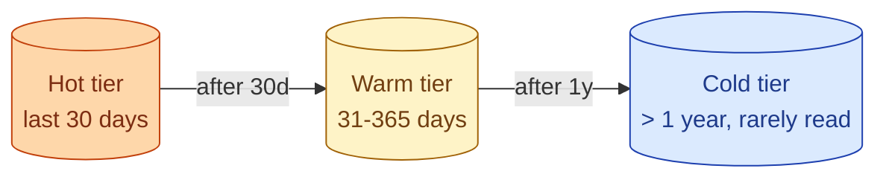

Object storage has multiple price tiers. Hot storage (S3 Standard) is fast and costs the most. Cold storage (S3 Glacier, Coldline) is cheap and takes minutes to hours to read. Picking the right tier per dataset and writing a lifecycle policy is one of the easiest wins on a warehouse bill that has grown over time.

| Tier | Read latency | Cost/GB | Where it fits |
|---|---|---|---|
| **Hot** (S3 Standard, GCS Standard) | Milliseconds | Highest | Active queries, dashboards |
| **Warm** (S3 Intelligent-Tiering, Nearline) | Milliseconds, but billed differently | Medium | Less frequent access |
| **Cold** (Glacier, Coldline, Archive) | Minutes to hours | Lowest | Regulatory, raw archives |

**What this page will cover.**

- The S3 / GCS / Azure tier table with current prices.
- Lifecycle policies that move objects automatically.
- The retrieval cost trap: cold storage is cheap to keep, expensive to read back.
- "Intelligent tiering" vs explicit lifecycle rules.
- The data-platform decision: keep raw forever, archive intermediates, never archive marts.
- The compliance angle: retention vs cost vs right-to-delete.

*Page coming soon.*

This concept sits in **Stage 6 (Reliability, debugging, cost)** of the [Data Engineering Roadmap](/practice/data-engineering/roadmap/).
