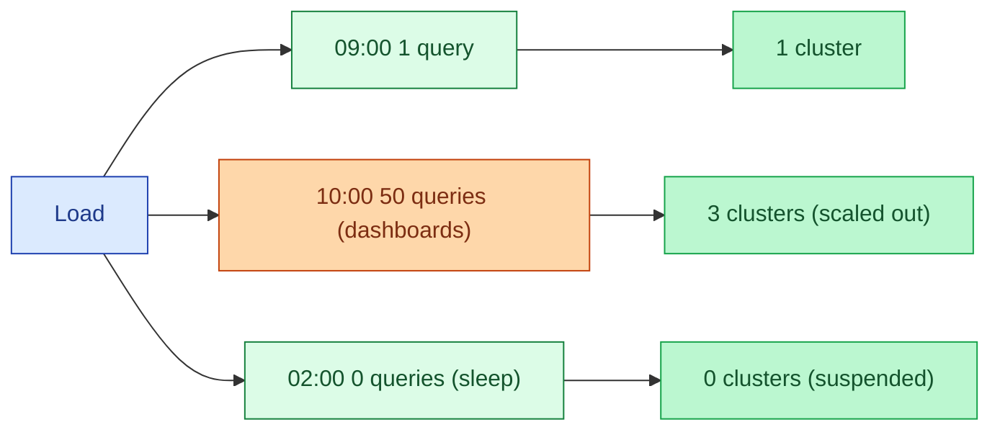

Modern warehouses charge per second of compute. Autoscaling spins up additional nodes when query load arrives and spins them down when it drops. Combined with auto-suspend (warehouse sleeps after N minutes idle), this is the difference between paying for a 24×7 cluster and paying for the seconds you actually use.

**What this page will cover.**

- Snowflake multi-cluster warehouses: how scale-out concurrency actually works.
- BigQuery slots, on-demand vs reservation, autoscaler.
- Databricks SQL Serverless: auto-start, auto-stop, auto-scale.
- The auto-suspend setting (60 seconds vs 5 minutes vs an hour) and what each costs.
- The "long-running query keeps the warehouse alive" trap.
- The honest take: enable autoscale + auto-suspend on day 1. Tighten later.

*Page coming soon.*

This concept sits in **Stage 6 (Reliability, debugging, cost)** of the [Data Engineering Roadmap](/practice/data-engineering/roadmap/).
