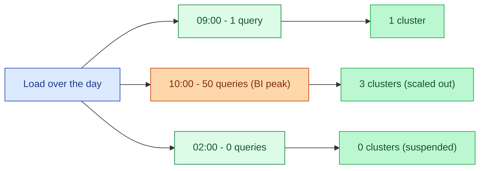
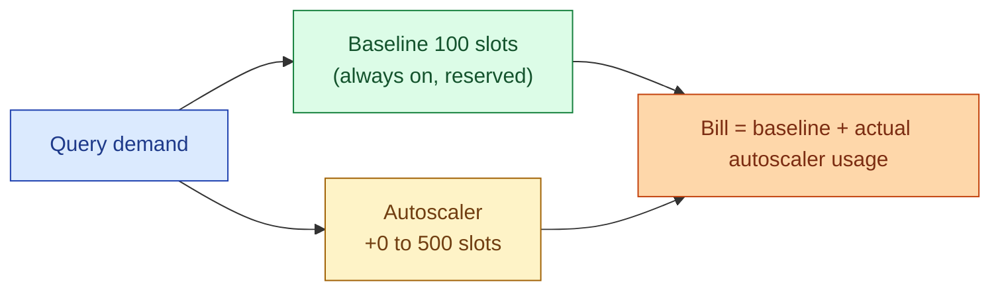
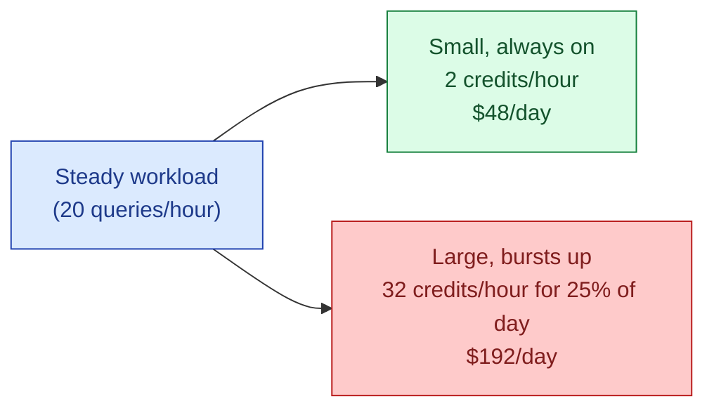

Modern warehouses charge per second of compute. Autoscaling spins up additional nodes when query load arrives and spins them down when it drops. Combined with auto-suspend (warehouse sleeps after N minutes idle), this is the difference between paying for a 24x7 cluster and paying for the seconds you actually use.

## The shape



Two different mechanisms in one picture: scale-out (add clusters during peak) and auto-suspend (drop to zero at night).

## Three flavours

| Mechanism | What scales | Trigger | Where it appears |
|---|---|---|---|
| **Multi-cluster** (scale-out) | Number of identical clusters | Concurrent queries queueing | Snowflake multi-cluster warehouse |
| **Slot autoscaler** | Pool of slots | Slot demand | BigQuery autoscaling reservations |
| **Cluster autoscaler** | Worker nodes inside one cluster | CPU or task pressure | Databricks job clusters, Spark on K8s |
| **Serverless** | Hidden, fully managed | Per-query | Databricks SQL Serverless, BigQuery on-demand |

The vocabulary is messy because each vendor invented its own. The underlying idea is the same: capacity follows demand, billing follows capacity.

## Snowflake multi-cluster warehouses

A multi-cluster warehouse defines a min and max number of identical clusters of a given size. Queries land on whichever cluster has spare slots. When all clusters are busy and a new query arrives, Snowflake starts another cluster (up to the max). When a cluster is idle for the auto-suspend window, it shuts down.

```sql
CREATE WAREHOUSE bi_warehouse
WITH
  WAREHOUSE_SIZE = 'MEDIUM'
  MIN_CLUSTER_COUNT = 1
  MAX_CLUSTER_COUNT = 4
  SCALING_POLICY = 'STANDARD'
  AUTO_SUSPEND = 60
  AUTO_RESUME = TRUE;
```

- `MIN_CLUSTER_COUNT = 1`: at least one cluster runs while the warehouse is awake.
- `MAX_CLUSTER_COUNT = 4`: under load, scale out to four identical mediums.
- `AUTO_SUSPEND = 60`: shut down everything 60 seconds after the last query.
- `AUTO_RESUME = TRUE`: wake automatically when a query arrives.

The `STANDARD` scaling policy adds clusters aggressively to keep queue times low. `ECONOMY` waits longer before adding a cluster, accepting some queue time in exchange for lower cost. For BI workloads, `STANDARD`. For batch, `ECONOMY`.

## BigQuery slots and the autoscaler

BigQuery's compute unit is a "slot." On-demand uses a shared pool with per-query slot allocation. Reservations let you buy a baseline plus an autoscaler that adds slots up to a ceiling when demand exceeds baseline.



The autoscaler bills in 1-minute increments and only for what it adds beyond the baseline. The Editions model (Standard, Enterprise, Enterprise Plus) bundles features with a per-slot-hour rate.

The trick: pick a baseline that covers your steady-state load, let the autoscaler handle bursts. A baseline that is too high wastes money during quiet hours. A baseline of zero means the autoscaler is always cold-starting, which hurts query latency.

## Databricks SQL warehouses

Databricks SQL Serverless and Pro warehouses both autoscale. A warehouse has a min and max cluster count and an auto-stop setting.

```hcl
resource "databricks_sql_endpoint" "bi" {
  name             = "bi_warehouse"
  cluster_size     = "Medium"
  min_num_clusters = 1
  max_num_clusters = 4
  auto_stop_mins   = 10
  enable_serverless_compute = true
}
```

Serverless removes the cold-start lag (clusters are warm in the Databricks-managed pool) at a premium per-DBU. Pro is cheaper but cold starts take 60-180 seconds. For interactive BI, serverless usually wins because users hate the cold-start wait. For scheduled batch, Pro is fine.

## Auto-suspend: the killer setting

Auto-suspend is the single highest-ROI setting on a cloud warehouse.

| Setting | Idle behaviour | Cost impact |
|---|---|---|
| `AUTO_SUSPEND = 60` (1 min) | Sleeps after 1 minute idle | Cheapest, more cold starts |
| `AUTO_SUSPEND = 300` (5 min) | Sleeps after 5 minutes | Default, balanced |
| `AUTO_SUSPEND = 3600` (1 hr) | Sleeps after 1 hour | Smooth UX, wasteful overnight |
| `AUTO_SUSPEND = 0` | Never sleeps | Highest cost, fastest queries |

A 24x7 medium warehouse at $0.50/credit/hour and 2 credits/hour costs ~$720/month. The same warehouse with `AUTO_SUSPEND = 60` and 4 hours of real query time per day costs ~$120/month. 6x cheaper, no perceptible UX difference for BI users (queries that arrive during sleep wait 1-3 seconds for the warehouse to wake up).

## Cluster autoscaler (Spark, Databricks job clusters)

Inside one cluster, the autoscaler grows and shrinks the worker count based on pending Spark tasks.

```python
{
  "spark.databricks.cluster.profile": "singleNode" ,
  "autoscale": {
    "min_workers": 2,
    "max_workers": 20
  },
  "autotermination_minutes": 30
}
```

Spark adds workers when the scheduler has pending stages with idle slots. It removes workers when they have been idle longer than the timeout. For long-running streaming jobs the autoscaler is less useful (the work is steady). For ETL with skewed stage sizes (small extract, large transform, small load), it can cut cost in half.

## Serverless: when there is no cluster

Serverless pricing charges per query or per second of actual compute, with no idle baseline. BigQuery on-demand, Snowflake's serverless tasks, Databricks SQL Serverless are all in this category.

The trade:

- **Serverless wins** for spiky, unpredictable workloads with long idle periods. No idle cost. Cold starts are usually hidden by warm pools.
- **Provisioned (with autoscale + auto-suspend) wins** for predictable steady-state workloads. The per-second rate is lower than serverless, the idle cost is bounded by auto-suspend.

The pattern most teams converge on: serverless for ad-hoc analyst queries, provisioned + autoscale for the BI warehouse and scheduled ETL.

## A surprising rule: small + always-on beats big + bursty

For steady continuous workloads, an always-on small warehouse often beats an autoscaled larger one. Here is why: a Medium is 4x the credits/hour of an XS. If the workload finishes in 1/3 the time on the Medium, the Medium costs 1.33x what the XS does. The XS is cheaper.



The bigger warehouse is faster per query, but the throughput-cost ratio is worse. Bigger only wins when a single query latency is the bottleneck (a single 4-hour overnight job that has to fit before 06:00 might justify XL).

## The long-running query trap

Auto-suspend triggers on idle time. A query that runs for 6 hours keeps the warehouse alive for those 6 hours, even if no other queries arrive. The fix is either to optimise the query or to run it on a separate, dedicated warehouse so the main BI warehouse can suspend.

## Common mistakes

- **Auto-suspend off "for performance."** Cold starts are 1-3 seconds. They are almost never the bottleneck. Turn auto-suspend on.
- **One enormous warehouse for everything.** ETL and BI on the same warehouse means BI users wait behind heavy batch jobs. Split warehouses.
- **Max cluster count = unlimited.** A runaway dashboard can scale you up to 10 clusters and burn thousands of credits before anyone notices. Set a cap.
- **Choosing Medium because "we might need it."** Start at XS or Small. Resize up when you can prove a single query needs it.
- **Treating serverless as "no cost."** Serverless has no idle cost. It still has plenty of per-query cost. A `SELECT * FROM 5TB_table` on serverless costs the same as on provisioned.
- **Forgetting that the autoscaler has a cold-start lag.** A scheduled pipeline that depends on the warehouse being ready may need a warm-up query 60 seconds before it runs.
- **Not measuring queue time.** If queries are queueing for more than a few seconds regularly, the scaling policy is too conservative or the max cluster count is too low.

## Quick recap

- Autoscaling matches compute to demand. Auto-suspend drops it to zero when idle.
- Snowflake multi-cluster, BigQuery slot autoscaler, Databricks SQL autoscale, cluster autoscaler all do versions of the same trick.
- Auto-suspend at 60 seconds is the highest-ROI setting on most warehouses. Turn it on.
- Serverless wins for spiky workloads with long idle gaps. Provisioned + autoscale wins for steady-state with predictable peaks.
- Small-always-on often beats big-bursty for continuous workloads. Match the size to throughput, not single-query latency.
- Split warehouses by workload type. ETL and BI should not compete for the same compute.

This concept sits in **Stage 6 (Reliability, debugging, cost)** of the [Data Engineering Roadmap](/practice/data-engineering/roadmap/).
