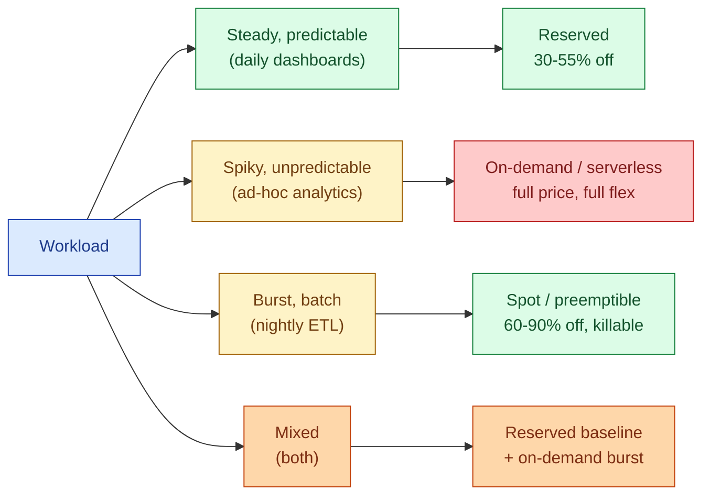
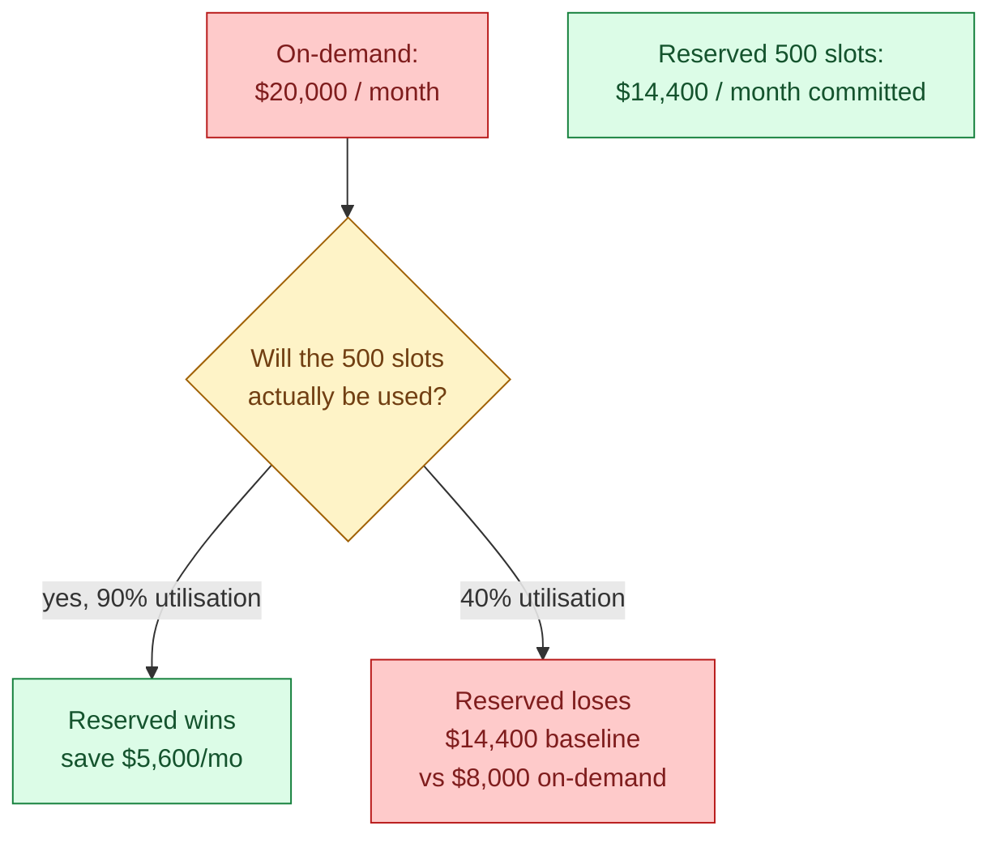
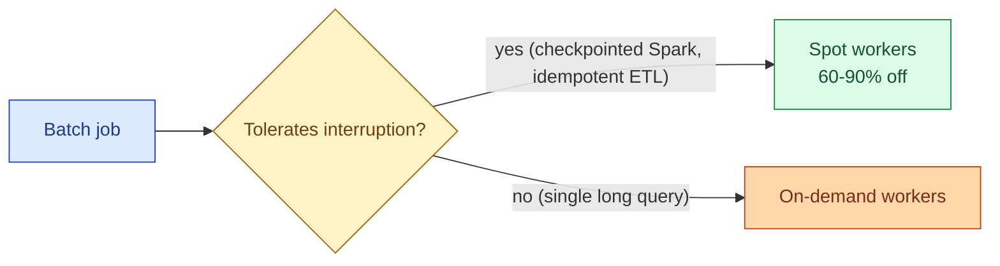
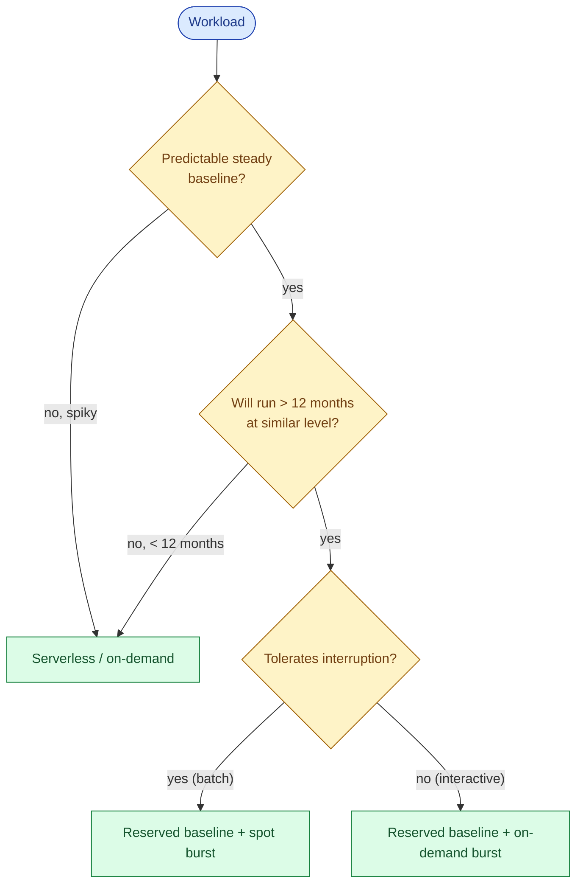

On-demand pricing charges per query, per second, per byte. Reserved capacity gives you a steep discount in exchange for a commitment (one year, three years). Spot/preemptible is cheap but can be killed any moment. Serverless is per-execution with no idle cost. Picking the right mix is a 30-50% bill difference for the same workload.

## The four pricing models

The decision tree starts with workload shape. Steady workloads commit. Spiky workloads pay on-demand. Batch jobs that can survive interruption use spot. Most platforms end up with a mix.

## Reserved capacity

You commit to a baseline of capacity for 1 or 3 years. The cloud bills you for that baseline whether you run a query or not. In exchange, the rate is 30-55% lower than on-demand.

| Vendor | Reservation product | Typical discount |
|---|---|---|
| **BigQuery** | Editions (Standard/Enterprise/Plus) with 1y/3y commitment | ~30% (1y), ~50% (3y) |
| **Snowflake** | Pre-purchased capacity (annual contract) | Tiered, ~15-40% |
| **Databricks** | Pre-purchased DBU commit | Tiered, ~20-40% |
| **AWS EMR / EC2** | Reserved Instances, Savings Plans | ~30-60% |
| **GCP** | Committed Use Discounts | ~30-57% |

The break-even rule: if you would use the capacity above 60-70% of the time at on-demand rates, reserve it. Below 60%, on-demand is cheaper because you only pay when you query.

## A worked break-even

Workload: BigQuery, currently spending $20,000/month on-demand. Considering 500 slots reserved on Enterprise Edition at ~$0.04/slot-hour = ~$14,400/month.

The reservation only saves money if the slots actually get used most of the time. Reserve from measured utilisation, not from peak demand.

The right baseline: look at the last 90 days of slot usage. Take the p50 (median) of hourly slot demand. Reserve that. Let the autoscaler handle the peaks above the p50.

## On-demand

You pay per query, per second, per byte scanned. No commitment, no idle cost. Full price for every unit of compute or data.

When on-demand is correct:

- **Ad-hoc analytics.** Analysts run queries in bursts; idle time is most of the day.
- **Early stage.** You do not know your workload yet. Committing for 1 year before you have 3 months of data is a guess.
- **Highly seasonal.** A workload that runs hot for 2 months and quiet for 10 months will not amortise a reservation.

The trade-off: convenience and flexibility cost about 30-50% more per unit of work.

## Spot / preemptible

Cloud providers sell their spare capacity at deep discounts (60-90% off) on the condition that they can take it back with 2 minutes notice. EC2 Spot, GCP Preemptible VMs, Databricks spot worker pools.

Spot is excellent for Spark batch jobs (Spark recovers killed executors), terrible for stateful single-process work (one killed worker, whole job restarts). A common Databricks pattern: driver on on-demand, workers on spot. The driver's state is precious; the workers are replaceable.

## Serverless

Per-query billing with no idle cost and no provisioning. BigQuery on-demand is serverless. Snowflake's serverless tasks and Databricks SQL Serverless are too.

The trade-off vs reserved + autoscale:

| Model | Idle cost | Per-second rate | Cold start |
|---|---|---|---|
| **Serverless** | Zero | Higher | Usually hidden |
| **Reserved + autoscale** | Reserved baseline | Lower | None |
| **Pure on-demand provisioned** | Suspend cost | Medium | 1-3 seconds |

Serverless wins when there are long idle gaps. Reserved + autoscale wins for steady-state high utilisation. The break point varies but is roughly 40% utilisation for most BigQuery and Snowflake workloads.

## The decision tree

Most large data platforms end at "reserved baseline + on-demand burst." Steady BI gets the reservation; ad-hoc analytics and overflow goes on-demand.

## The Snowflake / BigQuery flat-rate angle

Both Snowflake and BigQuery offer flat-rate-ish pricing for large accounts.

- **Snowflake**: capacity contracts at tiered discounts. Larger commits and longer terms get bigger discounts.
- **BigQuery**: Editions (Standard, Enterprise, Enterprise Plus) bundle features and pricing with 1y/3y options. Enterprise Plus includes cross-region and CMEK. Standard is cheapest per slot-hour.

The choice between editions is not just price. Enterprise adds autoscaling reservations and column-level security. Enterprise Plus adds cross-region and customer-managed keys. Pick the edition based on the feature set you need, not just the rate.

## The lock-in cost

Reservations are real money committed for 1-3 years. Two things to think about before signing.

**Migration off the vendor.** If you have a 3-year BigQuery reservation and decide to move to Snowflake, you still owe the BigQuery commitment. Plan reservations as 1-year by default, 3-year only when the vendor choice is settled.

**Over-commit risk.** Forecasting workload 12 months out is hard. The cost of over-committing (paying for capacity you do not use) often exceeds the discount. Better to reserve conservatively (p50 baseline, not p90) and pay on-demand for spikes.

## Common mistakes

- **Reserving from peak demand.** Reserve from the p50, not the p99. The autoscaler handles the rest. Reserving for peak means paying for idle 95% of the time.
- **3-year commits in year 1.** You do not know your workload yet. 1-year contracts give the same discount on smaller risk.
- **All-or-nothing thinking.** Reserved vs on-demand is not binary. Most platforms run a mix.
- **Spot workers on stateful jobs.** A driver on spot is asking for restarts. Driver on on-demand, workers on spot is the pattern.
- **Treating serverless as universally cheaper.** No idle cost is great. Per-unit rate is higher. At high utilisation, reserved + autoscale is much cheaper.
- **Forgetting feature gating.** BigQuery Editions, Snowflake editions, Databricks tiers all gate features. The cheapest tier may lack the security or networking features you need.
- **No utilisation tracking.** If you cannot measure how much of the reservation you actually use, you cannot tell if it is paying off. Build the dashboard before signing the contract.

## Quick recap

- Four models: reserved (commit, discount), on-demand (full price, full flex), spot (cheap, killable), serverless (per-use, no idle).
- Break-even for reserved is around 60-70% utilisation. Below that, on-demand is cheaper.
- Reserve from measured p50 baseline. Let autoscale or on-demand handle peaks.
- Spot fits checkpointed batch (Spark workers). Avoid spot for drivers and interactive queries.
- Serverless wins on spiky workloads with long idle gaps. Provisioned + autoscale wins at steady high utilisation.
- 1-year first. 3-year only when both the vendor and the workload are settled.
- Build the utilisation dashboard before signing the commitment.

This concept sits in **Stage 6 (Reliability, debugging, cost)** of the [Data Engineering Roadmap](/practice/data-engineering/roadmap/).
