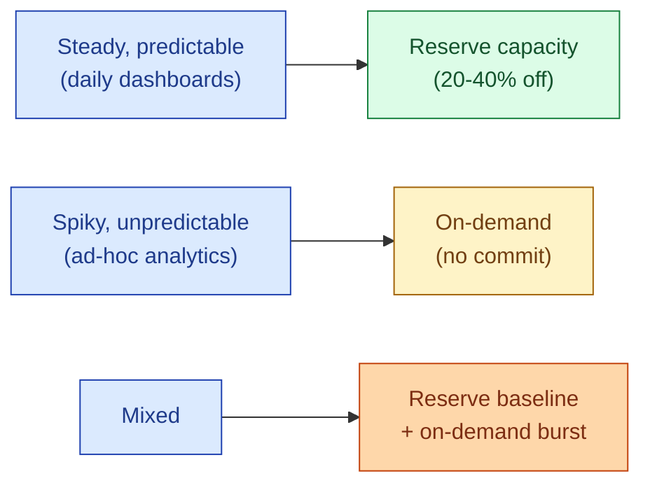

On-demand pricing charges per query, per second, per byte. Reserved capacity gives you a steep discount in exchange for a commitment (one year, three years). The break-even is usually 60-70% utilisation: if you would use the capacity that much anyway, reserve. If your workload is spiky and unpredictable, on-demand is cheaper.

**What this page will cover.**

- BigQuery slots vs on-demand, with the 60-70% break-even rule.
- Snowflake's pre-purchased capacity discount tiers.
- The 1-year vs 3-year commitment trade.
- The "right-sizing" question: how much to reserve in year one.
- Flex slots and short-term commitments for predictable seasonal load.
- The lock-in cost: leaving a vendor mid-commitment is expensive.

*Page coming soon.*

This concept sits in **Stage 6 (Reliability, debugging, cost)** of the [Data Engineering Roadmap](/practice/data-engineering/roadmap/).
