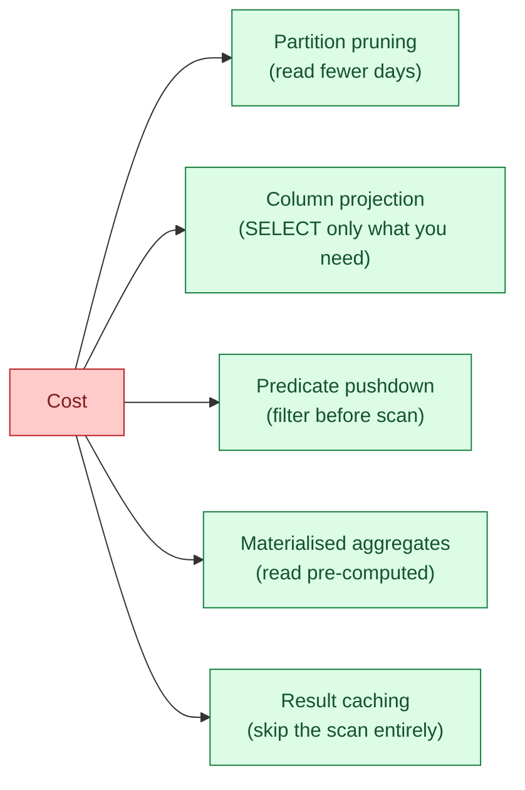
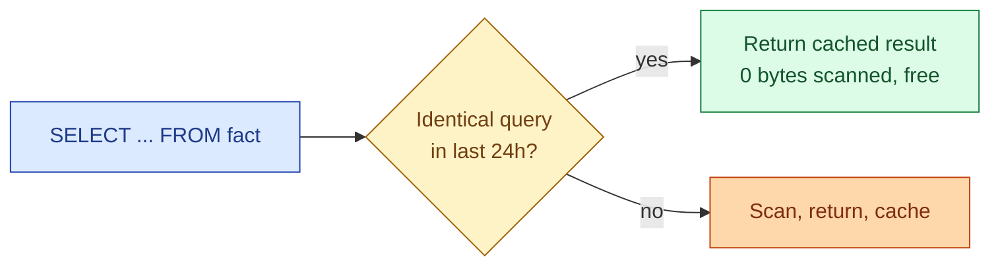
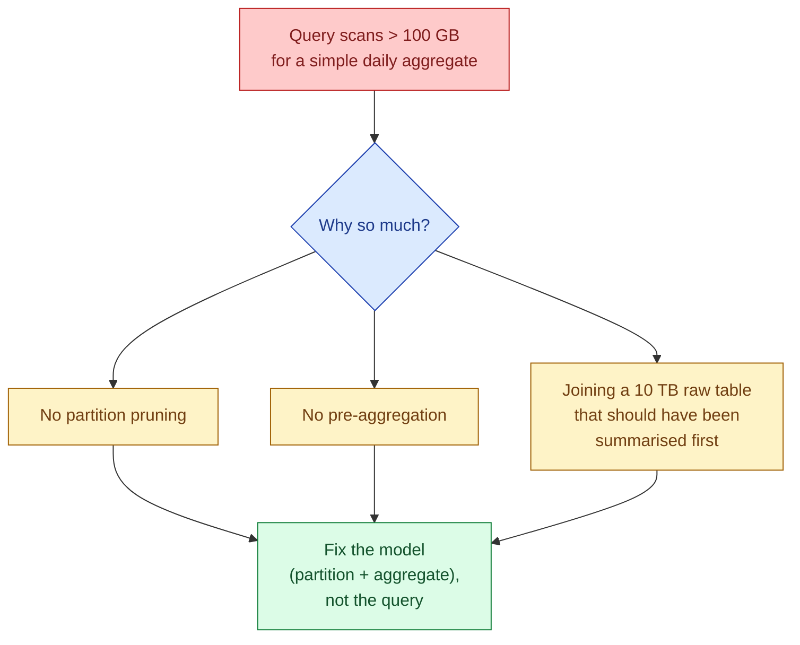

In a per-byte-scanned warehouse (BigQuery), or a per-second-of-compute warehouse (Snowflake, Databricks), the cost equation is the same: scan less, pay less. Every cost optimisation is a variation on this single rule. Partition pruning, column projection, filter pushdown, materialised aggregates, caching. All of them are ways to make the engine read fewer bytes.

## The five levers



Each lever cuts bytes scanned in a different way. They stack. A well-tuned query uses all five.

## Lever 1: partition pruning

If the table is partitioned by day and the query has `WHERE event_date = '2026-06-04'`, the engine reads one partition out of hundreds. Covered in detail at [#056 Partitioning for cost](/practice/data-engineering/concepts/056-partition-for-cost/).

A 2-year fact table with a one-day filter: ~730x reduction. Single biggest lever.

## Lever 2: column projection

Columnar formats (Parquet, ORC, BigQuery Capacitor, Snowflake micro-partitions) store each column separately. A query that touches 3 columns reads only those 3 column files, not the whole row.

```sql
-- bad: reads every column, even the 50 you do not use
SELECT * FROM events WHERE event_date = '2026-06-04';

-- good: reads 3 column files
SELECT user_id, event_name, amount FROM events WHERE event_date = '2026-06-04';
```

On a 100-column table where each column is roughly equal in size, listing the columns you need is a 33x reduction (3 of 100) versus `SELECT *`. Combined with partitioning, the same query is now 24,000x cheaper than the worst case.

`SELECT *` is the single most expensive habit in analytics. Code review for it.

## Lever 3: predicate pushdown

Filtering before scanning, not after. The engine should evaluate the `WHERE` clause against partition metadata and column statistics before touching the data files.

```sql
-- predicate is pushed down: the engine prunes partitions
-- and skips row groups whose min/max statistics fall outside the filter
SELECT user_id, SUM(amount)
FROM events
WHERE event_date = '2026-06-04'
  AND amount > 100
GROUP BY user_id;
```

The `amount > 100` filter would normally read every row to check. But Parquet stores per-row-group min and max for every column. If a row group's max is 80, the whole group is skipped. This is "predicate pushdown" plus "row group skipping" and it is free if the data is clustered well on the filtered column.

The trap: wrapping the filtered column in a function disables pushdown.

```sql
-- pushdown disabled, scans everything
WHERE UPPER(country) = 'SE'

-- pushdown works
WHERE country = 'SE'
```

## Lever 4: materialised aggregates

If the same `SUM(amount) GROUP BY day` runs every hour, materialise it. Build a daily aggregate table during the ETL window, query that instead.

```sql
-- raw query, reads 2 TB of fact rows every refresh
SELECT order_date, SUM(amount)
FROM fact_orders
GROUP BY order_date;

-- materialised: reads ~1 KB
SELECT order_date, daily_amount
FROM agg_orders_daily;
```

Same answer. The dashboard refresh is 6+ orders of magnitude cheaper. The cost moves from "every query" to "one rebuild per day" plus a tiny scan per query.

Materialised views (where the warehouse keeps them fresh automatically) and pre-aggregated tables (where dbt rebuilds them on schedule) are the same idea. See [SD #080 Materialised views](/practice/system-design/concepts/080-materialized-views/) for the deeper picture.

## Lever 5: result caching

If the exact same query was run recently, the warehouse can return the cached result without scanning anything. BigQuery caches results for 24 hours per user. Snowflake has a 24-hour result cache shared across users on the same warehouse.



The cache is invalidated when the underlying table changes. Dashboards that refresh every minute on a table that updates every hour should get 59 cache hits and 1 real scan. Most cost overruns from BI tools come from refresh schedules that fire faster than the cache TTL.

## Worked example: a single dashboard

The query behind a "revenue yesterday by region" tile.

```sql
-- naive version: 280 GB scanned, $1.75 per refresh
SELECT *
FROM fact_orders
WHERE DATE_TRUNC('day', created_at) = DATE_SUB(CURRENT_DATE, INTERVAL 1 DAY);
```

Refreshing every 15 minutes, $1.75 x 96 = $168/day, $5,000/month. For one tile.

Five fixes, one at a time.

| Fix | Bytes scanned | Cost/refresh |
|---|---|---|
| Baseline (the naive query) | 280 GB | $1.75 |
| 1. Rewrite filter so partition pruning works | 4 GB | $0.025 |
| 2. List the 4 columns the tile actually shows | 800 MB | $0.005 |
| 3. Predicate pushdown on `region` | 800 MB | $0.005 |
| 4. Materialise daily revenue table | 1 KB | ~$0 |
| 5. Result cache (refresh > 1 hour) | 0 | $0 |

Combined: $5,000/month becomes effectively zero. Same answer, same UX. The dashboard refreshes off a pre-aggregated table and most refreshes hit the cache. One tile.

Multiply that across 200 dashboards and "scan less" turns into real money.

## The 100 GB rule

A rule I tell every junior data engineer: if your query is scanning more than 100 GB to answer "yesterday's revenue", something is wrong with the model. Not the query. The model.



You cannot make a 5 TB scan cheap by tuning the SQL. You have to remove the need to scan 5 TB. That is a modelling change: partitioning, clustering, pre-aggregation, denormalisation. The query optimiser cannot rescue a poorly modelled table.

## Build it in, do not bolt it on

The cheapest queries come from models designed for the queries up front.

- Pick the partition column when you create the table, not after the bill comes.
- Build the daily aggregate as a dbt model, not a one-off fix.
- Choose columns the BI tool will actually use; do not dump everything from the raw layer into the mart layer.
- Tag queries with team and dashboard on day 1 so the cost-per-query rollup works without retrofitting.

Bolting cost optimisation onto a finished model is 5x the effort of designing for it from the start.

## The team habit that drops cost 30% in 90 days

A 30-minute weekly meeting. Three things on the agenda.

1. Top 10 expensive queries this week. Who owns them? Are they necessary?
2. Top 10 dashboards by cost. Are they viewed enough to justify the refresh schedule?
3. Any new models shipped this week. Did they get partitioned? Are columns projected?

This single meeting, run weekly, typically drops the bill 20-30% in the first quarter. After that it keeps the bill flat as the platform grows. The mechanism is not magic. It is putting cost in front of humans every week until they design for it.

## Common mistakes

- **`SELECT *` in production SQL.** Columnar formats reward column lists; `SELECT *` undoes everything they buy you.
- **`LIMIT 10` thinking the query is cheap.** `LIMIT` does not reduce bytes scanned in BigQuery. The engine still scans then truncates. The filter has to come from `WHERE` on the partition column.
- **Tuning the query when the model is the problem.** A 10 TB scan is a modelling failure, not a SQL failure. Fix the model.
- **Ignoring the result cache.** A dashboard that refreshes every 30 seconds on hourly-changing data wastes 119 of every 120 refreshes. Match the refresh rate to the data rate.
- **One huge fact table with everything.** Wide tables waste column projection (still small column files, but more of them) and metadata cost. Split by topic.
- **No materialised daily aggregates.** Every BI tool re-runs the same daily aggregation thousands of times. Materialise once.
- **No weekly review.** Without recurring human attention, the same expensive patterns reappear in every new pipeline.

## Quick recap

- The whole cost game: scan less, pay less. Every optimisation reduces to this.
- Five levers stack: partition pruning, column projection, predicate pushdown, materialised aggregates, result caching.
- `SELECT *` is the single most expensive habit. Code review for it.
- If a daily-revenue query scans more than 100 GB, the model is wrong. Fix the model, not the query.
- Build cost design into models up front. Bolting it on after is 5x the effort.
- A weekly 30-minute review meeting drops cost 20-30% in a quarter and keeps it flat after.

This concept sits in **Stage 6 (Reliability, debugging, cost)** of the [Data Engineering Roadmap](/practice/data-engineering/roadmap/).
