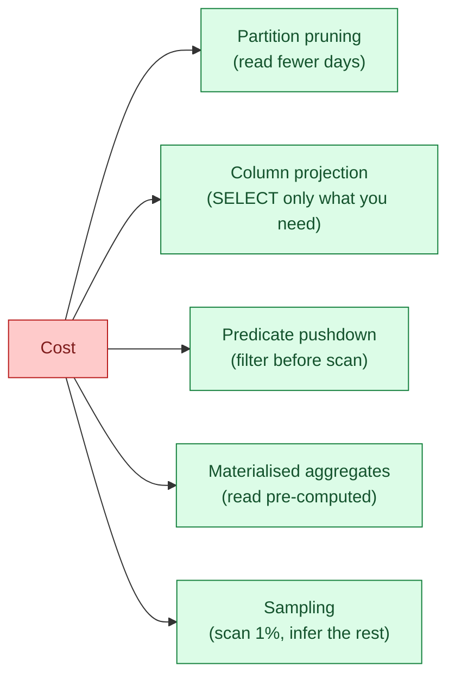

In a per-byte-scanned warehouse (BigQuery), or a per-second-of-compute warehouse (Snowflake, Databricks), the cost equation is the same: scan less, pay less. Every cost optimisation is a variation on this single rule. Partition pruning, column projection, filter pushdown, materialised aggregates, sampling — all of them are ways to make the engine read fewer bytes.

**What this page will cover.**

- The five levers and what each one is worth.
- `SELECT *` as the most expensive habit in analytics.
- Why a `LIMIT 10` in BigQuery scans the same as `LIMIT 10000000` if you don't filter.
- Materialised views as pre-computed scans (the cross-link to [SD #080](/practice/system-design/concepts/080-materialized-views/)).
- BigQuery's table sampling clause and Snowflake's `TABLESAMPLE`.
- The team habit that drops cost 30% in 90 days: a weekly "top query review" session.

*Page coming soon.*

This concept sits in **Stage 6 (Reliability, debugging, cost)** of the [Data Engineering Roadmap](/practice/data-engineering/roadmap/).
