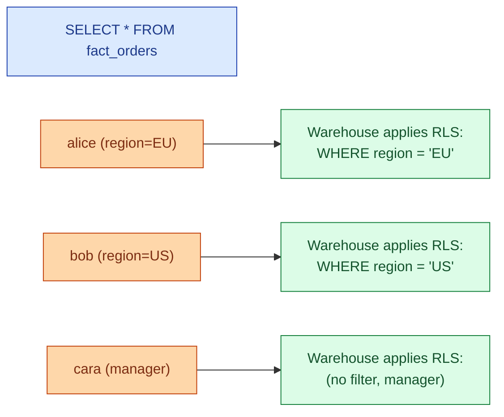
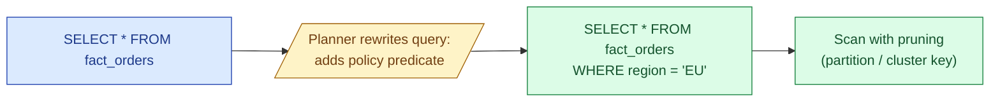
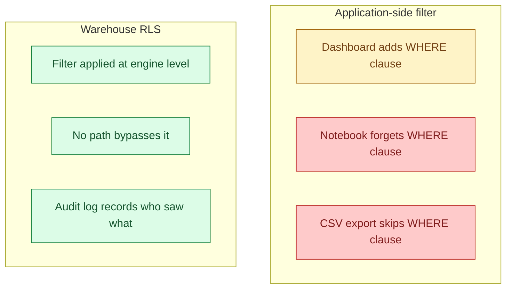

Row-level security (RLS) is a warehouse feature that filters rows automatically based on who is running the query. A sales rep selecting from `fact_orders` sees their own customers' orders. A manager sees their team's. A leadership user sees everything. The filter is enforced by the warehouse, not the BI tool, so it cannot be bypassed.



## The problem it solves

Without RLS, every BI tool, every notebook, every ad-hoc query has to remember to filter by region or team. Sooner or later someone forgets. The dashboard ships, the export goes out, the wrong manager sees the wrong team's compensation. The fix is to move the filter from the analyst's brain into the warehouse engine.

The other thing RLS solves: a single physical table for everyone. Without it, the usual workaround is one view per role (`fact_orders_eu`, `fact_orders_us`, ...), and the view sprawl gets worse every quarter.

## How it works in each warehouse

The vocabulary changes; the idea is the same. A policy is a SQL expression evaluated per row, with access to session context (the current user, role, or attributes).

### Snowflake row access policies

```sql
CREATE ROW ACCESS POLICY rap_orders_by_region
  AS (region VARCHAR) RETURNS BOOLEAN ->
    CURRENT_ROLE() = 'LEADERSHIP'
    OR region = (
      SELECT region FROM admin.user_region
      WHERE user_name = CURRENT_USER()
    );

ALTER TABLE fact_orders
  ADD ROW ACCESS POLICY rap_orders_by_region ON (region);
```

Every query against `fact_orders` now silently appends the policy's predicate. The lookup table `admin.user_region` is the mapping layer; in real deployments it is fed from your IdP or SCIM sync.

### BigQuery row-level security

```sql
CREATE ROW ACCESS POLICY rls_eu_only
ON `proj.dataset.fact_orders`
GRANT TO ('group:eu-analysts@company.com')
FILTER USING (region = 'EU');
```

BigQuery binds the policy directly to IAM groups. No lookup table needed; the group membership is the predicate input.

### Databricks dynamic views and row filters

```sql
CREATE OR REPLACE FUNCTION region_filter(region STRING)
RETURNS BOOLEAN
RETURN is_account_group_member('leadership')
  OR region = current_user_region();

ALTER TABLE fact_orders
  SET ROW FILTER region_filter ON (region);
```

Unity Catalog row filters compile down to a `WHERE` clause that runs in the query plan, same shape as Snowflake and BigQuery.

## Predicate planning and performance



RLS predicates are normal predicates. If `region` is a partition column or a clustering key, the policy prunes scans down to one region's files. If the policy joins a lookup table, the planner has to evaluate that join too, and a poorly written lookup table can become the slow part of every query in the warehouse.

Two practical rules.

- Make the column the policy reads cheap. A partition column or a clustering key is ideal.
- Keep the lookup table small and indexed. If your `user_region` table has 50,000 rows and the policy reads it on every query, cache it: most warehouses keep small lookup tables hot.

## A worked example: per-region access with a manager override

```sql
-- the mapping: who is allowed to see what
CREATE TABLE admin.user_region (
  user_name STRING,
  region STRING,
  is_manager BOOLEAN
);

-- the policy
CREATE ROW ACCESS POLICY rap_orders
  AS (region VARCHAR) RETURNS BOOLEAN ->
    EXISTS (
      SELECT 1 FROM admin.user_region u
      WHERE u.user_name = CURRENT_USER()
        AND (u.is_manager OR u.region = region)
    );

ALTER TABLE fact_orders
  ADD ROW ACCESS POLICY rap_orders ON (region);
```

Alice (EU, non-manager) running `SELECT COUNT(*) FROM fact_orders` gets the EU count. Cara (any region, `is_manager = TRUE`) gets the global count. Same SQL, same table, different answers.

## Testing RLS

This is the part teams skip. RLS bugs are silent: the query returns rows; just the wrong rows.

The pattern that works.

```sql
-- impersonate each role and check the row counts
USE ROLE eu_analyst;
SELECT COUNT(*) FROM fact_orders;          -- expect: EU only
SELECT DISTINCT region FROM fact_orders;   -- expect: {'EU'}

USE ROLE leadership;
SELECT COUNT(*) FROM fact_orders;          -- expect: full count
SELECT DISTINCT region FROM fact_orders;   -- expect: all regions
```

Bake these into a CI job. When someone edits the policy, the test catches the regression before the dashboard does.

## The service account trap

Pipelines do not log in as humans. They run as a robot user (an Airflow worker, a dbt service account, a Fivetran connector). If your policy says "user must appear in `user_region`," the robot does not appear, and every pipeline silently returns zero rows.

The fix in every warehouse is the same: carve out the service role.

```sql
-- Snowflake
CREATE ROW ACCESS POLICY rap_orders
  AS (region VARCHAR) RETURNS BOOLEAN ->
    CURRENT_ROLE() IN ('PIPELINE_ROLE', 'LEADERSHIP')
    OR EXISTS (...);
```

Pipelines see all rows; humans see filtered rows. This is the one exception that has to be explicit in the policy.

## RLS vs application-side filtering

A common question: why not just put `WHERE region = $user_region` in every dashboard query?



App-side filtering trusts every caller forever. RLS is one rule in one place that every caller inherits. The warehouse audit log then shows the policy fired, which user it fired for, and what rows came back, which is what the auditor wants.

## Combining RLS with column masking

RLS hides rows; column masking hides columns. The two compose. A typical setup.

- RLS: `region = current_user_region()` so analysts see their region only.
- Masking: `email` and `phone` are masked unless the role is `compliance`.

An EU analyst querying `fact_orders` sees EU rows with masked emails. A compliance user sees all rows with unmasked emails. One table, one query, four different visible result shapes depending on role.

## Common mistakes

- **Building views per role instead of one policy.** The view set sprawls. Six months later no one knows which view is current. Use RLS, keep one table.
- **Forgetting the service account.** Pipelines silently return zero rows. Always allow-list pipeline roles in the policy.
- **Policies that join giant tables.** Every query in the warehouse now joins a giant lookup. Keep the user-mapping table small and the policy predicate cheap.
- **Skipping the impersonation tests.** RLS bugs return the wrong rows quietly. Test by running queries as each role in CI.
- **Encoding role logic in the policy directly.** `CURRENT_USER() = 'alice'` does not scale past three users. Drive the policy from a mapping table that an IdP or SCIM sync owns.
- **Trusting the BI tool to enforce row filters.** Anyone with warehouse credentials bypasses the BI tool entirely. The filter has to live in the warehouse.
- **Mixing RLS with shared service accounts in BI.** If Tableau connects as `bi_service`, every Tableau user looks like `bi_service` to the warehouse. Use OAuth pass-through or per-user connections.

## Quick recap

- RLS pushes the filter from app code into the warehouse, so every query inherits it.
- Snowflake row access policies, BigQuery row-level security, and Databricks row filters are the same idea with different syntax.
- The policy is a normal predicate; if the column is partitioned or clustered, scans prune nicely.
- Service accounts have to be allow-listed in the policy or pipelines break.
- Test by impersonating each role in CI; silent wrong-row bugs are the failure mode.
- RLS plus column masking gives you per-row plus per-column control from one table.

This concept sits in **Stage 6 (Reliability, debugging, cost)** of the [Data Engineering Roadmap](/practice/data-engineering/roadmap/).
