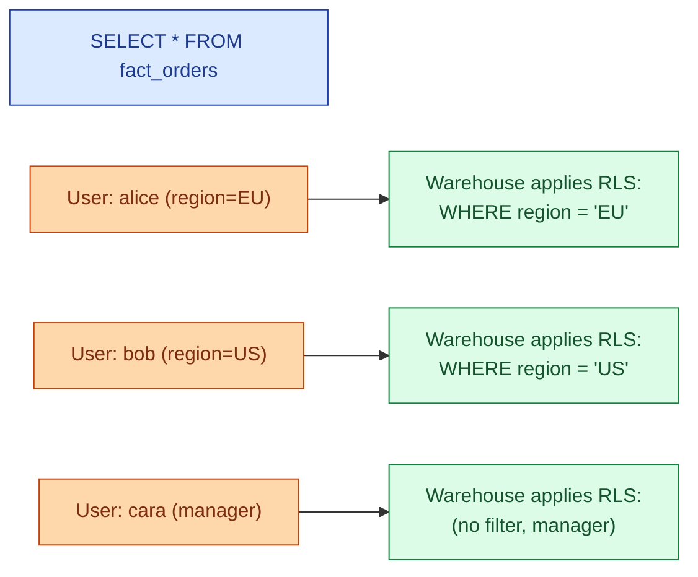

Row-level security (RLS) is a warehouse feature that filters rows automatically based on who is running the query. A sales rep selecting from `fact_orders` sees their own customers' orders. A manager sees their team's. A leadership user sees everything. The filter is enforced by the warehouse, not the BI tool, so it cannot be bypassed.

**What this page will cover.**

- Snowflake row access policies, BigQuery row-level security, Databricks dynamic views.
- Defining the policy: a SQL expression evaluated per row at query time.
- The performance cost: filter pushdown, predicate planning, the cost of complex policies.
- Combining RLS with column masking for full data access control.
- The "service account" trap: pipelines run as a robot, RLS must allow that role through.
- Why RLS belongs at the warehouse level, not the BI tool level.

*Page coming soon.*

This concept sits in **Stage 6 (Reliability, debugging, cost)** of the [Data Engineering Roadmap](/practice/data-engineering/roadmap/).
