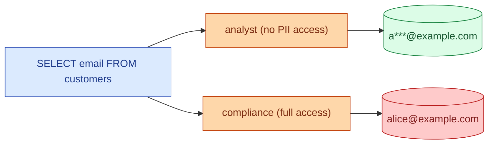

Column masking replaces a sensitive column's value at query time with a masked or tokenised version, depending on who is asking. An analyst sees `a***@example.com`. A compliance officer sees the real email. The masking is enforced by the warehouse, not by the application, so the original value never leaks into a downstream BI tool by accident.

**What this page will cover.**

- Snowflake masking policies (`CREATE MASKING POLICY`).
- BigQuery column-level access control + data masking.
- Databricks dynamic views and column-level security.
- Common masks: redact (`***`), partial (`first 3 chars + ***`), hash, tokenise.
- The "join through a masked column" trap and how each warehouse handles it.
- The audit log: who queried what unmasked, when.

*Page coming soon. Until then, see [#083 PII masking and right to be forgotten](/practice/data-engineering/083-pii-masking-and-right-to-be-forgotten/) for the practice problem.*

This concept sits in **Stage 6 (Reliability, debugging, cost)** of the [Data Engineering Roadmap](/practice/data-engineering/roadmap/).
