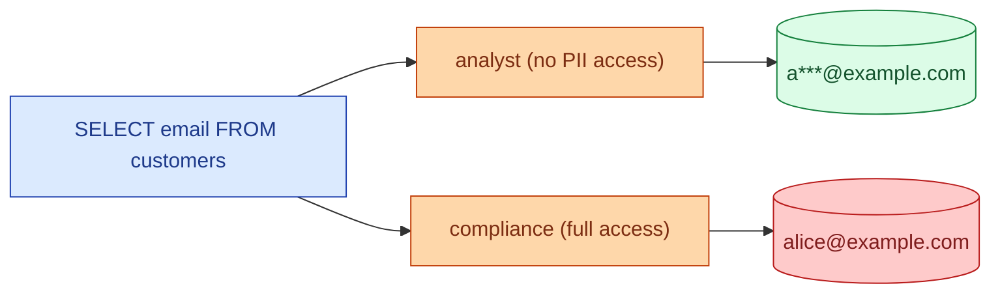
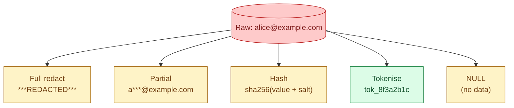
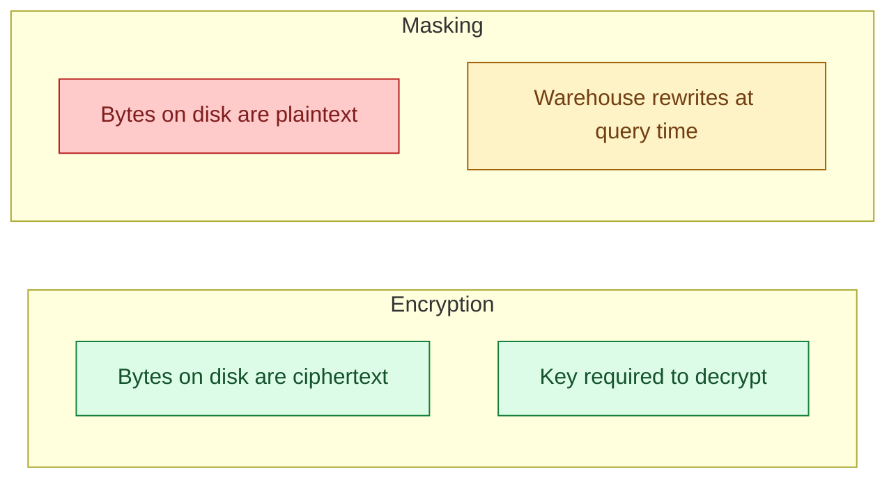

Column masking replaces a sensitive column's value at query time with a masked or tokenised version, depending on who is asking. An analyst sees `a***@example.com`. A compliance officer sees the real email. The masking is enforced by the warehouse, not by the application, so the original value never leaks into a downstream BI tool by accident.



## The problem it solves

Most analytics work needs the shape of a value, not the value itself. Cohort counts by email domain. Distribution of phone country codes. Whether a credit card was used on weekends. None of these need to read the actual email, phone, or card number. But the column has to be in the table, because some workflows do need the real value.

Column masking lets you keep one physical column, one canonical table, and decide at query time who sees the raw value and who sees a transformed version. The alternative (two columns: `email_raw`, `email_masked`) doubles storage and gets out of sync.

## How it works in each warehouse

### Snowflake masking policies

```sql
CREATE MASKING POLICY mp_email AS (val STRING) RETURNS STRING ->
  CASE
    WHEN CURRENT_ROLE() IN ('COMPLIANCE', 'PIPELINE_ROLE') THEN val
    WHEN CURRENT_ROLE() = 'ANALYST' THEN
      REGEXP_REPLACE(val, '^(.).+(@.+)$', '\\1***\\2')
    ELSE '***REDACTED***'
  END;

ALTER TABLE customers
  MODIFY COLUMN email SET MASKING POLICY mp_email;
```

The policy is a SQL function. Whatever role calls `SELECT email FROM customers` gets the value the policy returned for that role.

### BigQuery column data masking

```sql
CREATE SCHEMA `proj.taxonomy`;

-- a policy tag in the taxonomy
-- (created in the BigQuery console: taxonomy -> "PII" -> "email")

ALTER TABLE `proj.dataset.customers`
ALTER COLUMN email
SET OPTIONS (
  policy_tags = ['projects/proj/locations/eu/taxonomies/123/policyTags/456']
);

-- the masking rule attached to the policy tag:
-- "Email mask" routine: maps user@domain -> XXXXX@domain
```

BigQuery binds masks to policy tags in a taxonomy. Roles get permissions on the policy tag, not on the column directly. The same tag can protect a column in 50 tables.

### Databricks column masks

```sql
CREATE OR REPLACE FUNCTION mask_email(email STRING)
RETURN CASE
  WHEN is_account_group_member('compliance') THEN email
  ELSE regexp_replace(email, '^(.).+(@.+)$', '$1***$2')
END;

ALTER TABLE customers
  ALTER COLUMN email SET MASK mask_email;
```

Unity Catalog column masks are SQL functions bound to columns, like Snowflake.

## The common mask shapes



- **Full redact.** `***REDACTED***`. The column exists but tells you nothing. Useful when even the shape leaks information.
- **Partial.** `a***@example.com`, `xxx-xx-1234` for SSN, `+46 ** *** ** 23` for phone. Keeps enough for the analyst to recognise the row.
- **Hash.** `sha256(email)`. Deterministic, joinable, irreversible (without a rainbow attack). The audit story is: I cannot recover the email, I can only check if two rows have the same email.
- **Tokenise.** Replace with a vault-backed token. See [#063 PII tokenisation](/practice/data-engineering/concepts/063-pii-tokenisation/) for the deeper version.
- **Null.** The column is hidden entirely. Equivalent to dropping the column for that role.

The partial mask is the most common default. It keeps debug usefulness without giving up the value.

## Masking is not encryption

This trips people up. Encryption protects bytes at rest and in transit; the bytes are unreadable without a key. Masking is a query-time rewrite; the underlying value is still in plaintext on disk and the warehouse owner can read it directly.



If the warehouse account is compromised, masking does nothing. The attacker reads the raw column. For protection against that, use tokenisation (the value never enters the warehouse) or encryption at rest with customer-managed keys.

The right framing: masking is access control for legitimate users; encryption is protection against unauthorised access to the storage layer.

## Joining through a masked column

The trickiest scenario. Two tables, both have `email`, both masked. The analyst joins them.

```sql
-- both columns masked for the analyst role
SELECT a.email, b.email
FROM customers a
JOIN orders b ON a.email = b.email;
```

In Snowflake and Databricks, the policy runs after the join, so the join uses the raw value and only the projection is masked. Result: the analyst sees `a***@example.com` in both columns and the right rows joined.

In BigQuery, if the mask is `HASH`, the join works because both sides hash the same way. If the mask is `DEFAULT_MASK` (full redact), every row of one side joins every row of the other (both columns are now constants). Read the docs for which mask survives a join.

The rule: if you need to join on the masked column, make sure the mask is either bypassed during the join (the warehouse default) or applied deterministically (same input always produces the same output).

## The audit story

Masking by itself does not log who saw what. You need to combine it with the warehouse access log.

- Snowflake: `SNOWFLAKE.ACCOUNT_USAGE.ACCESS_HISTORY` shows every query, every column read, every policy that fired.
- BigQuery: Cloud Audit Logs show the same plus the policy tag.
- Databricks: Unity Catalog audit logs.

When the compliance officer asks "who ran a query that read the unmasked email column last week," these logs are the answer. Mask without an audit log and you have access control but no accountability.

## A worked example: end-to-end

```sql
-- 1. The masking policy
CREATE MASKING POLICY mp_phone AS (val STRING) RETURNS STRING ->
  CASE
    WHEN CURRENT_ROLE() = 'COMPLIANCE' THEN val
    WHEN CURRENT_ROLE() = 'PIPELINE_ROLE' THEN val
    WHEN CURRENT_ROLE() = 'ANALYST' THEN
      CONCAT(SUBSTR(val, 1, 4), ' *** *** ', SUBSTR(val, -2, 2))
    ELSE '***'
  END;

-- 2. Attach to the column
ALTER TABLE customers
  MODIFY COLUMN phone SET MASKING POLICY mp_phone;

-- 3. Verify
USE ROLE analyst;
SELECT phone FROM customers LIMIT 1;     -- '+46 *** *** 23'

USE ROLE compliance;
SELECT phone FROM customers LIMIT 1;     -- '+46 70 123 45 23'

USE ROLE marketing;
SELECT phone FROM customers LIMIT 1;     -- '***'
```

One column. Three different visible values. Zero changes to the dashboard SQL.

## Common mistakes

- **Treating masking as encryption.** The bytes on disk are plaintext. If the storage account is compromised, masking does nothing.
- **Masking without an audit log.** You have access control but no accountability. Turn on the warehouse access log alongside the policy.
- **Inconsistent masks across tables.** `customers.email` is partial-masked, `orders.email` is full-redacted. Join behaviour breaks. Use one policy across every table with that column.
- **Forgetting pipeline roles.** Service accounts that compute downstream marts need the raw value. Allow-list them in the policy.
- **Trusting BI tool caches.** A dashboard with cached results from a high-privilege query happily serves the cached values to low-privilege users. Cache invalidation matters.
- **Masking the join column without testing the join.** Some masks survive joins, some do not. Test with both roles before shipping.
- **Building two columns instead of one.** `email_raw` and `email_masked` get out of sync the day the pipeline crashes mid-batch.

## Quick recap

- Column masking rewrites a column at query time based on who is asking; the underlying value stays put.
- Snowflake masking policies, BigQuery column data masking, and Databricks column masks are the same idea, different syntax.
- The mask shapes: full redact, partial (the common default), hash, tokenise, NULL.
- Masking is access control, not encryption; it does not protect against a compromised warehouse account.
- Joins through masked columns work if the mask is bypassed at join time or deterministic.
- Pair masking with the warehouse access log so you can answer "who saw what."

This concept sits in **Stage 6 (Reliability, debugging, cost)** of the [Data Engineering Roadmap](/practice/data-engineering/roadmap/).
