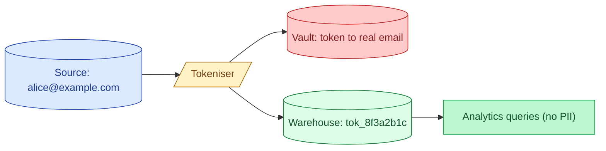
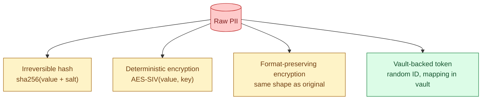
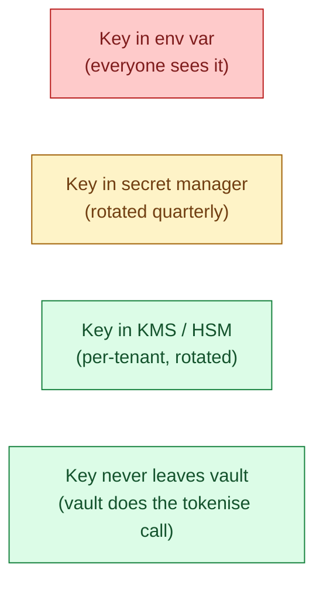
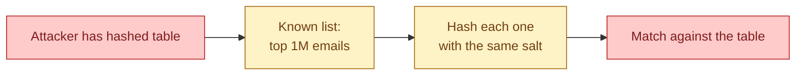

Tokenisation replaces a piece of personal data with a stable, random-looking token: `alice@example.com` becomes `tok_8f3a2b1c`. The token is consistent (the same email always produces the same token) so joins still work. The original value lives only in a vault. The warehouse holds tokens. If the warehouse leaks, the leak does not include PII.



## The problem it solves

A warehouse with raw PII is a leak waiting to happen. Every analyst, every BI tool, every notebook, every backup is now in the blast radius. Column masking helps for queries; it does nothing for backups, table exports, or a stolen credential.

Tokenisation removes the value from the warehouse entirely. Analysts see tokens, joins work because tokens are deterministic, and the only system holding the real value is the vault. The vault is small, audited heavily, and accessible to almost no one.

GDPR calls this **pseudonymisation**: data that cannot be attributed to a person without additional information held separately. It is not anonymisation (the mapping exists somewhere), but it changes the legal and security posture sharply.

## The four flavours



### Irreversible hash

```python
token = sha256(value + secret_salt).hexdigest()
```

Fast, no key management beyond the salt, and you can never recover the original. Good when the only thing you need is "are these two rows the same person."

The catch: low-entropy inputs are guessable. Hashing every email address against a salt does not protect against a brute-force attack on a known domain (`@example.com` plus the top 100k first names cracks most of them in minutes). Hashing an email is not anonymisation. It is a weak pseudonym at best.

### Deterministic encryption

```python
token = aes_siv_encrypt(value, key)
```

Reversible with the key, deterministic for joins. Stronger than a hash because the key gives a brute-force attacker nothing without the key. The hard part is key management: every system that needs to tokenise or untokenise needs the key, and the key has to rotate.

### Format-preserving encryption (FPE)

The token has the same shape as the original. A 16-digit card number tokenises to a 16-digit number. A US SSN tokenises to `XXX-XX-XXXX`. Required when the downstream system has hard schema validation: a payment gateway that rejects "anything not 16 digits" cannot accept `tok_8f3a2b1c`.

FPE is more complex (NIST FF1/FF3-1 algorithms), slower than AES, and overkill if downstream systems accept arbitrary strings.

### Vault-backed token

```python
token = vault.tokenise(value)   # returns a random ID
# vault stores: token -> ciphertext(value)
```

The token has no mathematical relationship to the value. The mapping lives in a vault (HashiCorp Vault, AWS Macie + KMS, Skyflow, Privacera). To untokenise, you call the vault and the call is logged.

This is the strongest model. The warehouse holds opaque random IDs. Even with the warehouse compromised, the attacker has nothing without the vault. The trade-off: every untokenisation is a network call, so you only do it when you have to (a single record at support time, not a million-row batch).

## Choosing between them

| Need | Use |
|---|---|
| Just "are two rows the same person" | Salted hash |
| Joins across systems, no untokenisation | Salted hash or deterministic encryption |
| Untokenisation by an approved service | Deterministic encryption or vault |
| Output must look like the original | Format-preserving encryption |
| Maximum protection, audited untokenisation | Vault-backed token |

The most common production setup is: vault-backed tokens for the values that matter most (full names, government IDs, full email addresses), deterministic encryption for moderate-risk values (hashed device IDs), and salted hashes for "is this the same user across two events." Different shapes for different threat models.

## Key management is the actual hard problem



If the key sits in an environment variable on the same box that holds the warehouse credential, tokenisation buys nothing. The same compromise reveals both. The point of tokenisation is to put the key somewhere the warehouse credential cannot reach.

The practical pattern.

- The key lives in KMS (AWS KMS, GCP KMS, Azure Key Vault). The warehouse never sees the raw key.
- The tokeniser is a separate service. It calls KMS to use the key; the key never leaves KMS.
- Analytics jobs never talk to KMS. They only see tokens.
- Untokenisation requires a separate role with explicit audit logging.

Get key management wrong and the cryptography is decorative.

## A worked example: salted hash for joinable user identity

```sql
-- in the ingest layer, hash the email at write time
CREATE OR REPLACE FUNCTION hash_email(email STRING)
RETURNS STRING
RETURN sha2(concat(lower(trim(email)), current_secret('email_salt')), 256);

-- raw landing table: never queried by analysts
CREATE TABLE _raw.events_landing (
  event_id STRING,
  email_raw STRING,
  ...
);

-- staging: tokens only
CREATE TABLE staging.events AS
SELECT
  event_id,
  hash_email(email_raw) AS user_token,
  ...
FROM _raw.events_landing;

-- the analyst-facing view has no PII
CREATE VIEW analytics.events AS
SELECT event_id, user_token, ...
FROM staging.events;
```

The analyst joins `events.user_token` with `orders.user_token` and gets the same person across both tables. They never see the email. The `_raw.events_landing` table has a short retention (24 hours) and tight access controls; the `staging` and `analytics` layers hold only tokens.

## Re-identification

Sometimes the business legitimately needs to look up the real value. A support ticket says "user with token `tok_8f3a2b1c` reports they cannot log in." Support has to find the actual user.

The pattern.

- Re-identification is a separate API call to the vault, never a SQL join.
- The call is audited: who called, when, which token, why (ticket number).
- The role that can re-identify is small (3-10 humans) and reviewed quarterly.

If your re-identification happens via a SQL join against a `token_to_email` table in the warehouse, you have not tokenised. You have just moved the PII to a different table in the same blast radius.

## Why hashing email is not anonymisation



Email addresses are low-entropy. There are roughly 4 billion in active use. If an attacker gets the salted hash table plus the salt (which often leaks together because the salt has to be available to the tokeniser), they can hash every known email and find a large fraction.

This is why GDPR draws the line at **pseudonymisation**, not anonymisation. A hashed email is still personal data. Treat it that way: keep it inside the warehouse boundary, keep access logged, do not paste it into third-party tools.

## Common mistakes

- **Hashing email and calling it anonymous.** It is not. It is a weak pseudonym. Still personal data under GDPR.
- **Storing the key next to the data.** The whole point is that compromising the warehouse should not compromise the key. Different system, different blast radius.
- **Re-identifying via SQL join.** A `token_to_email` table in the warehouse undoes the entire model. Re-identification is an audited API call.
- **Using FPE when format does not matter.** FPE is slower and more complex than other options. Use it only when a downstream schema requires it.
- **Forgetting to lowercase / trim before hashing.** `Alice@Example.com` and `alice@example.com` hash to different tokens. Normalise before tokenising or your joins miss.
- **One global salt, never rotated.** When the salt leaks (and it will), every hash is suddenly attackable. Rotate, and re-tokenise affected rows in a backfill.
- **Tokenising at the warehouse instead of the ingest edge.** If the raw value lands in the warehouse first, it lives in backups forever. Tokenise upstream of the warehouse.

## Quick recap

- Tokenisation replaces a PII value with a stable, random-looking token; the real value lives in a vault.
- Four flavours: salted hash, deterministic encryption, format-preserving encryption, vault-backed token. Pick by threat model.
- Hashing email is not anonymisation; low-entropy values are brute-forceable. GDPR still calls hashed PII personal data.
- Key management is the hard part. The key must live outside the warehouse blast radius.
- Re-identification is an audited API call, not a SQL join against a mapping table.
- Tokenise at the ingest edge, not after the warehouse, so backups never see raw PII.

This concept sits in **Stage 6 (Reliability, debugging, cost)** of the [Data Engineering Roadmap](/practice/data-engineering/roadmap/).
