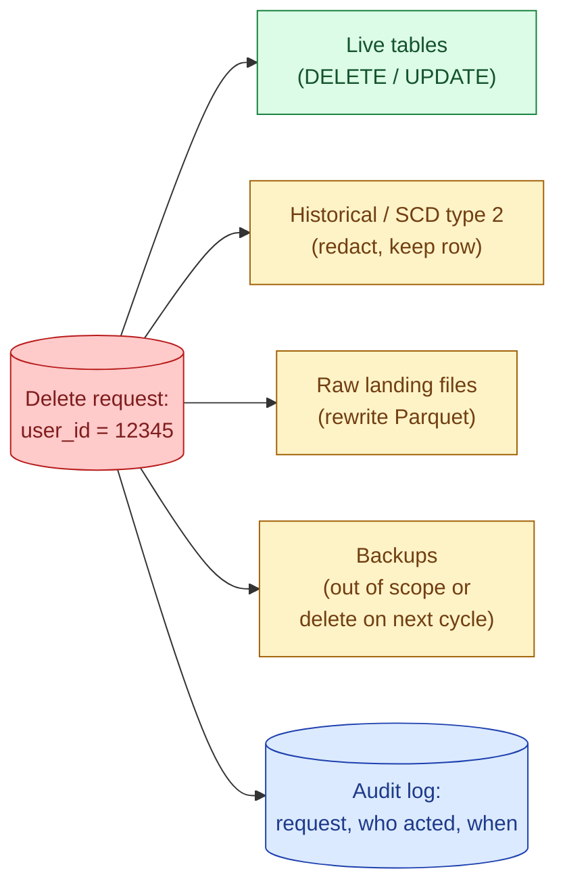
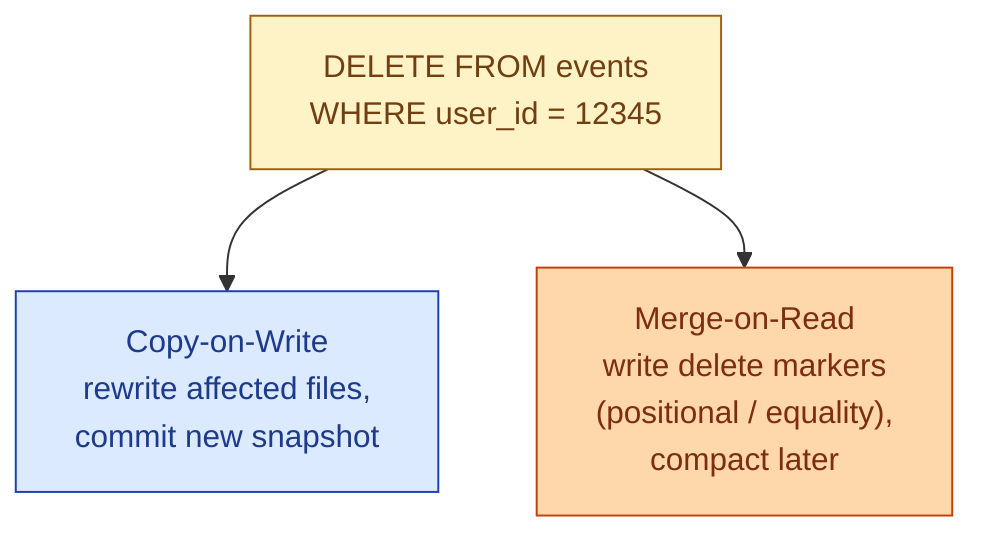
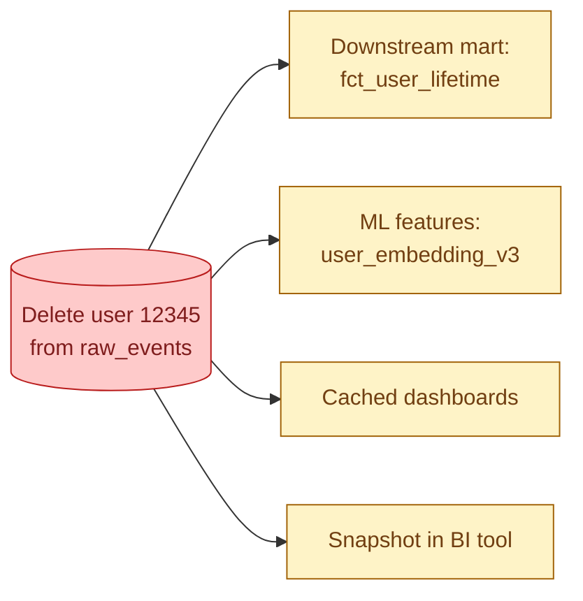
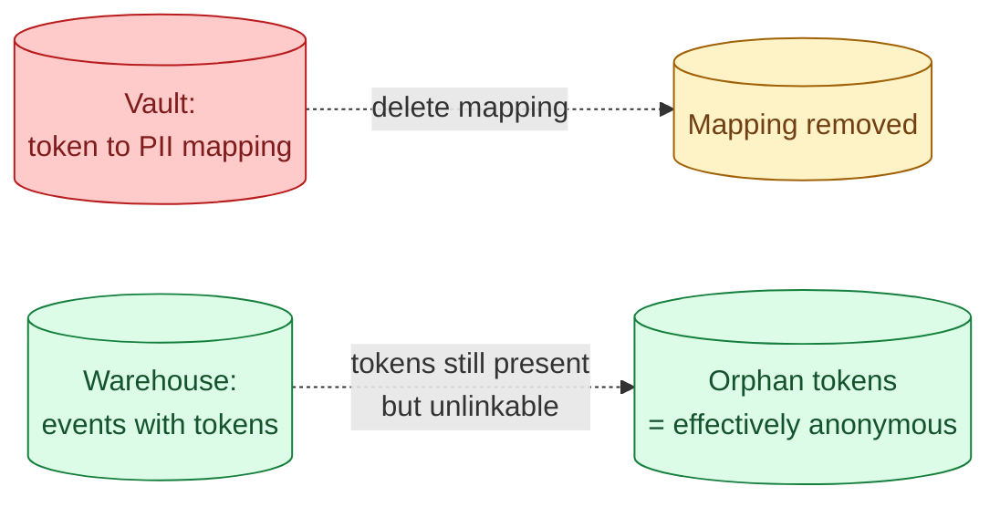

GDPR Article 17 ("right to erasure") gives users the right to have their personal data deleted. Sounds simple. Becomes one of the hardest engineering problems in a data warehouse, because the user's data is in fact tables, dimension tables, raw landing zones, archived files, backups, and probably a dashboard cache somewhere.



## Why "just DELETE the row" does not work

The columnar warehouse story used to be append-only. Parquet files are immutable. A single user appears in thousands of files across years of partitions. The naive `DELETE FROM events WHERE user_id = 12345` had to rewrite every affected file, sometimes terabytes of data, for one user.

S3 versioning kept the old files around. Backups had the user too. Derived tables computed from the raw data also had to be redone. The delete was less of an operation and more of a project.

Modern lakehouse table formats (Iceberg, Delta) solved most of the immediate problem with row-level deletes. The propagation problem (downstream marts, backups, ML features, embeddings) is still there.

## The 30-day reality

GDPR says "without undue delay," not "instantly." In practice, regulators have accepted 30 days as reasonable for complex systems. That window is what makes the engineering tractable: you can batch deletions weekly, run a propagation pass over downstream marts, and confirm the chain before the deadline.

What you cannot do is delete from the live system and then leave the raw landing zone untouched. The deletion has to be end-to-end within the window.

## Row-level delete in Iceberg and Delta

```sql
-- Iceberg
DELETE FROM events WHERE user_id = 12345;

-- Delta
DELETE FROM events WHERE user_id = 12345;
```

Both formats support this directly. Under the hood they use two strategies.



- **Copy-on-write (CoW).** Read each affected Parquet file, write a new file without the deleted row, swap. Expensive at delete time, free at read time. Default in Iceberg and Delta.
- **Merge-on-read (MoR).** Write a small "delete file" that says "these row positions in this data file are deleted." Cheap at delete time, query time has to apply the delete file. Compaction merges delete files into the data later.

For GDPR, both work. CoW gives you a cleaner final state (the row is actually gone from disk). MoR is faster for many small deletes but requires regular compaction to actually remove the bytes.

After deletion, run `VACUUM` (Delta) or `expire_snapshots` (Iceberg) to drop the old file versions. Until you do, the row is still in the storage layer in an older snapshot.

## Raw Parquet without a table format

If your raw landing zone is plain Parquet on S3 (no Iceberg, no Delta), there is no row-level delete. The options.

- **Partition-style delete.** If files are partitioned by date and the user appears in known partitions, rewrite those partitions without the user. Same effect as Iceberg copy-on-write, just done by hand.
- **Migrate to a table format.** This is the long-term answer. Once raw lands in Iceberg or Delta, deletes become one statement.
- **Shorten retention.** Raw landing data does not need to live forever. A 30-day retention means GDPR delete becomes "wait 30 days."

The honest take: in 2026, new raw landing zones should be Iceberg or Delta. The "plain Parquet on S3" pattern is a legacy decision that GDPR makes expensive.

## SCD type 2 and historical accuracy

Slowly Changing Dimension type 2 tables keep history of changes. The user's old address still exists in the row that says "user 12345 lived at X from 2024-01-01 to 2025-06-01." Deleting that row destroys history that other rows (fact tables, derived reports) reference.

Two patterns.

- **Redact in place.** Keep the row, NULL out the personal columns. The fact table still joins; the address is gone. The audit story: the dimension key is preserved but the personal data is not.
- **Tombstone.** Replace the entire row with a single `[DELETED]` marker. Joins still work; nothing personal remains.

Choose redact when downstream fact rows have to keep joining. Choose tombstone when the user's record itself is the artifact.

## The propagation problem



A delete from the raw layer is not done until every derived asset has been recomputed without the user. The usual offenders.

- **Aggregated marts.** A `fct_user_lifetime` table with one row per user obviously needs the row removed.
- **ML feature stores.** User embeddings, churn scores, recommendation vectors. Each one has to be recomputed or the specific user's features dropped.
- **BI tool extracts.** Tableau extracts, Power BI imports. These are local copies; they need a refresh.
- **Backups.** Most companies treat backups as out of scope (the data will age out) but document this in the GDPR procedure.
- **Logs and traces.** Application logs frequently include user IDs and PII. Retention policies handle this; one-off deletion is impractical.

The pattern that scales: a **deletion queue**. Every delete request is logged in a table. A weekly job runs the deletion pipeline: delete from raw, delete from each mart, recompute derived assets, mark the request as complete with timestamps. The audit trail is the queue.

## Tracking erasure requests

```sql
CREATE TABLE compliance.erasure_requests (
  request_id STRING,
  user_id STRING,
  received_at TIMESTAMP,
  deadline_at TIMESTAMP,            -- received_at + 30 days
  completed_at TIMESTAMP,
  scope ARRAY<STRING>,              -- ['raw', 'marts', 'features', 'extracts']
  notes STRING
);
```

When the auditor asks "show me proof you complied with this request," this table is the answer. Pair it with a daily check: rows where `deadline_at < CURRENT_DATE AND completed_at IS NULL` are overdue and have to be escalated.

## The tokenisation shortcut

If you tokenised PII at the ingest edge (see [#063 PII tokenisation](/practice/data-engineering/concepts/063-pii-tokenisation/)), GDPR delete becomes a different problem. The warehouse holds tokens, not personal data. To "delete" the user, you delete the token-to-PII mapping in the vault. The warehouse data becomes orphaned tokens that cannot be re-identified.



This is the most operationally friendly GDPR delete model. One vault row deletion makes the warehouse effectively anonymised for that user. The marts do not have to be rewritten; the analytics keep working; the user simply cannot be re-identified.

The caveat: this only works if the tokenisation was done at the ingest edge. If raw PII landed in the warehouse first, the vault deletion does not retroactively clean those rows.

## A worked deletion pipeline

```python
def process_erasure(user_id: str, request_id: str):
    # 1. log the request
    log_request(request_id, user_id, scope=['raw', 'marts', 'features'])

    # 2. delete from raw and silver lakehouse tables
    spark.sql(f"DELETE FROM bronze.events WHERE user_id = '{user_id}'")
    spark.sql(f"DELETE FROM silver.user_sessions WHERE user_id = '{user_id}'")

    # 3. redact in dimension (keep row, NULL the PII)
    spark.sql(f"""
        UPDATE silver.dim_user
        SET email = NULL, phone = NULL, full_name = '[DELETED]'
        WHERE user_id = '{user_id}'
    """)

    # 4. trigger recompute of affected gold marts
    trigger_dbt(['+fct_user_lifetime', '+fct_user_revenue'])

    # 5. drop ML features for this user
    feature_store.delete(user_id=user_id)

    # 6. compact / vacuum to drop old file versions
    spark.sql("VACUUM bronze.events RETAIN 0 HOURS")
    spark.sql("VACUUM silver.user_sessions RETAIN 0 HOURS")

    # 7. mark complete
    mark_complete(request_id, completed_at=now())
```

In production this runs weekly, batching all pending requests so the marts are rebuilt once instead of once per request.

## Common mistakes

- **Treating delete as "just `DELETE FROM`."** The downstream marts, ML features, and extracts also hold the row. End-to-end propagation is the actual work.
- **Forgetting to `VACUUM` / `expire_snapshots`.** The row is gone from the current snapshot but still on disk in older versions. Time-travel queries still see it.
- **Deleting from gold but not bronze.** Next pipeline run repopulates the row from raw. Start at the source layer.
- **Ignoring SCD type 2 history.** The historical row still holds the address. Redact in place or tombstone.
- **No erasure queue.** Without a tracking table, you cannot prove compliance and you cannot detect overdue requests.
- **One-off scripts per request.** Hand-run scripts make mistakes. Build a single pipeline that takes user IDs as input and processes them uniformly.
- **Treating backups as deletable.** Most backup systems are not designed for selective delete. Document a retention policy (e.g., 35-day rolling backup) so the user ages out within the audit window.

## Quick recap

- GDPR Article 17 deletes have to span raw, silver, gold, ML features, extracts, and history.
- Iceberg and Delta give you row-level `DELETE`; raw Parquet requires partition rewrites.
- After delete, run `VACUUM` or `expire_snapshots` so old file versions are dropped.
- SCD type 2 rows need redaction or tombstoning, not removal, to preserve referential integrity.
- An erasure queue with deadlines is the audit story. Without it you cannot prove compliance.
- Tokenisation at the ingest edge turns GDPR delete into "delete the vault row," which is the cleanest model.
- Backups are usually handled by retention windows, not selective delete.

This concept sits in **Stage 6 (Reliability, debugging, cost)** of the [Data Engineering Roadmap](/practice/data-engineering/roadmap/).
