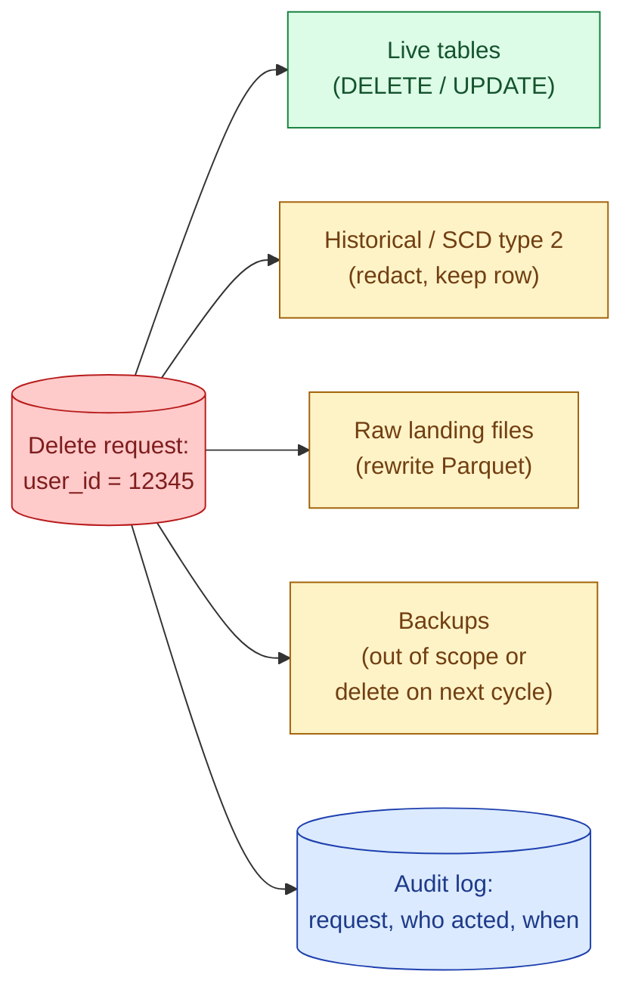

GDPR Article 17 ("right to erasure") gives users the right to have their personal data deleted. Sounds simple. Becomes one of the hardest engineering problems in a data warehouse, because the user's data is in fact tables, dimension tables, raw landing zones, archived files, backups, and probably a dashboard cache somewhere.

**What this page will cover.**

- The 30-day window: GDPR allows reasonable time, not instant.
- The "what to delete vs what to retain" decision: legal retention can outweigh deletion.
- Hard delete vs redact (overwrite with NULL or `[DELETED]`).
- Lakehouse formats (Delta, Iceberg) and their `DELETE FROM` support.
- Raw Parquet: rewriting partition files is the only path.
- The vault approach: delete the token-to-real mapping, and the warehouse is effectively anonymised.

*Page coming soon. Until then, see [#083 PII masking and right to be forgotten](/practice/data-engineering/083-pii-masking-and-right-to-be-forgotten/) for the practice problem.*

This concept sits in **Stage 6 (Reliability, debugging, cost)** of the [Data Engineering Roadmap](/practice/data-engineering/roadmap/).
