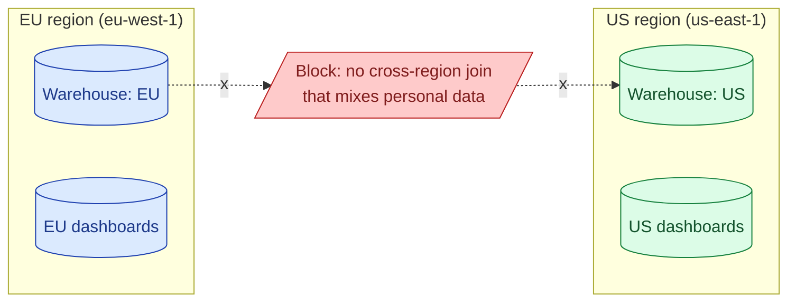
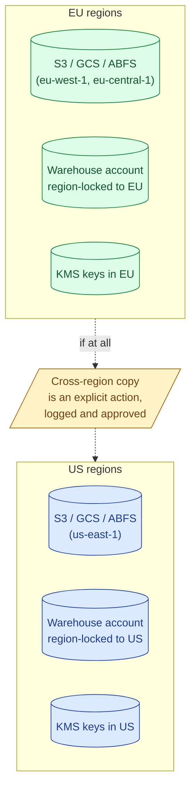
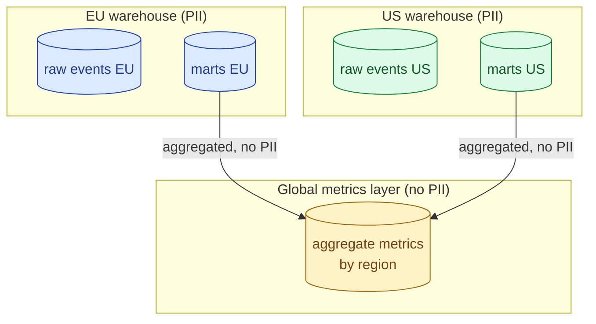
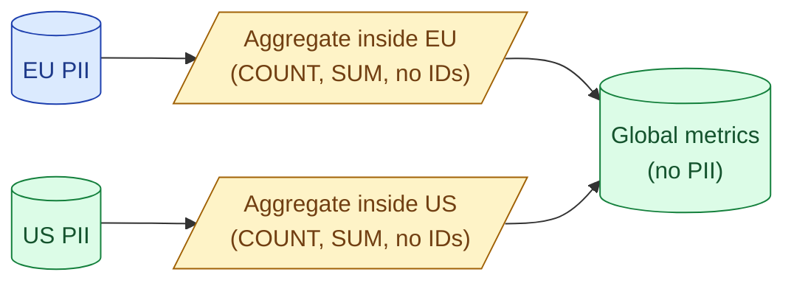

Data residency is the legal requirement that personal data stay in a specific geographic region. EU citizens' data, by GDPR, must be processed and stored in the EU (with narrow exceptions). The warehouse has to enforce this: separate accounts per region, replication boundaries, query routing.



## What residency actually means

Two requirements, often conflated.

- **Storage residency.** Bytes at rest live in a specific region. The S3 bucket is `eu-west-1`. The warehouse account is `eu-central-1`. The backup is in the same continent.
- **Processing residency.** The compute that reads, transforms, or queries the data also runs in the region. A warehouse in `eu-central-1` that streams data to a query engine in `us-east-1` violates processing residency even if storage stayed put.

GDPR cares about both. Schrems II (CJEU, 2020) tightened the processing side: US-headquartered cloud providers operating in the EU are subject to US surveillance law, and the court ruled that this is incompatible with GDPR unless additional safeguards exist. The practical answer in 2026: keep EU personal data in EU regions of EU-friendly providers, and document the supplementary measures (encryption keys held in the EU, contracts, access controls).

## How cloud regions enforce it



Every major cloud and warehouse pins regions explicitly.

- **Snowflake.** Account is created in a region. Cross-region replication requires a paid feature and explicit setup. Compute always runs in the account region.
- **BigQuery.** Datasets have a `location` property (`EU`, `US`, `europe-west4`, etc.). Cross-location queries are blocked unless you explicitly authorise a cross-region transfer.
- **Databricks.** Workspaces are tied to a region. Unity Catalog metastores too. Cross-region table reads require either replication or external sharing.
- **S3 / GCS / Azure Blob.** Buckets are regional. Cross-region replication is opt-in and slow.

The default in every system is "no cross-region anything." Residency violations almost always come from someone explicitly turning that off (a `gsutil cp` from EU bucket to US bucket, a Snowflake replication task, a BigQuery scheduled transfer). These actions show up in the cloud audit log.

## Multi-region tables and their cost

Some warehouses offer multi-region storage classes that automatically replicate across regions in a geography (BigQuery's `EU` multi-region writes to `europe-west1` and `europe-west4`; S3 cross-region replication does the same for buckets).

The trade-offs.

- **Cost.** You pay storage in every region the data lives.
- **Consistency.** Some multi-region modes are eventually consistent. Read-after-write across regions is not guaranteed.
- **Compliance scope.** EU multi-region includes only EU regions, so GDPR is fine. A "global" multi-region usually is not.

The honest pattern: multi-region within a single jurisdiction (EU multi-region for HA), single-region across jurisdictions (separate EU and US accounts that do not replicate personal data).

## The architecture: regional warehouses plus a global metrics layer



The pattern that scales.

- **Regional warehouses hold the raw and silver data.** EU users land in the EU warehouse. US users land in the US warehouse. These are separate accounts, separate IAM, separate compute.
- **Each regional warehouse computes its own marts.** Same dbt project, deployed to both regions, parameterised by region.
- **A global metrics layer holds non-personal aggregates.** Daily revenue by country. Active users by product line. No row that identifies a person. This is the table the global leadership dashboard reads.

The rule that makes it work: nothing leaves the regional warehouse unless it is an aggregate over enough rows that no individual is identifiable. Some teams enforce a minimum cohort size (e.g., aggregates only with `COUNT(DISTINCT user_id) >= 50`) to make this defensible.

## A concrete example

```sql
-- in the EU warehouse: regional fact table
CREATE TABLE eu_warehouse.marts.fct_orders (
  order_id STRING,
  user_id STRING,        -- personal data, stays in EU
  user_email STRING,     -- personal data, stays in EU
  amount NUMERIC,
  country STRING,
  order_date DATE
);

-- the aggregate that goes to the global layer: no PII
CREATE TABLE eu_warehouse.marts.gold_daily_revenue AS
SELECT
  order_date,
  country,
  COUNT(DISTINCT user_id) AS active_users,   -- count only, no IDs
  SUM(amount) AS revenue
FROM eu_warehouse.marts.fct_orders
GROUP BY order_date, country
HAVING COUNT(DISTINCT user_id) >= 50;        -- k-anonymity floor

-- a scheduled job copies gold_daily_revenue to the global layer
-- the copy is logged, reviewed, and contains zero personal data
```

The EU `fct_orders` never leaves the EU. The aggregated `gold_daily_revenue` does, because it cannot identify a person. The 50-user floor is a defensive floor against re-identification via small cells.

## Cross-region replication policies

When you do legitimately need to replicate across regions (disaster recovery, an actual product feature), make the policy explicit.

- **What classes of data can replicate.** Aggregates yes, raw events no. Encode this in a tagging system (every dataset has a `residency_class` label).
- **Who can authorise it.** Replication requires a sign-off from a named compliance role, not just an engineer.
- **How it is audited.** Every replication action shows up in the audit log with the dataset, the source region, the destination region, the requester, and the approver.
- **How it is undone.** If the policy changes, you need to be able to delete the replicated copy without a project.

Without a written policy, residency violations happen by accident: someone runs a `CREATE TABLE us_warehouse.foo AS SELECT * FROM eu_warehouse.bar` and the personal data is now in the US.

## Schrems II and supplementary measures

The short version. EU citizens' data processed by a US-headquartered cloud provider is subject to US surveillance law. The European Court of Justice ruled in 2020 that this is incompatible with GDPR unless **supplementary measures** are in place.

Supplementary measures in practice.

- **Encryption with EU-controlled keys.** The cloud provider holds the ciphertext; the key is in an EU KMS or HSM the provider cannot reach. AWS XKS, Google Cloud EKM, and Azure Key Vault BYOK support this pattern.
- **EU sovereign cloud regions.** AWS European Sovereign Cloud, Microsoft EU Data Boundary, Google Sovereign Controls. These regions promise stricter isolation from US-headquartered operations.
- **Standard Contractual Clauses (SCCs).** The legal contract that says the provider will follow EU law for EU data. Necessary but not sufficient.

The honest take: in 2026, EU residency is satisfied by "EU region, EU-held encryption keys, SCCs signed." Anything weaker is a legal grey zone.

## Keeping PII in-region while sharing aggregates globally



The aggregation happens inside the source region. The output is non-personal. That output crosses the border. Personal data never does. This is the architecture that the global leadership dashboard, the product analytics review, and the finance close are all built on.

If a question genuinely requires joining personal data across regions ("how many EU users also have US accounts?"), the answer is usually "aggregate it in one region and don't show individuals" or "build a per-region cohort definition and aggregate both."

## Common mistakes

- **Treating multi-region as one big region.** A `EU` multi-region dataset and a `US` multi-region dataset are not the same thing. Cross-multi-region queries violate residency.
- **One global warehouse account.** Convenient for the data team, illegal for EU personal data on a US-headquartered cloud account without supplementary measures.
- **Replicating "for analytics" without approval.** Engineers replicate buckets because it makes a dashboard easier. The audit log records this and the regulator notices.
- **Ignoring backup region.** The warehouse is in `eu-central-1` but the backup is in `us-east-1`. The backup is now a residency violation.
- **Forgetting KMS keys.** The data is encrypted, but with a key the US provider holds. Schrems II is unimpressed. Use customer-managed keys in an EU KMS.
- **Aggregating with no k-anonymity floor.** A "global metrics" table with `COUNT(*) = 1` rows is still personal data via re-identification. Set a minimum cohort size.
- **Assuming the cloud provider's region name implies sovereignty.** "eu-west-1" is an AWS region in Ireland. It is still operated by a US-headquartered company subject to US law. Supplementary measures still required.

## Quick recap

- Data residency means both storage and processing stay in a specific region; GDPR cares about both.
- Major warehouses are region-locked by default; cross-region anything is an explicit, audited action.
- The architecture that scales: regional warehouses for PII, a global metrics layer for non-personal aggregates.
- Aggregates leaving a region need a k-anonymity floor so they cannot re-identify individuals.
- Schrems II requires supplementary measures (EU-held keys, sovereign regions, SCCs) for US-headquartered providers handling EU data.
- The backup region, the KMS key region, and the warehouse region all have to match the residency requirement, not just the primary store.

This concept sits in **Stage 6 (Reliability, debugging, cost)** of the [Data Engineering Roadmap](/practice/data-engineering/roadmap/).
