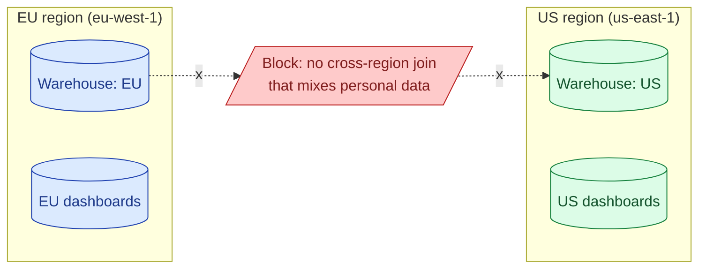

Data residency is the legal requirement that personal data stay in a specific geographic region. EU citizens' data, by GDPR, must be processed and stored in the EU (with narrow exceptions). The warehouse has to enforce this: separate accounts per region, replication boundaries, query routing.

**What this page will cover.**

- Snowflake / BigQuery / Databricks region selection at account or dataset level.
- The Schrems II ruling and what it means for US warehouses holding EU data.
- Standard Contractual Clauses and supplementary measures.
- Aggregation across regions: yes for non-PII metrics, no for personal-level joins.
- The architecture decision: regional warehouses + a global metrics layer with no PII.
- The honest take: data residency is a compliance and architecture problem, not just a button.

*Page coming soon.*

This concept sits in **Stage 6 (Reliability, debugging, cost)** of the [Data Engineering Roadmap](/practice/data-engineering/roadmap/).
