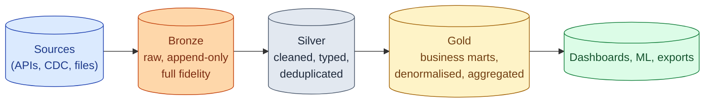
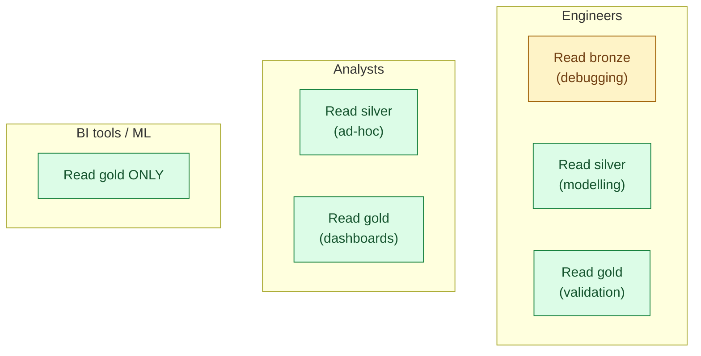
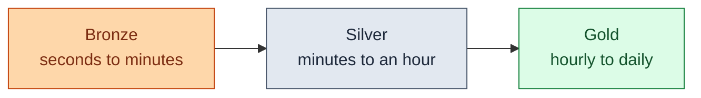

The medallion architecture organises a lakehouse into three layers. **Bronze** holds raw data, exactly as it arrived. **Silver** holds cleaned, deduplicated, validated data. **Gold** holds the business-level marts that dashboards and ML models read. Each layer has different freshness, quality, and access requirements. The pattern came from Databricks and is now standard.



## Why three layers, not one

The temptation when you start a warehouse is to write raw data directly into the analytics table. It works for the first week. Then the source schema changes and the downstream report breaks. Then someone discovers the dedup logic was wrong. Then a backfill has to run, but there is no raw layer to backfill from.

Three layers separate three concerns.

- **Bronze fixes the "we lost the raw data" problem.** Whatever happens upstream or downstream, bronze is the ground truth.
- **Silver fixes the "every consumer does its own cleaning" problem.** One canonical clean version, used by everyone.
- **Gold fixes the "the BI tool joins seven tables and dies" problem.** Pre-joined, pre-aggregated, dashboard-ready.

## What goes in each layer

### Bronze: raw, immutable, full fidelity

Bronze contains the data exactly as it arrived. Every field, every weird value, every duplicate. The source-system types. The source-system names. The JSON blobs that have not been parsed yet.

```sql
CREATE TABLE bronze.stripe_charges (
  payload VARIANT,           -- the whole JSON object as it came in
  ingested_at TIMESTAMP,     -- when our pipeline saw it
  source_file STRING,        -- which file it came from
  source_offset BIGINT       -- where in the file
);
```

The bronze rule: never modify a row in place. Append only. If a record is updated upstream, you write a new row in bronze with a later `ingested_at`. The history is the audit trail.

The other bronze rule: no business logic. Bronze is the source. Anything that interprets the data belongs in silver.

### Silver: cleaned, typed, deduplicated, conformed

Silver takes bronze and makes it usable. Columns have proper types. Duplicates are removed. Field names are normalised across sources. Foreign keys point to the silver dimension, not the source ID.

```sql
CREATE TABLE silver.charges AS
SELECT
  payload:id::STRING                    AS charge_id,
  payload:customer::STRING              AS customer_id,
  payload:amount::NUMERIC / 100         AS amount_usd,
  payload:created::TIMESTAMP            AS created_at,
  ingested_at
FROM bronze.stripe_charges
QUALIFY ROW_NUMBER() OVER (
  PARTITION BY payload:id ORDER BY ingested_at DESC
) = 1;
```

Silver is where the source-system mess becomes a usable model. One row per entity. Real types. Names that match the rest of the warehouse.

Silver is also where data quality lives. Tests for not-null, uniqueness, value ranges, foreign key validity. If silver is wrong, gold is wrong, so you stop the pipeline at silver if a test fails.

### Gold: business-ready marts

Gold is what the dashboard reads. A row per business question. Pre-joined facts and dimensions. Aggregations that took 10 minutes to compute are precomputed once.

```sql
CREATE TABLE gold.fct_daily_revenue AS
SELECT
  DATE(c.created_at)            AS revenue_date,
  o.country,
  o.channel,
  COUNT(DISTINCT c.customer_id) AS paying_customers,
  SUM(c.amount_usd)             AS revenue_usd
FROM silver.charges c
JOIN silver.orders o ON c.charge_id = o.charge_id
GROUP BY 1, 2, 3;
```

Gold tables are denormalised on purpose. The dashboard does not join anything; it just reads a row. Latency at query time is the metric gold optimises for.

## Layer access patterns



The default access rule: BI tools and ML pipelines read gold only. Analysts can read silver for ad-hoc work. Engineers can read everything, including bronze, for debugging. This concentrates the dashboard load on a small set of curated tables and stops the BI tool from accidentally querying a 10 TB raw table.

The other reason: governance. Gold is the layer that has been reviewed for PII, masked, audited. Silver is mostly there but with rawer columns. Bronze is "anything goes." Limiting BI to gold limits the surface where PII can leak.

## The dbt mapping

dbt's standard project structure is medallion under different names.

| Medallion layer | dbt folder | What it does |
|---|---|---|
| Bronze | `sources/` (not modelled) plus raw schemas | Raw landing |
| Silver | `models/staging/` plus `models/intermediate/` | Cleaned, typed, intermediate joins |
| Gold | `models/marts/` | Final business-ready tables |

A typical dbt project that follows this strictly.

```
models/
  staging/
    stripe/
      stg_stripe__charges.sql        -- silver: typed, deduped
      stg_stripe__customers.sql
    shopify/
      stg_shopify__orders.sql
  intermediate/
    int_orders__joined_with_charges.sql  -- silver: pre-join logic
  marts/
    finance/
      fct_daily_revenue.sql          -- gold
      fct_monthly_revenue.sql        -- gold
    marketing/
      fct_campaign_attribution.sql   -- gold
```

Source freshness checks live in `sources.yml` at the bronze edge. Tests live across staging and marts. Documentation lives in YAML next to each model. See [#069 dbt project structure](/practice/data-engineering/concepts/069-dbt-project-structure/) for the deeper version.

## Freshness expectations per layer



The rule of thumb.

- **Bronze runs at the rate of the source.** CDC stream: seconds. Hourly API: hourly. Daily file drop: daily.
- **Silver runs slightly behind bronze.** Often the same cadence; sometimes batched to amortise the dedup cost.
- **Gold runs at the cadence the business needs.** Most marts are daily. Some are hourly. A few are real-time (streaming gold tables, see Materialised Views).

Trying to keep gold at sub-minute freshness when nobody asked is the most common cost mistake in this pattern.

## The "skip silver" sin

The most common medallion sin: writing a model that reads directly from bronze and lands in gold.

```sql
-- DON'T: bronze straight to gold
CREATE TABLE gold.fct_daily_revenue AS
SELECT
  DATE(payload:created::TIMESTAMP) AS revenue_date,
  ...
FROM bronze.stripe_charges;
```

Two problems.

- Every consumer that needs the same parsing now has to redo it.
- The dedup logic, the type casting, the source-name normalisation are all hidden inside the gold model. When the source schema changes, every gold model breaks at once.

The fix is always the same: introduce a `stg_stripe__charges` staging model that does the cleaning, then have gold read from staging. The staging layer is the contract between source and business logic.

## A worked example: end-to-end

```sql
-- BRONZE: raw landing from a CDC stream
CREATE TABLE bronze.orders (
  payload VARIANT,
  op CHAR(1),               -- 'I', 'U', 'D'
  ingested_at TIMESTAMP
);

-- SILVER: deduplicated, typed, one row per current order
CREATE TABLE silver.orders AS
SELECT
  payload:order_id::STRING                  AS order_id,
  payload:customer_id::STRING               AS customer_id,
  payload:total::NUMERIC                    AS total,
  payload:status::STRING                    AS status,
  payload:created_at::TIMESTAMP             AS created_at,
  payload:updated_at::TIMESTAMP             AS updated_at,
  ingested_at
FROM bronze.orders
WHERE op != 'D'
QUALIFY ROW_NUMBER() OVER (
  PARTITION BY payload:order_id ORDER BY ingested_at DESC
) = 1;

-- GOLD: a business mart, one row per customer per month
CREATE TABLE gold.fct_customer_monthly AS
SELECT
  customer_id,
  DATE_TRUNC('month', created_at) AS month,
  COUNT(*)                        AS order_count,
  SUM(total)                      AS revenue,
  MAX(created_at)                 AS last_order_at
FROM silver.orders
WHERE status = 'completed'
GROUP BY customer_id, DATE_TRUNC('month', created_at);
```

Bronze captures every CDC event. Silver gives us the current state of each order. Gold gives the dashboard one row per customer per month, with no joins required at read time.

## Common mistakes

- **Bronze with business logic.** Once bronze starts filtering or transforming, it stops being the source of truth. Keep bronze raw.
- **Gold with source-system schemas.** A gold mart with a column called `stripe_customer_id_raw` has leaked the source into the business layer. Normalise in silver.
- **Skipping silver.** Bronze straight to gold puts cleaning logic in every gold model. Painful when the source changes.
- **One gold table per dashboard.** Gold should be modelled around the business, not the dashboard. Two dashboards reading the same gold table is the goal.
- **No retention policy on bronze.** Bronze grows forever. Either set a TTL (90 days, for example) or rely on the source for replay.
- **Treating freshness as global.** Bronze is real-time, gold is hourly. Trying to make every layer real-time burns compute and gains nothing.
- **Letting BI tools read silver.** Now you have a quasi-production interface to silver, and any change to silver breaks a dashboard. Pin BI to gold.

## Quick recap

- Bronze: raw, append-only, full fidelity. Never modified. No business logic.
- Silver: cleaned, typed, deduplicated, conformed. The contract between source and business.
- Gold: dashboard-ready marts. Pre-joined, pre-aggregated, denormalised.
- BI and ML read gold only; analysts can read silver; engineers can read bronze for debugging.
- The dbt mapping is `staging/` plus `intermediate/` for silver, `marts/` for gold.
- Freshness per layer: bronze at source rate, silver close behind, gold at business cadence.
- The most common sin is bronze straight to gold; always go through silver.

This concept sits in **Stage 2 (Data modeling and warehousing)** of the [Data Engineering Roadmap](/practice/data-engineering/roadmap/).
