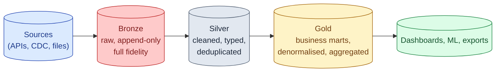

The medallion architecture organises a lakehouse into three layers. **Bronze** holds raw data, exactly as it arrived. **Silver** holds cleaned, deduplicated, validated data. **Gold** holds the business-level marts that dashboards and ML models read. Each layer has different freshness, quality, and access requirements. The pattern came from Databricks and is now standard.

**What this page will cover.**

- What each layer holds, in one sentence.
- The "raw is the source of truth" principle: bronze is never modified.
- The dbt convention: `staging` (silver-ish), `intermediate`, `marts` (gold).
- Freshness expectations: bronze is real-time, gold is daily, intermediate is whatever.
- Why "skip silver and go straight to gold" is the most common medallion sin.
- Access patterns: who reads which layer, and the security implications.

*Page coming soon. Until then, see [#099 No staging layer: everything touches raw](/practice/data-engineering/099-no-staging-layer-everything-touches-raw/) for the practice problem.*

This concept sits in **Stage 2 (Data modeling and warehousing)** of the [Data Engineering Roadmap](/practice/data-engineering/roadmap/).
