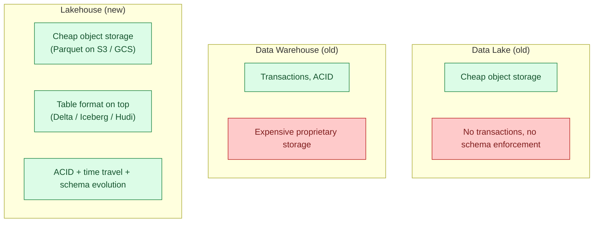

A data lake stores raw files cheaply on object storage. A data warehouse stores curated, queryable, transactional tables. A lakehouse fuses the two: object storage for the bytes (cheap), a table format on top (Delta / Iceberg / Hudi) for transactions, schema evolution, and time travel. You get warehouse semantics at lake prices.

**What this page will cover.**

- Why lakehouse won the 2020s: cheap storage + warehouse semantics.
- The three table formats again (Delta, Iceberg, Hudi) and how each enables the lakehouse.
- The "open" lakehouse: any engine can read your tables (Trino, Spark, DuckDB, Snowflake).
- The "closed" lakehouse: Databricks Delta or Snowflake Iceberg-backed tables.
- The cost of avoiding lock-in: an open lakehouse is slightly slower than a vendor-tuned one.
- The 2026 honest take: lakehouse is the default for new analytical platforms.

*Page coming soon. Until then, see [#013 Data lake vs warehouse vs lakehouse](/practice/data-engineering/013-data-lake-vs-warehouse-vs-lakehouse/) for the practice problem.*

This concept sits in **Stage 5 (Storage and file formats)** of the [Data Engineering Roadmap](/practice/data-engineering/roadmap/).
