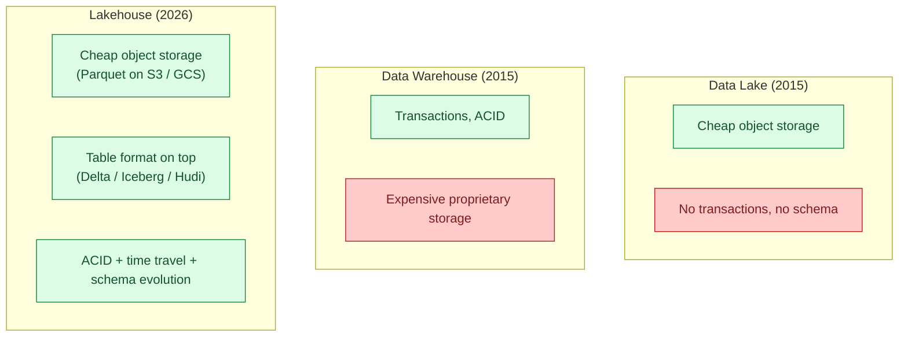
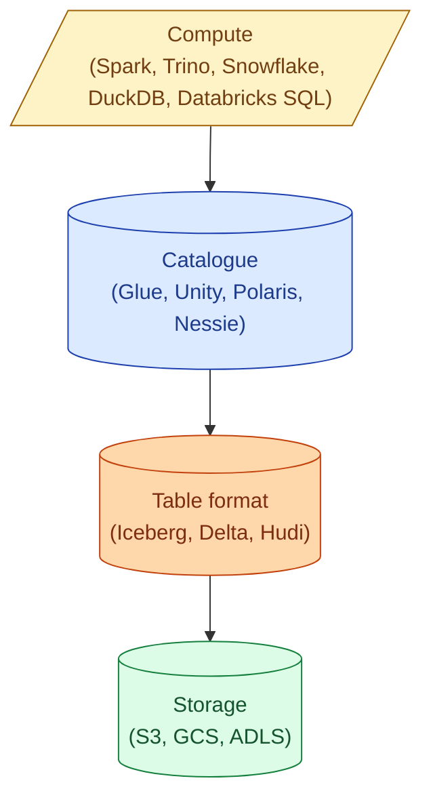
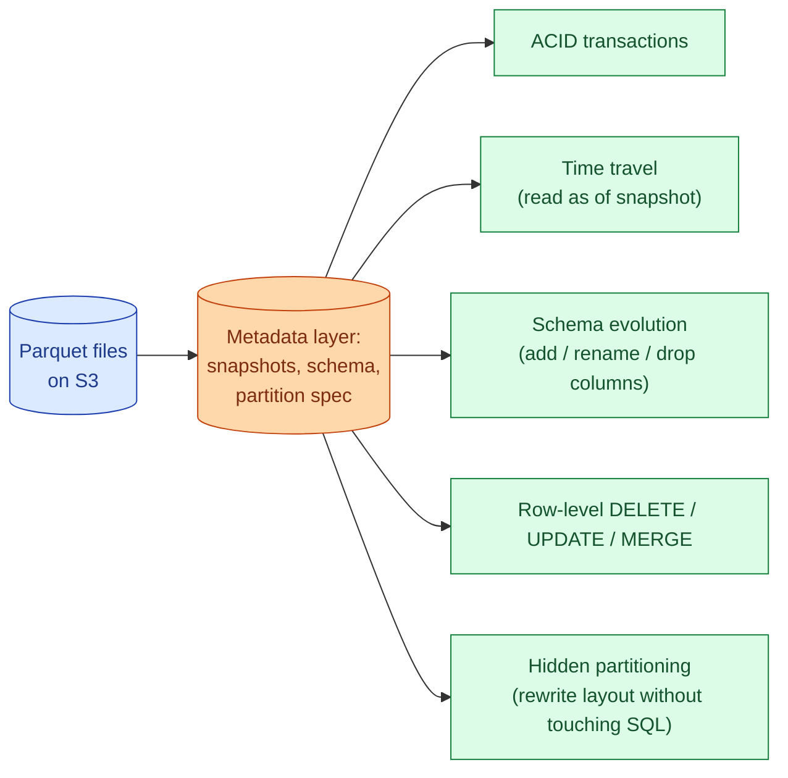
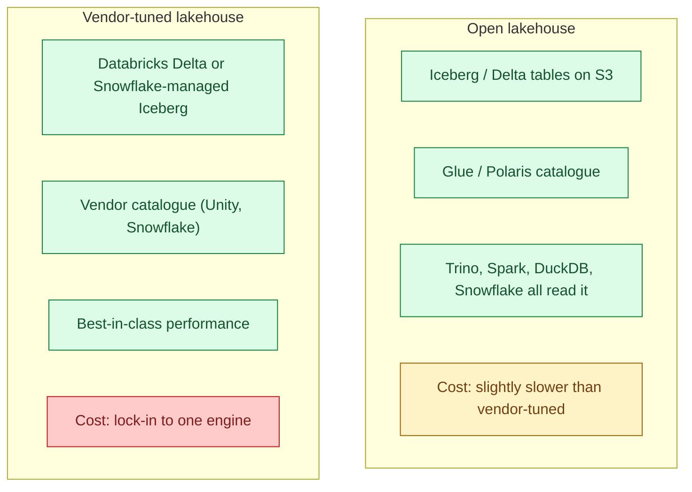

A data lake stores raw files cheaply on object storage. A data warehouse stores curated, queryable, transactional tables. A lakehouse fuses the two: object storage for the bytes (cheap), a table format on top (Delta / Iceberg / Hudi) for transactions, schema evolution, and time travel. You get warehouse semantics at lake prices.



## What a lakehouse actually is

A lakehouse is four layers, each pluggable.



- **Storage.** Object storage. S3, GCS, ADLS, MinIO. Stores Parquet files. Cheap.
- **Table format.** A layer of metadata files (manifests, snapshots) on top of the Parquet that turns "a folder of files" into "a transactional table." Iceberg, Delta Lake, Apache Hudi.
- **Catalogue.** Tracks which tables exist, where their metadata lives, who can read them. AWS Glue, Databricks Unity Catalog, Snowflake Polaris, Project Nessie.
- **Compute.** The engines that read and write. Spark, Trino, Flink, Snowflake (external Iceberg tables), Databricks SQL, DuckDB, Athena.

The breakthrough is that these four layers are independent. You can change the engine without rewriting your data. You can query the same table with Trino and Spark at the same time. The data is yours, not the vendor's.

## Why this beats the warehouse-vs-lake debate

The old debate.

- Lake. Cheap, scales to petabytes, no transactions, schema-on-read pain, BI tools struggle.
- Warehouse. Transactions, fast queries, schema enforcement, but proprietary storage and per-byte costs.

The compromise the industry tried first was "lake plus warehouse": land everything in S3, then copy curated data into Snowflake or BigQuery. The copy is expensive (compute, time, freshness), the data is duplicated, and the BI tool reads the warehouse but the data scientist reads the lake, so neither sees the same truth.

The lakehouse removes the copy. The warehouse-grade tables live on the lake. Snowflake can read them via external tables. Databricks reads them natively. Trino reads them with one connector. The data scientist and the BI dashboard read the same bytes.

## The three table formats

| Format | Origin | Strength | Trade-off |
|---|---|---|---|
| **Delta Lake** | Databricks (2019) | Most mature, deep Databricks integration, excellent stream + batch | Best on Databricks; other engines slightly behind |
| **Apache Iceberg** | Netflix (2017), Apache project | Most open, multi-vendor support, hidden partitioning | Newer, ecosystem still catching up in places |
| **Apache Hudi** | Uber (2017) | Upserts and CDC are first class, record-level indexing | Smaller ecosystem, more complex configuration |

In 2026, Iceberg has won the "neutral table format" debate. Snowflake, AWS, Google, and most of the open-source world support it. Delta is the right choice if your stack is Databricks-heavy. Hudi is niche but excellent for streaming upsert workloads.

The conceptual model is the same in all three: a table is a folder of Parquet plus a stack of metadata files describing snapshots, schemas, and partition specs.

## What you get from a table format



- **ACID transactions.** A `MERGE` either commits or does not. No half-written tables.
- **Time travel.** `SELECT * FROM events FOR VERSION AS OF 12345`. Useful for debugging, reproducibility, audit.
- **Schema evolution.** Add a column without rewriting old files. Rename without breaking queries.
- **Row-level operations.** `DELETE`, `UPDATE`, `MERGE` work, which is what makes GDPR deletes tractable.
- **Hidden partitioning (Iceberg).** The user queries `WHERE event_date = '2026-06-04'`; the engine figures out which partition files to read. Changing partition layout does not break queries.

These are the warehouse features that the lake never had. Now the lake has them.

## A worked example: creating and querying an Iceberg table

```sql
-- 1. create the table (one writer, any engine)
CREATE TABLE warehouse.events (
  event_id STRING,
  user_id STRING,
  event_type STRING,
  occurred_at TIMESTAMP,
  payload STRING
)
USING ICEBERG
PARTITIONED BY (days(occurred_at));

-- 2. write from Spark
spark.write.format("iceberg").mode("append").saveAsTable("warehouse.events")

-- 3. query the same table from Trino
SELECT event_type, COUNT(*)
FROM iceberg.warehouse.events
WHERE occurred_at > now() - INTERVAL '1' DAY
GROUP BY event_type;

-- 4. query from Snowflake (external Iceberg table)
CREATE EXTERNAL TABLE events_ext
  USING TEMPLATE ICEBERG
  LOCATION = 's3://lake/warehouse/events/'
  CATALOG = 'glue_catalog';

-- 5. time travel (Iceberg)
SELECT * FROM warehouse.events
  FOR TIMESTAMP AS OF '2026-06-01 00:00:00';

-- 6. delete for GDPR
DELETE FROM warehouse.events WHERE user_id = '12345';
```

One table, three engines, time travel, row-level delete. Five years ago each of those was a separate decision with separate storage.

## Open vs closed lakehouse



- **Open lakehouse.** You own the storage account, the table format is open, the catalogue is open. Any engine can read your data. You can swap Snowflake for Trino on Tuesday.
- **Vendor-tuned lakehouse.** Databricks Delta is technically open but the best performance is on Databricks. Snowflake's Iceberg-backed tables are the same with Snowflake. You get faster queries; you give up easy multi-engine access.

The honest take in 2026. Most platforms run an open table format (Iceberg) with one primary engine for performance and other engines for specific use cases. "Pure" open lakehouses without a primary vendor exist but the operational cost is real (manage your own Trino, your own Spark, your own catalogue).

## Engines that read a lakehouse

| Engine | Iceberg | Delta | Hudi |
|---|---|---|---|
| Spark | Yes | Yes (native) | Yes |
| Databricks SQL | Yes (Unity) | Yes (native) | Limited |
| Snowflake | Yes (external + native) | Read only | No |
| Trino / Presto | Yes | Yes | Yes |
| DuckDB | Yes (read) | Yes (read) | No |
| Athena | Yes | Yes | Yes |
| Flink | Yes | Yes | Yes (best) |
| BigQuery | Yes (BigLake external Iceberg) | Limited | No |

The convergence of 2024-2026: every major engine now reads Iceberg. The vendor-vs-vendor competition is shifting from "whose storage is better" to "whose compute is fastest on the same storage."

## When the lakehouse is the wrong answer

It is not always the right answer.

- **Sub-second OLTP.** You need a transactional database, not a lakehouse. Postgres, MySQL, or a serverless OLTP.
- **Tiny data.** If your whole analytics fit in 100 GB, a single Postgres or DuckDB is simpler and faster than a lakehouse.
- **Hard real-time.** Lakehouse latency is seconds-to-minutes for writes (commit cycles). A stream processor (Flink) writing to KV (Redis) is faster.
- **No data engineers.** The lakehouse stack has more moving parts (catalogue, format, engine). A managed warehouse (BigQuery, Snowflake) is simpler if you do not have the team.

The default for new analytical platforms in 2026 is a lakehouse. The exceptions above are still real.

## Common mistakes

- **Confusing the lakehouse with one vendor.** Databricks did not invent the lakehouse; it popularised the pattern. Iceberg gives you the same model without Databricks.
- **Treating Iceberg as just Parquet.** Without the metadata layer, you have no transactions, no time travel, no row-level deletes. The metadata is what makes it a lakehouse.
- **Ignoring the catalogue.** The table format describes the table; the catalogue tells engines where to find it. Without a shared catalogue, multi-engine breaks.
- **Skipping compaction.** Small files and delete markers accumulate. Run `OPTIMIZE` (Delta) or `rewrite_data_files` (Iceberg) regularly or query performance degrades.
- **Letting metadata grow forever.** Each commit creates a new snapshot. Without `VACUUM` / `expire_snapshots`, the metadata layer becomes huge and slow.
- **Picking the format by hype rather than by fit.** If your stack is Databricks, Delta. If your stack is multi-engine, Iceberg. If your workload is streaming upserts, Hudi.
- **Comparing lakehouse cost to warehouse cost without compute.** Storage on S3 is cheaper than Snowflake storage. Compute is comparable. Total cost depends on how you query.

## Quick recap

- A lakehouse is object storage plus an open table format plus a catalogue plus pluggable compute.
- Iceberg, Delta, and Hudi are the three table formats. Iceberg is the neutral default in 2026.
- ACID, time travel, schema evolution, row-level operations: lake storage with warehouse semantics.
- Open lakehouse means any engine can read; vendor-tuned lakehouse is faster on one engine.
- The convergence is real: Snowflake, Databricks, Trino, DuckDB, Athena, Flink all read Iceberg now.
- Compaction and snapshot expiration are operational requirements; without them the lakehouse slows down.
- The lakehouse is the default for new analytical platforms; the warehouse-vs-lake debate is over.

This concept sits in **Stage 5 (Storage and file formats)** of the [Data Engineering Roadmap](/practice/data-engineering/roadmap/).
