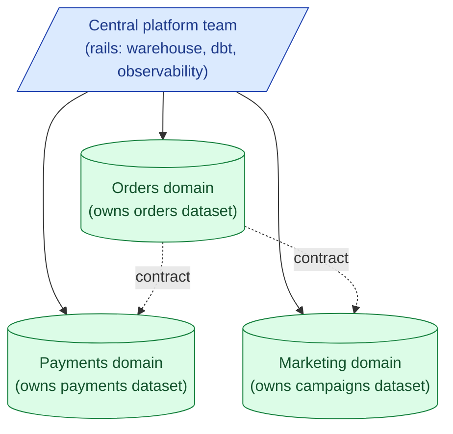

Data mesh is an organisational pattern, not a technology stack. Each domain team (orders, payments, marketing) owns its own data as a product: clean, documented, tested, contract-backed. A central platform team provides the rails (warehouse, orchestrator, observability). The mesh works when teams are big enough to actually own data. It fails when small teams are forced to do platform work they cannot staff.

**What this page will cover.**

- The four data mesh principles (Zhamak Dehghani, 2019).
- Domain-oriented ownership: who owns what dataset.
- Data as a product: SLAs, contracts, discoverability, documentation as first-class.
- Self-serve platform: the central team's job.
- Federated governance: shared standards without a central bottleneck.
- The honest take: data mesh is for organisations of 500+ engineers; smaller teams should stay centralised.

*Page coming soon.*

This concept sits in **Stage 6 (Reliability, debugging, cost)** of the [Data Engineering Roadmap](/practice/data-engineering/roadmap/).
