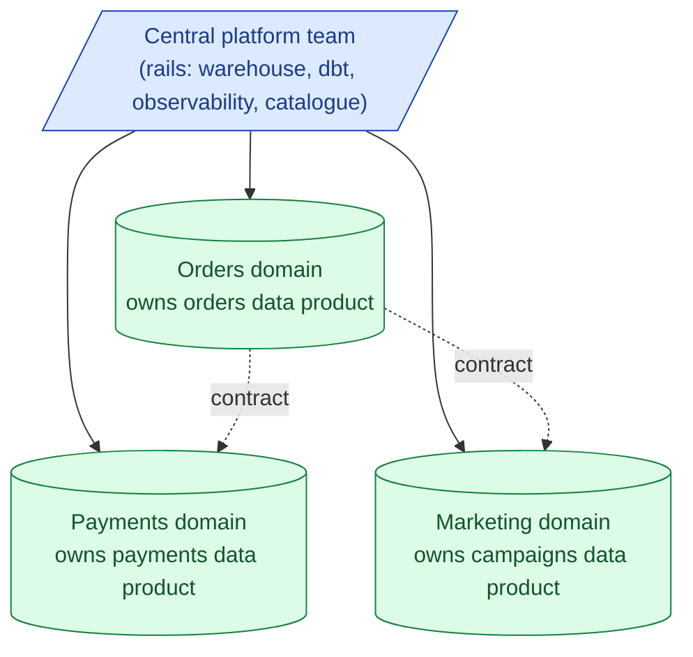
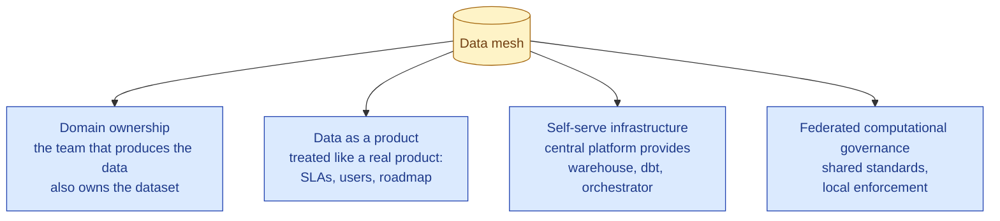
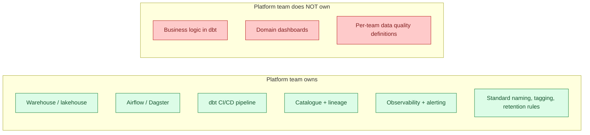

Data mesh is an organisational pattern, not a technology stack. Each domain team (orders, payments, marketing) owns its own data as a product: clean, documented, tested, contract-backed. A central platform team provides the rails (warehouse, orchestrator, observability). The mesh works when teams are big enough to actually own data. It fails when small teams are forced to do platform work they cannot staff.



## The four principles

Zhamak Dehghani's original 2019 essay laid out four principles. They have aged better than the buzzword.



### Domain ownership

The team closest to the source owns the dataset. Orders is owned by the orders engineering team, not by a central analytics team. The argument: the orders team knows when a column means "what I think it means," and they know first when it changes.

The cost: every domain team now has to do data engineering. That is the trade.

### Data as a product

A "data product" has the same properties as a software product.

- A name. `orders.fct_completed_orders`.
- An owner. A specific team, a specific on-call rotation.
- A contract. The schema, the SLA, the freshness commitment, the test suite.
- Users. Other teams or dashboards that consume it.
- A roadmap. Planned changes are announced; breaking changes go through a deprecation cycle.

A `dbt` project published with `dbt docs`, `model contracts`, freshness SLAs, and an on-call rota is exactly this.

### Self-serve infrastructure

The central platform team's job. They run.

- The warehouse / lakehouse.
- The orchestrator (Airflow, Dagster).
- The transformation layer (dbt Cloud, or a dbt CI/CD platform).
- The catalogue (Datahub, OpenMetadata, Unity Catalog).
- The observability (data tests, freshness alerts, lineage).

Domain teams use these as a service. They never set up Airflow themselves. The platform team is graded on developer experience, not on uptime alone.

### Federated computational governance

Shared standards (column naming, PII tagging, retention policies) enforced by tooling, not by a central review board. A dbt model with a PII column without the `pii` tag fails CI. A breaking schema change requires a deprecation notice. The rules are global; the enforcement is automated and local.

The alternative (a central governance committee approving every dataset) is the bottleneck that mesh was invented to remove.

## What a data product looks like in practice

A real data product is usually a domain-owned dbt project that publishes a set of contracted models. Concretely.

```
orders-data-product/
  models/
    public/
      fct_completed_orders.sql          <- the product
      dim_orders.sql                    <- the product
    internal/
      stg_orders__events.sql            <- not exposed
      int_orders__joined.sql            <- not exposed
  models/public/schema.yml              <- contracts, owner, SLA
  tests/
  exposures.yml                         <- who consumes this product
  README.md                             <- the docs
  .github/workflows/                    <- CI: tests, contracts, lineage
```

The `public/` schema is the product. `internal/` is implementation. The contract lives in YAML.

```yaml
models:
  - name: fct_completed_orders
    description: "One row per completed order."
    config:
      contract:
        enforced: true
    columns:
      - name: order_id
        data_type: string
        constraints:
          - type: not_null
          - type: unique
      - name: total_usd
        data_type: numeric
    meta:
      owner: "team-orders@company.com"
      freshness: "1 hour"
      pii: false
      retention: "5 years"
```

When the orders team changes the column type from `numeric` to `string`, dbt's contract enforcement blocks the change at CI. The consuming teams' pipelines do not break in production; they break in the orders team's CI.

## The platform team's actual scope



The line is usually clear in retrospect and blurry on day one. A new platform team will be pulled into "can you help us write this dbt model?" requests and will spend their first quarter saying no in a polite way.

## Where data mesh fails

The mesh works when domain teams have the headcount, skills, and incentive to own data. It fails when any of those is missing.

### Failure mode 1: small teams forced to do platform work

A 50-person company splits "data" into seven product squads. Each squad has one engineer with vague data skills. Now every squad runs a dbt project, an Airflow setup, a catalogue integration. The total data engineering capacity is the same as before; the operational overhead has multiplied by seven. Nothing gets done.

The fix is to stay centralised until you outgrow it. Most companies under 200 engineers should not run a mesh.

### Failure mode 2: single-domain orgs

A company that is essentially one domain (a B2B SaaS where almost all data is "customer behaviour in our product") does not benefit from mesh. There is no natural split. Trying to invent one creates artificial boundaries.

### Failure mode 3: "give every team their own bucket"

The 2026 reality. Big orgs adopt "data mesh" by giving every team their own warehouse schema or their own S3 bucket, with no contracts, no shared standards, no governance. The result is what people used to call a data swamp: 200 teams, 200 schemas, no idea where anything lives.

Mesh without the contracts and the platform is the same as no mesh, but with more YAML.

### Failure mode 4: the platform team becomes the bottleneck anyway

If the platform team is too small, every domain team's request piles up. Domains lose autonomy. The mesh becomes "centralised data, with extra steps."

The fix is to staff the platform team adequately. A rough heuristic: one platform engineer per 5-10 domain teams.

## When data mesh actually works

The success cases share traits.

- The org has 500+ engineers and 10+ natural product domains.
- Each domain team has at least one engineer who can own data (typically a senior backend engineer with data experience, or a domain data engineer).
- The platform team is well-staffed and treated as an internal product team.
- Contracts are enforced by tooling. Breaking changes are caught in CI, not in production.
- There is a federated governance rhythm: a quarterly forum where domain leads agree on the standards.
- Critically, the org has tried centralised data and hit the bottleneck. Mesh solves an actual problem they have.

## The honest 2026 take

Data mesh is popular in big orgs and often degenerates into a polite re-skinning of "every team has their own thing." The principles are correct. The execution is hard.

If you are at a 50-person company, run a centralised data team with a single dbt project. Mesh is for later.

If you are at a 5000-person company with a centralised team that has become the bottleneck, mesh is probably the right move, but only with serious investment in the platform team and the tooling that enforces contracts.

If you are at a 500-person company, you are in the messy middle. Some mesh principles (data as product, federated governance) help even without full domain ownership. Adopt the principles; do not adopt the org chart unless you have to.

## Common mistakes

- **Adopting mesh for the buzzword.** If centralised is working, do not switch. The cost is real and the benefit is not.
- **Mesh without contracts.** Domain ownership without enforced schemas is just sprawl. Contracts are the load-bearing part.
- **Mesh without a platform team.** Each domain team running its own infra is not mesh; it is decentralised chaos. The rails matter.
- **Treating the platform team as central data analytics.** Their job is rails, not dashboards. If they are writing the marketing report, the model is broken.
- **Domain teams that cannot staff data.** A "domain owner" who does not know SQL is not an owner. Either staff the team or do not call it a data product.
- **No deprecation policy.** Domains will change their products. Without a versioning and deprecation contract, downstream breaks happen weekly.
- **Skipping the catalogue.** Mesh has more datasets than central. Without a catalogue, nobody can find anything.

## Quick recap

- Data mesh is an organisational pattern: domain ownership, data as product, self-serve platform, federated governance.
- A data product is a domain-owned dbt project with contracts, SLAs, owners, and consumers.
- The platform team owns the rails; the domains own the content.
- Mesh fails for small teams, single-domain orgs, and any setup without contracts or platform investment.
- It works for 500+ engineer orgs with well-staffed platform teams and CI-enforced governance.
- In 2026 most "data mesh" adoptions in mid-size companies are decentralisation in disguise. Adopt the principles selectively; skip the org chart if you do not need it.

This concept sits in **Stage 6 (Reliability, debugging, cost)** of the [Data Engineering Roadmap](/practice/data-engineering/roadmap/).
