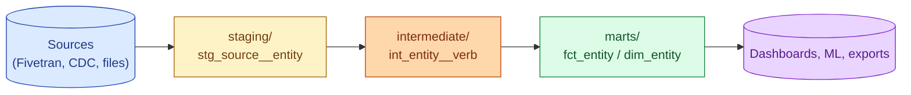
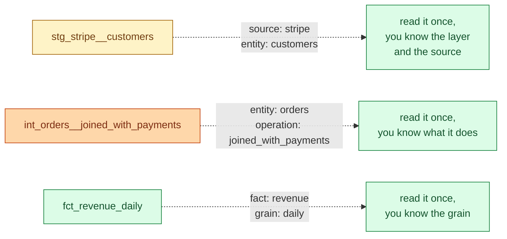
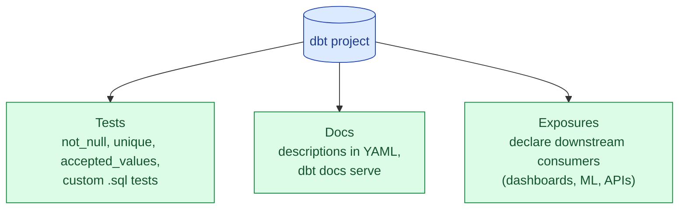



A small dbt project can put every model in one folder and still ship. A 500-model project cannot. The structure that has emerged from real teams: source-aligned `staging`, business-aligned `intermediate`, consumer-facing `marts`. Inside each, group by domain. The naming convention is half the value: when you read a model name, you should know which layer and which domain it belongs to.



## The three layers

dbt Labs' best-practices guide settled on three layers years ago. The naming has stuck because it solves real problems.

### staging/ : one model per source table

A staging model is the thinnest possible interface to a source table.

- Type-cast every column to a sane type.
- Rename columns to the warehouse's naming convention.
- Filter out test rows or soft-deletes.
- Nothing else. No joins. No aggregations. No business logic.

The rule: one staging model per source table. If the source table is `stripe.customers`, the staging model is `stg_stripe__customers`. Always.

```sql
-- models/staging/stripe/stg_stripe__customers.sql
WITH source AS (
    SELECT * FROM {{ source('stripe', 'customers') }}
),
renamed AS (
    SELECT
        id::STRING                          AS customer_id,
        email::STRING                       AS email,
        created::TIMESTAMP                  AS created_at,
        deleted::BOOLEAN                    AS is_deleted,
        currency::STRING                    AS currency
    FROM source
    WHERE NOT deleted
)
SELECT * FROM renamed
```

This is the contract between the raw source and everything else. Change here and you change the contract. Test here heavily.

### intermediate/ : the "thinking happens" layer

Intermediate models are where the SQL gets hard. Multi-source joins. Window functions. Sessionisation. Anything that takes more than two CTEs.

Intermediate models are an implementation detail. No dashboard reads them. They exist to keep the marts simple.

```sql
-- models/intermediate/orders/int_orders__joined_with_payments.sql
WITH orders AS (
    SELECT * FROM {{ ref('stg_shopify__orders') }}
),
payments AS (
    SELECT * FROM {{ ref('stg_stripe__charges') }}
),
joined AS (
    SELECT
        o.order_id,
        o.customer_id,
        o.order_total,
        p.charge_id,
        p.amount_charged,
        p.charged_at
    FROM orders o
    LEFT JOIN payments p ON o.order_id = p.metadata_order_id
)
SELECT * FROM joined
```

Naming: `int_<entity>__<verb>`. The double underscore makes the entity easy to spot.

### marts/ : the dashboards-and-ML layer

Marts are the public API of the warehouse. Every BI tool, ML pipeline, and reverse-ETL job should read from a mart and never from staging or intermediate.

```sql
-- models/marts/finance/fct_orders.sql
WITH joined AS (
    SELECT * FROM {{ ref('int_orders__joined_with_payments') }}
),
final AS (
    SELECT
        order_id,
        customer_id,
        order_total,
        charge_id,
        amount_charged,
        charged_at,
        (amount_charged - order_total) AS overcharge_amount,
        DATE(charged_at) AS charge_date
    FROM joined
)
SELECT * FROM final
```

Naming: `fct_*` for fact tables, `dim_*` for dimensions. Both are denormalised; the dashboard does not have to join anything.

## The folder layout

```
models/
  staging/
    stripe/
      _stripe__sources.yml          <- declare sources for stripe here
      _stripe__models.yml           <- model-level docs and tests
      stg_stripe__customers.sql
      stg_stripe__charges.sql
      stg_stripe__subscriptions.sql
    shopify/
      _shopify__sources.yml
      _shopify__models.yml
      stg_shopify__orders.sql
      stg_shopify__customers.sql
  intermediate/
    orders/
      _int_orders__models.yml
      int_orders__joined_with_payments.sql
      int_orders__deduped.sql
    customers/
      int_customers__unified.sql
  marts/
    finance/
      _finance__models.yml
      fct_orders.sql
      fct_revenue_daily.sql
      dim_customer.sql
    marketing/
      _marketing__models.yml
      fct_campaign_attribution.sql
```

Inside each layer, group by source (in staging) or by business domain (in intermediate and marts). The YAML files use a leading underscore so they sort to the top of the folder listing.

## The naming convention



The convention.

- **Staging.** `stg_<source>__<entity>`. The source goes first because dependencies flow from source.
- **Intermediate.** `int_<entity>__<verb>`. The entity goes first because consumers think about the entity, not the verb.
- **Marts.** `fct_<thing>` or `dim_<thing>`. The grain (`_daily`, `_monthly`) goes in the name when relevant.

Half the value of the convention is that you can `grep` for any layer or any source instantly. `ls models/staging/stripe/` tells you everything that depends on Stripe.

## Source freshness in YAML

Source freshness checks are cheap and high-value. They catch upstream stalls before downstream breaks.

```yaml
# models/staging/stripe/_stripe__sources.yml
version: 2

sources:
  - name: stripe
    database: raw
    schema: stripe
    loaded_at_field: _ingested_at
    freshness:
      warn_after:  { count: 2,  period: hour }
      error_after: { count: 12, period: hour }
    tables:
      - name: customers
      - name: charges
        freshness:
          error_after: { count: 1, period: hour }   # tighter for critical tables
      - name: subscriptions
```

`dbt source freshness` runs these checks. Wire it into your scheduler and you get a "Stripe sync is stalled" alert before the daily dashboard does.

## Tests, docs, and exposures



- **Tests** live in YAML alongside each model. `not_null` and `unique` on every primary key. `accepted_values` for low-cardinality columns. Custom SQL tests for business rules (e.g., `assert: every completed order has at least one charge`).
- **Docs** live in YAML descriptions. `dbt docs generate` and `dbt docs serve` produce a navigable site. The marts layer should have descriptions for every column.
- **Exposures** are the missing piece in most dbt projects. They declare "this Tableau dashboard depends on `fct_revenue_daily`." When you change the mart, you know what breaks.

```yaml
exposures:
  - name: cfo_dashboard
    type: dashboard
    url: https://tableau.company.com/views/CFO
    owner:
      name: Finance team
      email: finance@company.com
    depends_on:
      - ref('fct_revenue_daily')
      - ref('dim_customer')
```

## Packaging shared code

A 500-model project will have repeated logic. The pattern is to extract it into macros and, eventually, into a dbt package.

- Macros: in `macros/` of your main project. For project-specific reusable SQL.
- Packages: separate dbt projects that you depend on via `packages.yml`. `dbt-utils`, `dbt-expectations`, and any internal packages.

```yaml
# packages.yml
packages:
  - package: dbt-labs/dbt_utils
    version: 1.3.0
  - package: calogica/dbt_expectations
    version: 0.10.4
  - git: "https://github.com/company/dbt-internal-macros.git"
    revision: v0.5.0
```

When the same macro is used in three projects, package it.

## Performance: incremental, ephemeral, table

Every model has a materialisation: `view` (default), `table`, `incremental`, or `ephemeral`.

- **view.** Cheap to build, expensive to query. Default for staging.
- **table.** Expensive to build, cheap to query. Default for marts.
- **incremental.** Only process new rows on each run. Default for high-volume fact tables.
- **ephemeral.** Inlined as a CTE; no actual table or view. Useful for intermediate models that are only used once.

```sql
{{ config(
    materialized='incremental',
    unique_key='order_id',
    on_schema_change='append_new_columns'
) }}

SELECT *
FROM {{ ref('stg_shopify__orders') }}


  WHERE updated_at > (SELECT MAX(updated_at) FROM {{ this }})

```

The default rule of thumb: staging as views, intermediate as ephemeral, marts as tables, high-volume fact tables as incremental.

## A 50-person org's structure

A real 50-engineer company's dbt project usually settles around.

- 80-150 staging models (one per source table, across 8-15 source systems).
- 30-60 intermediate models (cross-source joins, sessionisation, customer unification).
- 40-80 marts (business-facing facts and dimensions).
- 5-10 exposures (the dashboards and ML pipelines that matter).

Around 500 models total. The folder layout above scales to this size cleanly. Beyond about 1500 models, you start splitting into multiple dbt projects (one per domain) and using dbt mesh or package references between them.

## Common mistakes

- **No staging layer.** Marts reading directly from sources couples the business model to the source schema. Always go through staging.
- **Business logic in staging.** Staging should just rename and cast. The moment a `CASE WHEN ... THEN 'high_value'` appears in staging, the layer is being abused.
- **One folder for every model.** Works until model 50. Folders by source / domain make `dbt run --select` actually useful.
- **No source freshness.** Stale source data silently produces stale marts. Freshness alerts cost almost nothing to set up.
- **No exposures.** When you change a mart, you do not know what breaks downstream. Exposures make this knowable.
- **Skipping `unique` and `not_null` tests on primary keys.** Cheap to add, expensive to discover the violation in production.
- **One giant model that does everything.** A 500-line mart is impossible to test or change safely. Break it up; that is what intermediate is for.
- **Materialising staging as tables.** Staging is mostly noise; views are fine. Tables add cost without benefit.

## Quick recap

- Three layers: staging (one model per source table), intermediate (the "thinking" layer), marts (dashboard-facing).
- Naming convention: `stg_<source>__<entity>`, `int_<entity>__<verb>`, `fct_<thing>` / `dim_<thing>`.
- Source freshness in YAML catches upstream stalls before downstream breaks.
- Tests, docs, and exposures are the triangle that makes a dbt project maintainable.
- Materialisations: views for staging, ephemeral for intermediate, tables for marts, incremental for high-volume facts.
- Package shared logic when it appears in three places; split into multiple dbt projects past ~1500 models.



This concept sits in **Stage 3 (Batch pipelines and orchestration)** of the [Data Engineering Roadmap](/practice/data-engineering/roadmap/).
