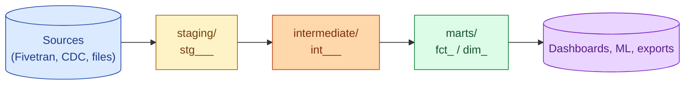

A small dbt project can put every model in one folder and still ship. A 500-model project cannot. The structure that has emerged from real teams: source-aligned `staging`, business-aligned `intermediate`, consumer-facing `marts`. Inside each, group by domain. The naming convention is half the value: when you read a model name, you should know which layer and which domain it belongs to.

**What this page will cover.**

- The three folders and what each layer is allowed to do.
- The naming convention: `stg_stripe__customers`, `int_orders__joined`, `fct_orders`, `dim_customer`.
- One staging model per source table. The "lift, type-cast, rename" rule.
- The intermediate layer as the "transformation thinking" layer.
- The marts layer as the only place dashboards can read.
- Why everyone should follow [dbt Labs' best practices guide](https://docs.getdbt.com/best-practices) the first month, then earn the right to deviate.

*Page coming soon.*

This concept sits in **Stage 3 (Batch pipelines and orchestration)** of the [Data Engineering Roadmap](/practice/data-engineering/roadmap/).
