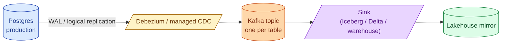
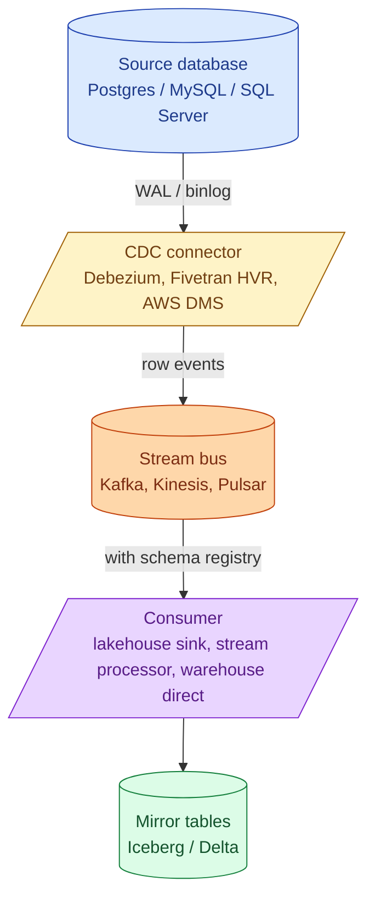
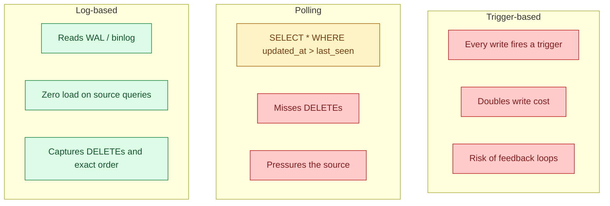
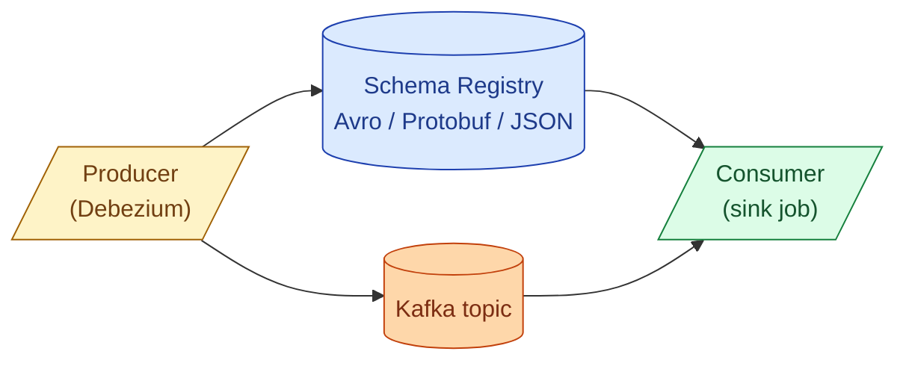
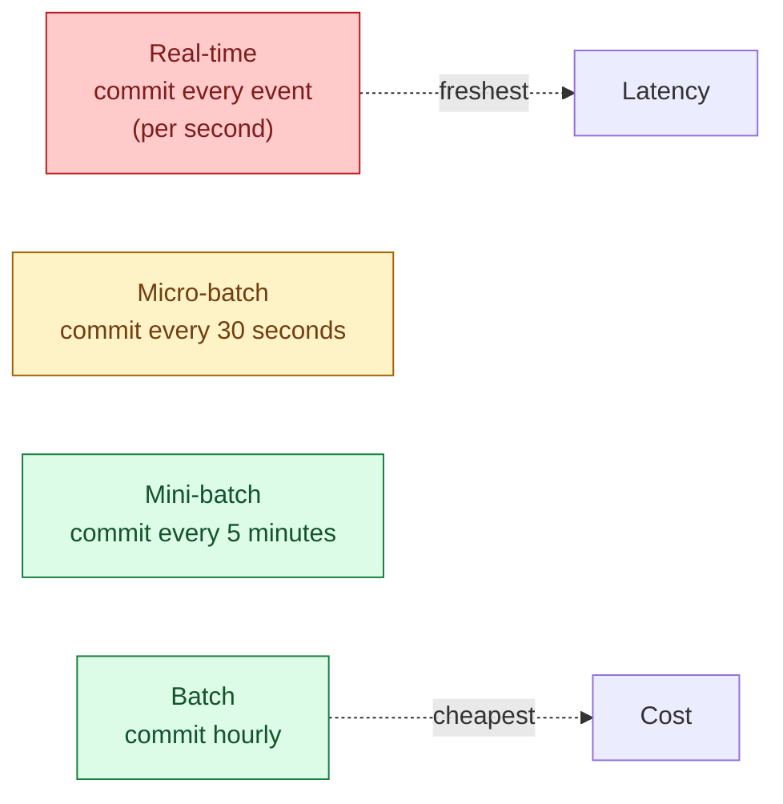

Change Data Capture (CDC) streams every insert, update, and delete from a production database into the warehouse or a stream. Done well, it gives near-real-time replication without dual writes and without the source database noticing. Done badly, it falls behind and silently drops history. CDC is the foundation of every modern "real-time analytics" architecture.



## The end-to-end stack

A modern CDC pipeline has four pieces, each replaceable.



1. **Source database.** A database with a write-ahead log (Postgres WAL, MySQL binlog, SQL Server transaction log, MongoDB oplog). The log is what makes CDC possible: every change is already recorded for replication.
2. **CDC connector.** Reads the log and emits one event per row change. Debezium is the open-source default. Fivetran, Airbyte, AWS DMS, GCP Datastream are managed alternatives.
3. **Stream bus.** Kafka, Pulsar, Kinesis. Buffers events durably. Allows multiple consumers and replay.
4. **Consumer.** Writes the events into a sink: a lakehouse table (Iceberg / Delta), a warehouse, a stream processor (Flink / ksqlDB) for further transformation.

You can skip pieces. Snowflake Streams reads CDC from a Snowflake table directly. Fivetran writes straight to the warehouse without exposing Kafka. The full stack above is what you see at scale, where the buffer and the multi-consumer story matter.

## Why log-based CDC, not triggers or polling



Trigger-based CDC writes a "change row" on every insert/update/delete. It doubles the write cost on the source. Polling misses deletes (a deleted row never shows up in a `SELECT`) and adds query pressure. Log-based CDC reads the same WAL the database already writes for crash recovery and replication. Source load: near zero.

The catch is operational. The log has to be retained long enough for the CDC connector to catch up after an outage. Postgres uses replication slots that retain WAL until consumed; if the slot is abandoned, the WAL fills the disk and crashes the database. Slot management is the most common CDC failure mode.

## The event shape

A CDC event has roughly this shape (Debezium format).

```json
{
  "before": null,
  "after": {
    "order_id": "abc123",
    "customer_id": "cust-42",
    "total": 99.50,
    "status": "completed",
    "updated_at": "2026-06-04T10:21:33Z"
  },
  "source": {
    "db": "shop",
    "schema": "public",
    "table": "orders",
    "lsn": 123456789,
    "ts_ms": 1717495293000
  },
  "op": "u",        // c=create, u=update, d=delete, r=read (snapshot)
  "ts_ms": 1717495293100
}
```

The `before` and `after` give the old and new row. The `op` tells you what kind of change. The `lsn` is the log sequence number, the source-of-truth ordering for events from the same database. Two events from the same row have a strict order via LSN; you never have to guess which came last.

## Schema registry as the contract layer

Without a contract, every schema change at the source breaks every consumer downstream. The fix is a schema registry (Confluent Schema Registry, AWS Glue Schema Registry, Apicurio).



The producer registers its schema. The consumer fetches the schema by ID and decodes events with it. When the producer wants to evolve the schema, the registry enforces compatibility rules (backward, forward, or full). A breaking change is rejected at publish time, not at consume time.

This is the difference between "we noticed at 3am because the dashboard broke" and "the producer's CI failed last Tuesday."

## Idempotency via Kafka offsets

Kafka guarantees that each partition has a strict order, and each consumer tracks an offset (where it has read up to). If the consumer crashes, it restarts from the last committed offset. If it processes the same event twice, the downstream write has to be idempotent.

The pattern that works for lakehouse sinks.

```python
for event in kafka_consumer.poll():
    key = (event.source.table, event.after.order_id, event.source.lsn)
    # write with a MERGE keyed on order_id, only apply if the new lsn is higher
    spark.sql(f"""
        MERGE INTO mirror.{event.source.table} t
        USING (SELECT '{event.after.order_id}' AS pk, ... ) s
          ON t.pk = s.pk
        WHEN MATCHED AND t.lsn < s.lsn THEN UPDATE SET ...
        WHEN NOT MATCHED THEN INSERT ...
    """)
    kafka_consumer.commit(event.offset)
```

The `lsn` comparison makes the write idempotent. Replaying the same event ten times is harmless because the `MERGE` only applies if the incoming LSN is newer than the stored one.

## Exactly-once into Iceberg

A common goal: every source change appears in the Iceberg mirror table exactly once, with no duplicates from replays. The pattern.

- Consumer reads from Kafka in micro-batches (every 10-30 seconds).
- Each micro-batch produces a single Iceberg snapshot via `MERGE`.
- The Kafka offset is committed in the same Iceberg transaction (via the catalogue's metadata table, or by storing the offset inside the snapshot summary).

If the consumer crashes mid-batch, the next run starts from the last committed offset, and the not-yet-committed batch is replayed. The `MERGE` with LSN comparison ensures the replay does not duplicate. The result: exactly-once semantics from Kafka into Iceberg.

This is what tools like Tabular, Onehouse, and Confluent's Iceberg sink connector do under the hood.

## Freshness vs ingestion cost



Each commit to Iceberg / Delta creates a snapshot and a set of small Parquet files. Commit every event and you get sub-second freshness and a metadata layer that becomes huge. Commit every 5 minutes and you save 99% of the metadata overhead and lose 5 minutes of freshness.

The rule that holds up. Pick the freshness the business actually needs. Most "real-time" requirements are satisfied by 30-second to 5-minute micro-batches. Sub-second commits are necessary only for fraud detection, trading, and a few operational use cases.

The hidden cost of high-frequency commits: compaction. Small files have to be merged later. If you commit every second, you write thousands of small files per hour and have to run `OPTIMIZE` constantly.

## The three deployment patterns

### Debezium plus Kafka (open source, full control)

```text
Postgres --> Debezium connector --> Kafka --> Spark/Flink sink --> Iceberg
```

You run Debezium, Kafka, the schema registry, the sink job. Maximum control, maximum operational cost. Good for teams that already run Kafka.

### Managed CDC (Fivetran, Airbyte Cloud, AWS DMS)

```text
Postgres --> Fivetran connector --> Warehouse (Snowflake / BigQuery)
```

The connector handles the WAL, the buffering, the schema evolution. You see tables appear in the warehouse. Trade-off: per-row pricing, less control over latency, less visibility into what is happening.

### Database-native (Snowflake Streams, BigQuery CDC ingestion)

```text
Postgres --> writes into Snowflake-managed CDC ingestion --> tables in Snowflake
```

Snowflake's Snowpipe Streaming and BigQuery's CDC ingestion bring CDC inside the warehouse. Simplest operationally, locked to one vendor.

The 2026 reality. Big orgs run Debezium plus Kafka because they need the buffer and the multi-consumer story. Smaller orgs use managed CDC because it just works. The database-native approach is gaining traction for "I just want my Postgres in my warehouse" use cases.

## A worked example: orders table to Iceberg mirror

Step by step.

```sql
-- 1. enable logical replication on Postgres
ALTER SYSTEM SET wal_level = logical;
CREATE PUBLICATION orders_pub FOR TABLE public.orders;

-- 2. Debezium config (excerpt)
{
  "name": "orders-source",
  "config": {
    "connector.class": "io.debezium.connector.postgresql.PostgresConnector",
    "database.hostname": "prod-db",
    "publication.name": "orders_pub",
    "slot.name": "debezium_slot",
    "topic.prefix": "shop.prod"
  }
}

-- 3. Kafka topic appears: shop.prod.public.orders

-- 4. Spark Structured Streaming sink into Iceberg
spark.readStream
  .format("kafka")
  .option("subscribe", "shop.prod.public.orders")
  .load()
  .writeStream
  .format("iceberg")
  .outputMode("append")
  .option("path", "warehouse.bronze.orders")
  .option("checkpointLocation", "/checkpoints/orders")
  .trigger(processingTime="30 seconds")
  .start()

-- 5. silver layer applies MERGE keyed on order_id with LSN check
MERGE INTO silver.orders t
USING (
  SELECT * FROM (
    SELECT *, ROW_NUMBER() OVER (
      PARTITION BY order_id ORDER BY lsn DESC
    ) AS rn
    FROM bronze.orders
    WHERE _processed_at >= current_date()
  ) WHERE rn = 1
) s
  ON t.order_id = s.order_id
WHEN MATCHED AND t.lsn < s.lsn THEN UPDATE SET ...
WHEN NOT MATCHED AND s.op != 'd' THEN INSERT ...
WHEN MATCHED AND s.op = 'd' THEN DELETE;
```

Postgres to bronze: append every event. Bronze to silver: deduplicate per `order_id`, apply the latest, propagate deletes. The silver table is a current-state mirror of production within 30 seconds.

For the system-design framing, see [SD #076 Change Data Capture](/practice/system-design/concepts/076-change-data-capture/).

## Common mistakes

- **Abandoned replication slots.** The slot retains WAL until consumed. A dead consumer fills the disk and crashes Postgres. Monitor slot lag.
- **No schema registry.** Producer changes a column type, consumer crashes, dashboard goes dark. Register the schema and enforce compatibility.
- **Polling instead of log-based.** Misses deletes, pressures the source. Use the WAL / binlog.
- **Treating CDC as eventually consistent without bounds.** "Eventually" can mean five minutes during normal load and five hours during a backfill. Set freshness SLAs and alert on them.
- **Committing every event to Iceberg.** Thousands of small files per hour. Micro-batch at 30 seconds or longer for most use cases.
- **Skipping the LSN check on merge.** Out-of-order replays overwrite newer state with older state. The `t.lsn < s.lsn` guard is not optional.
- **Bronze that mixes CDC and snapshot data.** A pipeline that periodically full-loads "to be safe" duplicates rows that CDC already captured. Pick one.
- **No replay capability.** When the silver table is corrupted, the only recovery is replaying from bronze. Make sure bronze has a long retention.

## Quick recap

- CDC reads the database's WAL / binlog to capture every row change as an event.
- The stack: source DB, CDC connector (Debezium / Fivetran / managed), stream bus (Kafka / Kinesis), sink (lakehouse / warehouse).
- Schema registry is the contract layer; without it, producer changes break consumers silently.
- Idempotency via LSN comparison in MERGE makes replays safe.
- Exactly-once into Iceberg via micro-batch commits with offset stored in the snapshot.
- Freshness vs cost: most "real-time" needs are met by 30-second to 5-minute micro-batches.
- Replication slot bloat is the most common production failure; monitor slot lag.
- Three deployment patterns: open-source Debezium plus Kafka, managed CDC, database-native.

This concept sits in **Stage 3 (Batch pipelines and orchestration)** of the [Data Engineering Roadmap](/practice/data-engineering/roadmap/).
