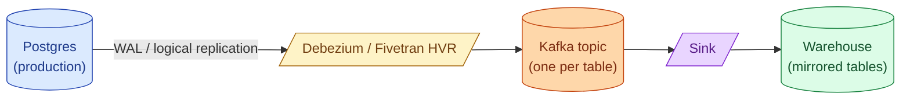

Change Data Capture (CDC) streams every insert, update, and delete from a production database into the warehouse or a stream. Done well, it gives near-real-time replication without dual writes and without the source database noticing. Done badly, it falls behind and silently drops history. CDC is the foundation of every modern "real-time analytics" architecture.

**What this page will cover.**

- The three implementations: Debezium (open source), Fivetran HVR (managed), database-native (Snowflake Streams).
- WAL / binlog reading: the path that does not pressure the source database.
- The outbox pattern: producing CDC events from your application without a separate logical replication slot.
- Sinks: writing into the warehouse vs into Iceberg / Delta tables.
- The operational concerns: replication slot bloat, schema change handling, replay capability.
- The cross-link to [SD #076 CDC](/practice/system-design/concepts/076-change-data-capture/) for the system-design framing.

*Page coming soon.*

This concept sits in **Stage 3 (Batch pipelines and orchestration)** of the [Data Engineering Roadmap](/practice/data-engineering/roadmap/).
