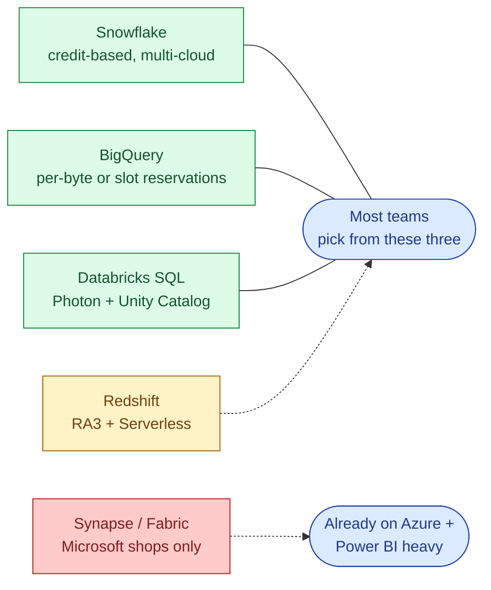
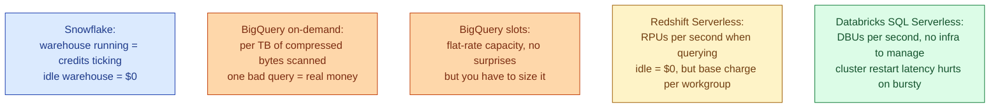
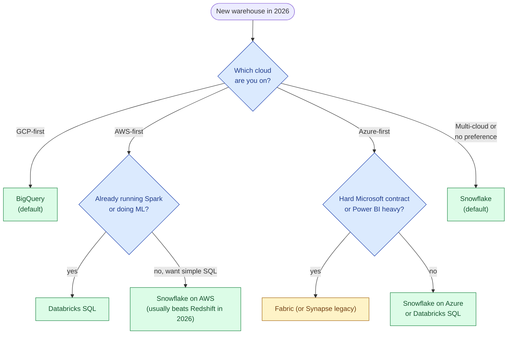

For a new analytical warehouse in 2026, four products dominate the shortlist: Snowflake, BigQuery, Redshift, and Databricks SQL. Azure Synapse is still around but has effectively been folded into Microsoft Fabric and is a niche pick outside Microsoft shops. The brochures look identical (SQL, columnar, separated storage and compute, autoscaling). The real differences live in the pricing model, the cloud you already pay, and the operational shape the product asks of your team.

## The 2026 state of play

Snowflake and BigQuery still win the most new logos. Databricks SQL is the fastest-growing of the four because teams already running Spark for ML find it easy to point BI at the same lakehouse. Redshift keeps existing AWS workloads but rarely wins a greenfield bake-off in 2026. Synapse barely shows up outside Azure-mandated environments; Microsoft is funnelling new customers into Fabric, which is a different product story.

## Side by side

| | Snowflake | BigQuery | Redshift | Databricks SQL |
|---|---|---|---|---|
| **Pricing unit** | Credits per second of warehouse runtime | Per TB scanned (on-demand) or slots (reserved) | RA3 nodes or Serverless RPUs | DBUs per second on a SQL warehouse |
| **Storage** | Snowflake-managed or Iceberg external | Native or BigLake (Iceberg, Hudi, Delta) | Managed + Spectrum on S3 | Delta on object storage, optional Iceberg via UniForm |
| **Cloud** | AWS, GCP, Azure | GCP only | AWS only | AWS, GCP, Azure |
| **SQL ergonomics** | Best in class | Very good (standard SQL, geospatial, ML) | Good but quirks (sort keys, dist keys still matter on RA3) | Good and improving fast |
| **Concurrency story** | Multi-cluster warehouses scale out | Slots auto-route | Concurrency scaling clusters | Serverless SQL warehouses scale out |
| **Best ergonomics for** | A small data team without a platform engineer | A team that lives in GCP and runs ad-hoc heavy | A team locked into AWS with predictable load | A team already doing Spark + ML + dbt on the lakehouse |
| **Worst surprise** | Bills when warehouses are left auto-resuming all day | A single bad query scanning 50 TB | Resizing reserved clusters is painful | Cluster startup latency on the smaller tiers |
| **2026 momentum** | Strong | Strong | Flat to declining | Strong, closing the gap on Snowflake |

## Pricing models, plainly

The pricing model is what bites you, not the per-unit price.

**Snowflake** charges by the second of a running virtual warehouse. The trap is auto-suspend set too high (10 minutes is the default; many teams forget to lower it). A warehouse left thinking it's busy on dashboard polls eats credits all day. Cost governance is required reading from day one.

**BigQuery on-demand** charges per TB of bytes scanned. One developer writing `SELECT *` against a 12 TB partitioned table without a partition filter generates a real bill. Reserved slots are a flat capacity that turns the warehouse back into a predictable monthly number, but you have to forecast slot demand and set autoscaling correctly.

**Redshift Serverless** in 2026 is the only mode worth picking for new workloads; reserved RA3 clusters still exist but resizing them is painful and the operational toil is real. Even Serverless has a base RPU cap to set, and idle workgroups can still accrue minor charges.

**Databricks SQL Serverless** runs on Photon and bills DBUs by the second. It's price-competitive with Snowflake once you account for the lakehouse storage being open-format. The honest gotcha is cluster start latency on small warehouse sizes, which makes bursty BI feel slow.

## Strengths and weaknesses, opinionated

**Snowflake wins** on ergonomics for small teams. Time travel, zero-copy cloning, secure data sharing, and the marketplace are all genuinely useful. The catch is cost discipline. Without resource monitors, cost dashboards, and a culture of suspending warehouses, the bill grows faster than the team realises.

**BigQuery wins** when the team already lives in GCP and runs lots of ad-hoc analytics on big tables. The serverless model is the cleanest of the four: no clusters, no warehouses, just queries. Partitioning and clustering matter more than people admit; a poorly partitioned table is a bill-generator.

**Databricks SQL wins** when there is already a Databricks workspace for ML or Spark ETL. Unity Catalog is a real governance plane, and running BI, ETL, and ML on the same Delta tables removes a lot of integration glue. It's the loser if your team has zero Spark experience and just wants a warehouse, because the platform mental model is bigger than Snowflake's.

**Redshift wins** when you are deeply on AWS, have predictable workloads, and have a contractual reason to stay on AWS-native services. For greenfield in 2026, the honest call is that Snowflake on AWS or Databricks SQL on AWS is usually a better pick than Redshift unless cost-procurement says otherwise.

**Synapse / Fabric** is the loser here unless you already have a Microsoft + Power BI shop with a Fabric commitment. Microsoft is steering customers to Fabric, which is a unified analytics platform rather than a pure warehouse. Pick it because politics says so, not because the engineering wins.

## Picking decision tree

The honest meta-rule: pick the warehouse that matches the cloud and the team's existing skills. The per-query price difference between the top three is not the deciding factor at any reasonable scale; the cost of integration work and operational toil dwarfs it.

## A note on Iceberg, dbt, and the warehouse choice

In 2026 all four major warehouses can read or write Iceberg tables, and dbt runs against all four with the same project structure. This makes the "lock-in" argument softer than it was three years ago: you can model in dbt against Snowflake, point the same models at BigQuery, and the SQL mostly ports. The expensive thing to migrate is not the model code; it's the operational glue (jobs, monitoring, governance, security model, cost dashboards), the people who learned the platform's quirks, and the BI tools that bake assumptions about your warehouse into their connectors.

A useful rule of thumb: the warehouse choice locks in roughly 2-3 quarters of switching cost. That's not nothing, but it's also not the decade-long commitment people sometimes treat it as. Pick well, iterate the operational layer on top, and re-evaluate every couple of years as the market keeps moving.

## Common mistakes

- **Picking on per-second list price.** The list price for compute is the smallest variable in your bill. Storage, egress, idle warehouses, and bad queries dominate.
- **Treating BigQuery on-demand as "free until you query."** A single bad scan on a 10 TB partitioned table without a partition filter costs more than a month of slot reservations.
- **Leaving Snowflake auto-suspend at 10 minutes.** A polling dashboard keeps the warehouse hot 24/7. Set auto-suspend to 60 seconds and use resource monitors.
- **Picking Redshift in 2026 because the team knows it from 2018.** The product has changed, but more importantly, the alternatives have pulled ahead on ergonomics.
- **Picking Databricks SQL without budget for the platform learning curve.** Unity Catalog, workspaces, cluster policies, and entitlements are a real investment.
- **Believing the "multi-cloud" pitch.** Multi-cloud Snowflake or Databricks means you can run in multiple clouds, not that you should. Cross-cloud replication adds cost and complexity.
- **Ignoring egress.** Pulling data out of any of these warehouses to another cloud or to a BI tool can be the largest line item nobody noticed.

## Quick recap

- Four real choices in 2026: Snowflake, BigQuery, Redshift, Databricks SQL. Synapse / Fabric is niche outside Microsoft shops.
- Snowflake wins on ergonomics. BigQuery wins on GCP-native ad-hoc analytics. Databricks SQL wins when the lakehouse is already there. Redshift is the AWS-incumbent pick, no longer a default.
- The pricing model matters more than the per-unit price. Each one has a different way to surprise you on the invoice.
- Default rule: match the cloud you're already on and the skills you already have. Cost differences between the top three are smaller than integration friction.
- Cost governance is not optional. Resource monitors, partition filters, auto-suspend, and slot reservations all pay for themselves in the first month.

This concept sits in **Stage 6 (Reliability, debugging, cost)** of the [Data Engineering Roadmap](/practice/data-engineering/roadmap/).
