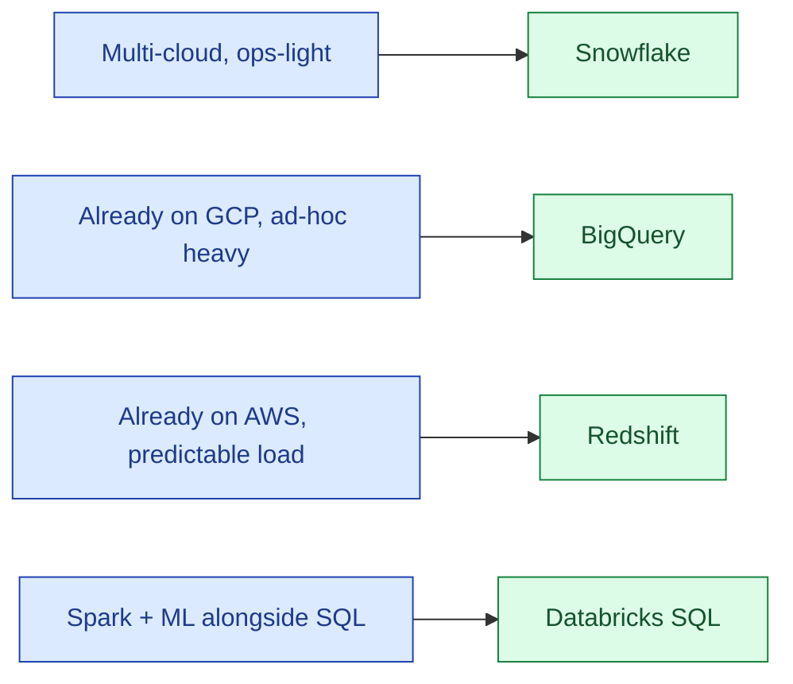

For new analytical warehouses in 2026, four products dominate: Snowflake, BigQuery, Redshift, Databricks SQL. They look similar on the brochure (SQL, columnar, autoscaling, separation of storage and compute). The real differences are pricing model, ecosystem, and the operational shape they ask of your team.

| | Snowflake | BigQuery | Redshift | Databricks SQL |
|---|---|---|---|---|
| **Pricing** | Per-second compute | Per-byte scanned (or slots) | Reserved nodes / Serverless | Per-DBU |
| **Best at** | Multi-cloud, easy ops | GCP-native, ad-hoc analytics | AWS-native, predictable workloads | Lakehouse + ML on the same platform |
| **Hardest part** | Cost without governance | Slot reservation tuning | Resizing reserved nodes | The lakehouse mental model |
| **Ecosystem** | Snowflake Marketplace, broad partners | GCP + open table format support | AWS-deep, Spectrum for lake | Mature notebooks + jobs + SQL |

**What this page will cover.**

- The per-byte-scanned vs per-second-of-compute pricing trade.
- BigQuery slots and reservations: when on-demand bites you.
- Snowflake credits, multi-cluster warehouses, the cost of warehouses left running.
- Redshift Serverless: how it compares to the others in 2026.
- Databricks SQL Serverless: the "use the lakehouse as a warehouse" pitch.
- The 2026 honest take: pick the one your cloud and your data already live in, unless you have a specific reason not to.

*Page coming soon. Cross-link: [SD #067 Warehouses comparison](/practice/system-design/concepts/067-warehouse-redshift-bigquery-synapse/) gives the system-design angle.*

This concept sits in **Stage 6 (Reliability, debugging, cost)** of the [Data Engineering Roadmap](/practice/data-engineering/roadmap/).
