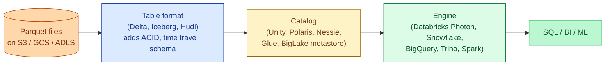
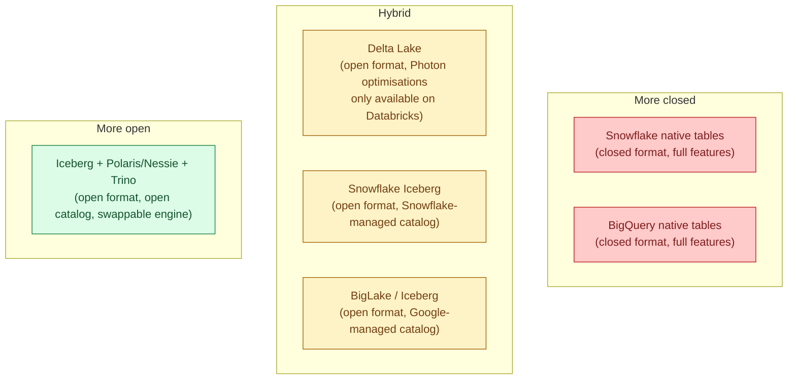
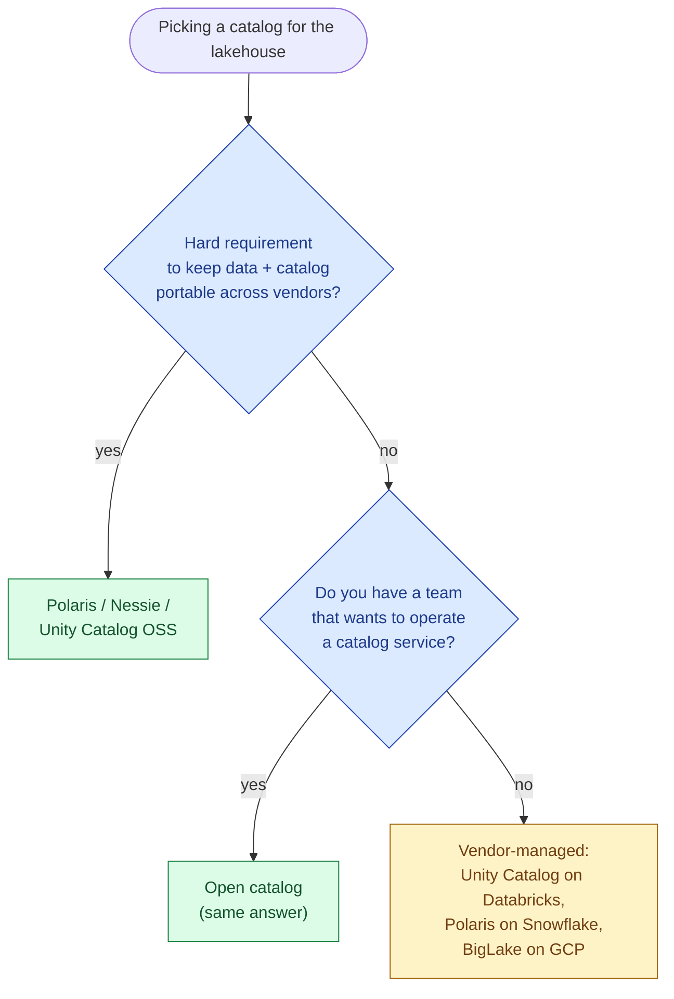

Databricks invented the lakehouse term and shipped Delta Lake as the table format. Snowflake added Iceberg-backed external tables, then native Iceberg writes, then the Polaris catalog. BigQuery added BigLake tables that read Iceberg, Hudi, or Delta from object storage. The open-source side now has a credible answer too: Iceberg + Trino + a catalog like Polaris, Nessie, or Unity Catalog OSS. All four sell some version of "lakehouse." They are not the same architecture.

The 2026 question is not "should I do a lakehouse?" Almost everyone is, even if they call it a warehouse. The question is "whose catalog do I trust, and how much lock-in am I taking?"

## What "lakehouse" actually means

Three layers stacked on object storage: files, table format, catalog. The engine on top is interchangeable in theory. In practice, who owns the catalog decides who owns your data.

## The four shapes

| | Databricks | Snowflake | BigQuery | Open stack (Iceberg + Trino + Polaris/Nessie) |
|---|---|---|---|---|
| **Default format** | Delta Lake (UniForm exposes Iceberg metadata too) | Native Snowflake tables; Iceberg native and external | BigQuery native; BigLake reads Iceberg, Hudi, Delta | Iceberg |
| **Catalog** | Unity Catalog | Polaris (Iceberg REST) + native | BigLake metastore + Dataplex | Polaris, Nessie, Gravitino, or Unity Catalog OSS |
| **Engine** | Photon (Spark) + Databricks SQL | Snowflake compute | BigQuery slots | Trino, Spark, Dremio, anything that speaks Iceberg |
| **Who runs the compute** | Databricks | Snowflake | Google | You (on EKS, EMR, or a managed Trino like Starburst) |
| **Governance plane** | Unity Catalog (mature) | Horizon / Polaris (improving fast) | Dataplex / IAM | Whatever your catalog ships; bring your own RBAC |
| **Open vs closed** | Delta is open; the optimised runtime is closed | Iceberg is open; Snowflake compute is closed | BigLake formats are open; BigQuery compute is closed | All open; you own the integration |
| **Best at** | Spark + ML + SQL on one platform | SQL ergonomics + Iceberg interop | GCP-native, serverless | Avoiding vendor lock-in, multi-engine reads |
| **Worst at** | Locking you into Photon for best perf | Iceberg writes are newer than native Snowflake; some features lag | BigLake performance is below native BigQuery on some workloads | Operational toil; you maintain the catalog and engine |

## The lock-in matrix

Every "open format" claim has an asterisk. Delta is open, but the runtime that makes Delta fast (Photon, liquid clustering, predictive optimisation) only ships on Databricks. Iceberg on Snowflake is open, but the catalog managing it lives in your Snowflake account. The genuinely-open story is Iceberg + an open catalog (Polaris donated to Apache by Snowflake, Nessie from Project Nessie, Unity Catalog OSS donated by Databricks, or Gravitino from Apache) + a swappable engine like Trino or Spark.

Whether to take the open stack depends on a question worth answering honestly: do you trust your team to operate the catalog and the engine? An open catalog with no platform team behind it is worse than a closed catalog with a vendor on call.

## What each one is good at

**Databricks lakehouse**. The most cohesive platform if your workload mixes SQL, Spark ETL, and ML on the same tables. Unity Catalog is the strongest governance plane of the four in 2026: lineage, tags, row/column masking, and the same RBAC across notebooks, jobs, and SQL warehouses. UniForm lets external engines read your Delta tables as Iceberg without rewriting files. Loses to Snowflake on pure SQL ergonomics for non-Spark teams.

**Snowflake lakehouse**. The Iceberg story matured fast: native Iceberg tables write from Snowflake but are readable by Trino, Spark, or DuckDB through Polaris. Best when you want Snowflake SQL ergonomics but need an external engine (often Spark for heavy ML) to read the same data without copying it. Polaris becoming Apache Polaris in 2024 made this story significantly more credible.

**BigQuery lakehouse**. BigLake tables expose Iceberg / Hudi / Delta to BigQuery. Best inside the GCP ecosystem: Vertex AI reads the same tables, Dataplex handles governance, IAM is the same as the rest of GCP. Less compelling outside GCP because the catalog stays Google-managed.

**Open stack (Iceberg + Trino + open catalog)**. Best when avoiding lock-in is a hard requirement: regulated industries, multi-region multi-vendor setups, or teams that want to mix engines (Spark for ETL, Trino for BI, DuckDB for ad-hoc). Pays for that flexibility in operational work: you run the Trino cluster, the catalog, the metadata maintenance, and the table optimisation jobs. Managed Trino vendors like Starburst Galaxy and Dremio Cloud blunt this, but they re-introduce a vendor.

## The "do I trust an open catalog" question

Open catalogs are real and production-grade in 2026, but they are a service you run, not a feature you turn on. Most teams under 30 engineers do not have the platform capacity to take this on, and a vendor-managed catalog buys back time worth more than the lock-in cost.

## Storage cost vs compute cost

One quiet upside of the lakehouse pattern is that storage and compute decouple cleanly. Parquet on S3 is roughly the cheapest durable storage available to most teams; Snowflake-managed storage costs more per terabyte. For petabyte-scale archives that you query rarely, an Iceberg-on-S3 lakehouse with Trino or Athena on top can be an order of magnitude cheaper than the equivalent native warehouse.

The trap is reading that price gap and ignoring compute. Snowflake's native format is fast because the engine and storage are co-designed. Reading the same data via Iceberg can be slower for the same queries; the price difference shrinks once you account for the extra compute. Run a real benchmark on your queries before committing to "we'll save 70% by moving to a lakehouse." Sometimes it's true. Sometimes it's a wash.

## Common mistakes

- **"Iceberg means no lock-in."** The format is open. The catalog and the engine often are not. Lock-in moves up the stack, not away.
- **Picking the open stack without a platform team.** Running Trino + Polaris + S3 + table maintenance is a real platform commitment. Underestimating this is the most common painful mistake.
- **Using Delta on Snowflake or Iceberg on Databricks as if they were native.** Cross-format reads exist and work, but you give up a layer of vendor optimisation. Benchmark on your data before committing to a hybrid pattern.
- **Forgetting table maintenance.** Iceberg and Delta both need compaction, snapshot expiry, and orphan file cleanup. On vendor platforms this is automated; on the open stack you schedule it yourself.
- **Letting "lakehouse" hide a regular warehouse decision.** If your only queries are SQL and your only writers are dbt, you are picking a warehouse. The lakehouse framing matters when there is a second engine (Spark, Flink, Trino) sharing the same tables.
- **Believing a "neutral" catalog is fully neutral.** Polaris is governed by Apache now, but the most-mature integration is still with Snowflake. Unity Catalog OSS is most mature with Databricks. Pick your future centre of gravity with eyes open.

## Quick recap

- Lakehouse means table format + catalog + engine on top of object storage. The format is usually open; the catalog and engine are where lock-in lives.
- Databricks is the most cohesive platform; best when Spark and ML are already in the picture.
- Snowflake's Iceberg + Polaris story is credible in 2026 and is the right pick for SQL-first teams that want external engines to read the same data.
- BigQuery's BigLake is the GCP-native lakehouse; great inside GCP, less compelling outside.
- Open stack (Iceberg + Trino + Polaris/Nessie) is real but is a platform commitment. Pick it when avoiding lock-in is a hard requirement, not a preference.
- Format-level openness does not equal vendor-level openness. The catalog is the new lock-in point.

This concept sits in **Stage 5 (Storage and file formats)** of the [Data Engineering Roadmap](/practice/data-engineering/roadmap/).
