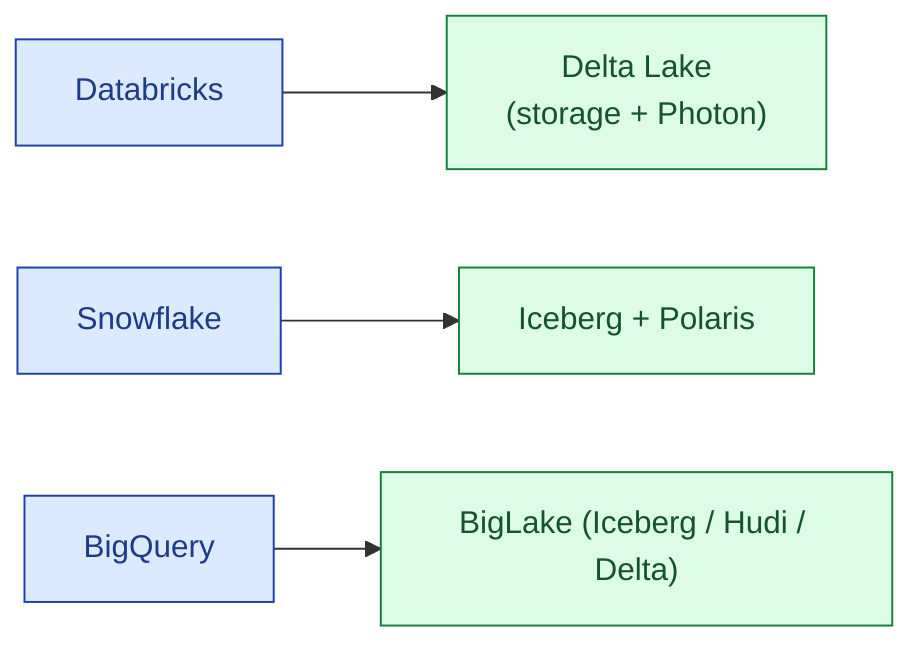

Databricks invented the lakehouse term and shipped Delta Lake as the table format. Snowflake added Iceberg-backed external tables and Polaris catalogue. BigQuery added BigLake tables that read Iceberg, Hudi, or Delta from object storage. All three sell "lakehouse" but the architectural shape is different in each.

| | Databricks | Snowflake | BigQuery |
|---|---|---|---|
| **Default table format** | Delta Lake | Native + Iceberg | Native + BigLake |
| **Open vs closed** | Delta is open, Databricks-optimised | Iceberg is open, others read it | BigLake is open, others read it |
| **Compute** | Photon engine | Snowflake compute | BigQuery slots |
| **Lakehouse mental model** | Storage and compute fully unified | Warehouse + external tables | Warehouse + external tables |

**What this page will cover.**

- The "table format on object storage" core that all three share.
- Where each one diverges: catalogue, engine integration, governance.
- Delta vs Iceberg vs Hudi in practice (deep-link to concept #19).
- Vendor lock-in risk per option: Databricks > Snowflake (Iceberg-backed) ≈ BigQuery (BigLake).
- Cost shape: pay for storage + compute, but who runs the compute varies.
- The honest 2026 take: pick the lakehouse that matches the rest of your stack.

*Page coming soon.*

This concept sits in **Stage 5 (Storage and file formats)** of the [Data Engineering Roadmap](/practice/data-engineering/roadmap/).
