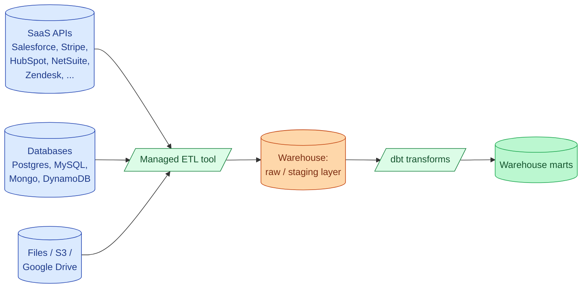
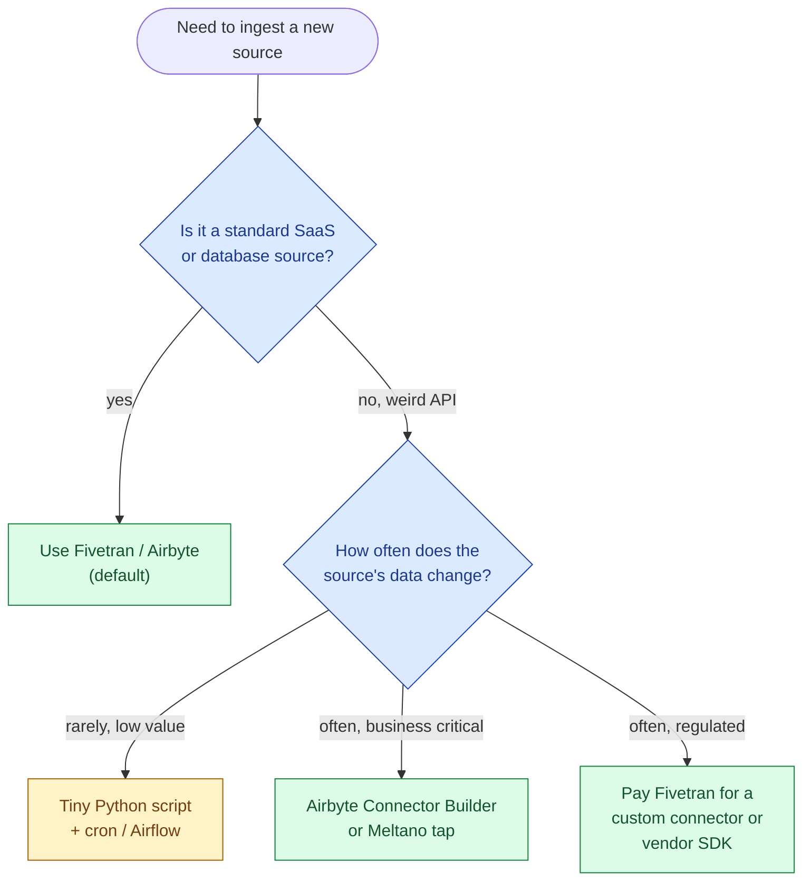

Extracting from Salesforce, Stripe, HubSpot, NetSuite, Zendesk, and 300 other SaaS APIs is undifferentiated work. The connectors are mostly boring, mostly the same, and 100% your problem when an API changes. Managed ingestion tools exist so your team does not spend its quarter chasing OAuth refresh tokens. The real choice in 2026 is between Fivetran (premium, fully managed), Airbyte (open source plus cloud), Stitch (declining), Hevo (cheaper Fivetran-alike), and Meltano (Singer-based, DIY-ish). The build-it-yourself option still exists but is rarely the right call.

## What this category does

The job is narrow and well-defined: pull rows out of a source on a schedule, land them in the warehouse as faithfully as possible, deal with incremental keys, schema drift, deletes, rate limits, retries, and pagination. The output is a raw layer that dbt or your transformation tool of choice operates on. Nothing in this category does serious transformation; the "T" lives in the warehouse.

## Side by side

| | Fivetran | Airbyte (OSS) | Airbyte Cloud | Stitch | Hevo | Meltano |
|---|---|---|---|---|---|---|
| **Model** | Fully managed | Open source, self-hosted | Managed | Managed | Managed | Open-source CLI on Singer taps |
| **Connectors** | 500+ certified | 400+ (community + certified) | Same set | 130, mostly stable | 150+ | 600+ Singer taps (quality varies) |
| **Pricing** | MAR (Monthly Active Rows) per source | Free + your infra | Capacity- or row-based | Row-based, capped | Event-based, cheaper | Free + your infra |
| **CDC support** | Yes, mature | Yes, improving | Yes | Limited | Yes | Depends on the tap |
| **Schema drift** | Auto-propagated, conservative | Auto-propagated | Same | Manual sometimes | Auto | Depends on the tap |
| **Custom connectors** | Connector SDK, slow process | Connector Builder (low-code), fast | Same | Limited | Yes | Singer SDK (Python) |
| **Best at** | Large enterprise, high-stakes sources | Cost-sensitive teams with engineers | Teams that want managed but cheaper | Legacy customers | Mid-market | Teams that already have an SRE culture |
| **Worst at** | Bill predictability under growth | Self-hosting cost is real | Some sources less mature than Fivetran | Strategic future (Talend has deprioritised it) | Smaller ecosystem | Reliability and observability are DIY |

## Pricing models, in one paragraph each

**Fivetran's MAR** counts unique rows that changed in the source per month. A Salesforce table with 100k accounts that get updated daily counts as 100k MAR, not 3M. This sounds cheap until a chatty CRM update or a re-sync inflates the count. Forecast pessimistically; the line item grows with the business.

**Airbyte Cloud** runs on capacity tiers (consumption-based credits in 2026) and is usually 30 to 60% cheaper than Fivetran at similar volumes. The cheaper price reflects a younger, less battle-tested connector library; the most-used connectors (Postgres CDC, Salesforce, Stripe, HubSpot) are solid, while the long tail is hit or miss.

**Airbyte self-hosted** is "free" in the way Postgres is free. You run it on Kubernetes, monitor it, upgrade it, debug the Java + Python connectors when they leak memory, and on-call when Stripe's API rate-limits you at 3 a.m. Honest break-even: Airbyte OSS becomes cheaper than Airbyte Cloud somewhere around the 100M+ rows/month mark, assuming you have an engineer who can own it.

**Stitch** bills per row and is still cheap, but Talend (its owner) has put almost no investment into it since the Qlik acquisition. Treat new Stitch deployments as taking on debt.

**Hevo** is roughly 40% cheaper than Fivetran with a smaller catalog. Best fit: mid-market teams with a known list of sources and a tight budget.

**Meltano** is the open-source CLI that runs Singer taps. Configuration as code, version-controllable, and free. The catch is that Singer taps are community-maintained and quality varies wildly. The Stripe tap is solid; the niche-SaaS tap might be six months out of date. Best when you have an engineer who is happy to debug taps and you want full code-level control.

## The build vs buy decision

The "we'll build our own Salesforce connector" decision is one of the most expensive mistakes a small data team makes. Salesforce's API has bulk and REST and streaming variants, OAuth refresh, sandbox modes, field-level permission inheritance, and at least three ways to surface deletes. Maintaining a connector for it is a part-time job for one engineer indefinitely. Pay someone.

The exception is a source so niche that no vendor supports it (an internal HR system, a partner's bespoke API). Even then, Airbyte's Connector Builder and Meltano's Singer SDK exist precisely so you can write a connector in a day and run it on managed infrastructure.

## The newer entrants worth knowing

**dlt** (data load tool) is a Python library that turns "write a script to pull from this API" into a structured, schema-aware, incremental pipeline. Not a managed service; a library you import into your own orchestrator. The fastest way to ship a custom connector in 2026 if your team already writes Python.

**Sling** is a CLI for moving data between databases and files. Best for database-to-warehouse moves where you do not want a full ETL platform.

**Estuary Flow** combines streaming CDC with managed connectors, billed by data volume. Real-time-first, which neither Fivetran nor Airbyte does cleanly.

These three do not replace Fivetran or Airbyte for the bulk of "SaaS to warehouse" work, but they fit specific gaps that the incumbents handle awkwardly.

## CDC: the source-type that bites people

Change Data Capture from Postgres, MySQL, or MongoDB is the most operationally fragile category in this space. The tool reads the database's write-ahead log, ships changes to the warehouse, and tracks the last position consumed. It works beautifully when it works and creates outages when it doesn't.

Common CDC gotchas across every vendor:

- **Replication slot growth on Postgres.** If the connector falls behind, the WAL grows on the source until disk fills. Monitor slot lag.
- **Schema changes mid-stream.** A column added or dropped on the source triggers different behaviour per tool. Test it.
- **Snapshots on large tables.** The initial snapshot of a 500 GB table can take a day and lock-walk the database. Plan it for a maintenance window.
- **Deletes on Postgres.** Logical replication captures deletes; tools differ on whether they expose them as soft deletes or hard deletes in the warehouse.

Fivetran has the most mature CDC story among the managed options. Airbyte's CDC has improved a lot in the last 18 months but still benefits from an engineer who understands replication slots. For mission-critical CDC, the rule of thumb is "pay for it" until you have a real reason not to.

## Common mistakes

- **Building the Salesforce connector ourselves.** Almost always a bad call. The maintenance cost is permanent.
- **Forecasting MAR pricing optimistically.** Re-syncs after schema changes, CDC blowing up on noisy tables, and growth all push MAR up. Budget for 2x what your initial run shows.
- **Treating Airbyte self-hosted as free.** The license is free; the operational cost is not. Allocate at least 20% of an engineer to keep it healthy at any real scale.
- **Picking Stitch in 2026.** Talend has not meaningfully invested in years. Existing customers stay; new customers should look elsewhere.
- **Skipping the warehouse raw layer.** Land data raw, transform in dbt. Doing transforms in the ETL tool is how you end up debugging business logic in vendor configuration screens.
- **Ignoring schema drift behaviour.** Each tool handles new columns and changed types differently. Test it on day one, not the first week your source adds a column.
- **Not isolating connector failures.** One source going down should not block the rest. Each connector should have its own monitoring and alerting per pipeline.

## Quick recap

- The default for new ingestion in 2026 is Fivetran or Airbyte. Stitch is legacy, Hevo is mid-market, Meltano is for engineers who want code-level control.
- Pay-managed vs self-hosted is a "do you have a platform engineer to spare" question. Below ~100M rows/month, managed almost always wins on total cost.
- Building your own SaaS connectors is rarely worth it. Use Airbyte's Connector Builder or dlt for the long tail instead.
- The "T" lives in the warehouse via dbt. Keep transformation out of the ETL tool.
- MAR / row pricing scales with the business and surprises people. Forecast pessimistically and put resource monitors on the warehouse cost downstream.

This concept sits in **Stage 6 (Reliability, debugging, cost)** of the [Data Engineering Roadmap](/practice/data-engineering/roadmap/).
