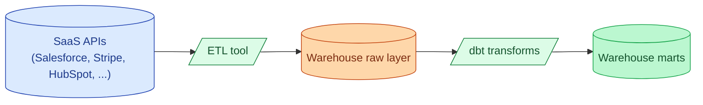

Extracting from Salesforce, Stripe, HubSpot, NetSuite, and 200 other SaaS APIs is undifferentiated work. Managed ETL tools (Fivetran, Stitch) and the open-source alternative (Airbyte) handle the connectors. They land raw data in your warehouse; you transform it with dbt. The decision is "paid managed vs open source vs build your own", almost never "build the connector yourself."

| | Fivetran | Airbyte | Stitch |
|---|---|---|---|
| **Model** | Managed, per-connector pricing | Open source + Cloud option | Managed, simpler |
| **Connector count** | 500+ | 350+ | 130+ |
| **Cost** | Higher, by Monthly Active Rows | Free self-hosted; Cloud is similar to Fivetran | Lower, by rows |
| **Best at** | Enterprise, lots of sources | Cost-sensitive teams, niche sources | Simpler use cases |

**What this page will cover.**

- Why "build the Salesforce connector ourselves" is one of the most expensive decisions a team makes.
- Fivetran's MAR (Monthly Active Rows) pricing and how to forecast it.
- Airbyte self-hosted: real operations cost, not free in practice.
- Stitch as the "Fivetran-lite" option, owned by Talend.
- The Sling and dlt newer entrants and where they fit.
- The 2026 honest take: pay for it unless you have a real cost or compliance reason not to.

*Page coming soon.*

This concept sits in **Stage 6 (Reliability, debugging, cost)** of the [Data Engineering Roadmap](/practice/data-engineering/roadmap/).
