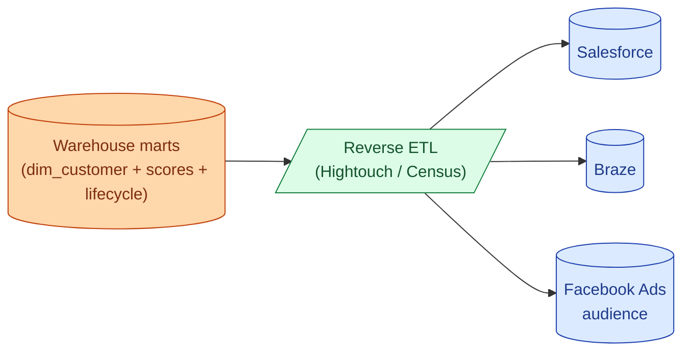

Regular ETL pulls source data into the warehouse for analytics. Reverse ETL pushes warehouse models back out to operational tools: customer scores into Salesforce, lifecycle stages into Braze, retargeting audiences into Facebook Ads. The warehouse becomes the canonical source for "who is this customer right now?" and reverse ETL is how that truth reaches the tools that use it.

**What this page will cover.**

- The "data activation" trend: warehouse as the source of truth for operational tools.
- Hightouch vs Census: feature overlap is large, pricing model differs.
- Identity resolution: matching customers across systems before syncing.
- The sync model: append, update, replace, upsert.
- Reverse ETL vs CDP (Customer Data Platform): when each fits.
- The honest take: useful pattern, but only after your warehouse is genuinely the source of truth.

*Page coming soon.*

This concept sits in **Stage 6 (Reliability, debugging, cost)** of the [Data Engineering Roadmap](/practice/data-engineering/roadmap/).
